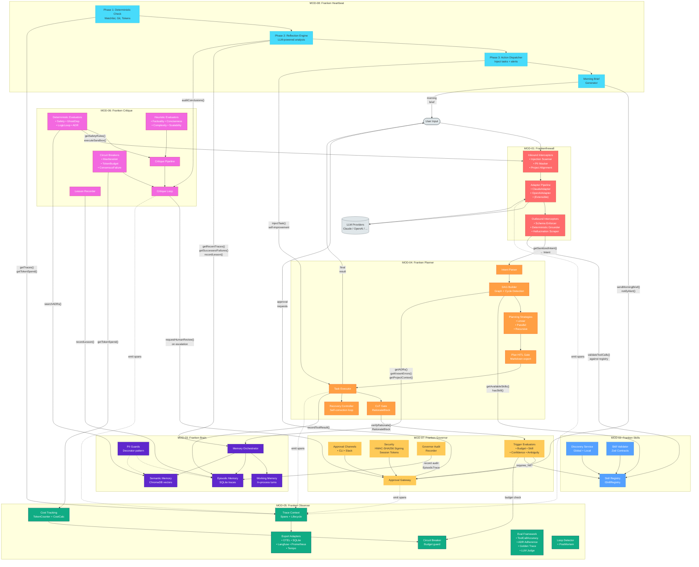

# Frankenbeast Architecture

## System Overview

Frankenbeast is a deterministic guardrails framework for AI agents, comprising 10 packages:

| Package | Role |
|---------|------|
| `frankenfirewall` | MOD-01: LLM proxy with injection detection, PII masking, and response validation |
| `franken-skills` | MOD-02: Skill registry and discovery |
| `franken-brain` | MOD-03: Working + Episodic + Semantic memory |
| `franken-planner` | MOD-04: DAG-based task planning with CoT gates |
| `franken-observer` | MOD-05: Tracing, cost tracking, and eval framework |
| `franken-critique` | MOD-06: Self-critique pipeline with deterministic + heuristic evaluators |
| `franken-governor` | MOD-07: Human-in-the-loop governance and approval gating |
| `franken-heartbeat` | MOD-08: Continuous improvement, reflection, and morning briefs |
| `franken-types` | Shared type definitions (TaskId, Severity, Result, TokenSpend, etc.) |
| `franken-orchestrator` | The Beast Loop — wires all modules into a 4-phase agent pipeline |

## The Beast Loop (franken-orchestrator)

The orchestrator runs 4 sequential phases:

```
User Input → [1. Ingestion] → [2. Planning] → [3. Execution] → [4. Closure] → BeastResult
                  │                 │                │                │
              Firewall          Planner          Skills          Observer
              Memory            Critique         Governor        Heartbeat
```

1. **Ingestion** — Firewall sanitizes input (injection/PII), Memory hydrates project context
2. **Planning** — Planner creates task DAG, Critique reviews in loop (max N iterations)
3. **Execution** — Tasks run in topological order with HITL governor gates
4. **Closure** — Token accounting, optional heartbeat pulse, result assembly

**Circuit breakers** halt execution on: injection detection (immediate halt), budget exceeded (HITL escalation), critique spiral (HITL escalation).

**Resilience**: Context serialization to disk, graceful SIGTERM/SIGINT handling, module health checks on startup.

## HTTP Services (Hono)

Three modules expose HTTP servers:

| Service | Port | Endpoints |
|---------|------|-----------|
| Firewall | 9090 | `POST /v1/chat/completions`, `POST /v1/messages`, `GET /health` |
| Critique | — | `POST /v1/review`, `GET /health` |
| Governor | — | `POST /v1/approval/request`, `POST /v1/approval/respond`, `POST /v1/webhook/slack`, `GET /health` |

## Shared Types (@franken/types)

Canonical type definitions shared across all modules:
- `TaskId` (branded string), `ProjectId`, `SessionId`
- `Severity` superset with module-specific subsets
- `RationaleBlock`, `VerificationResult`
- `ILlmClient`, `IResultLlmClient`
- `Result<T, E>` monad
- `TokenSpend`

## Module Interconnections


