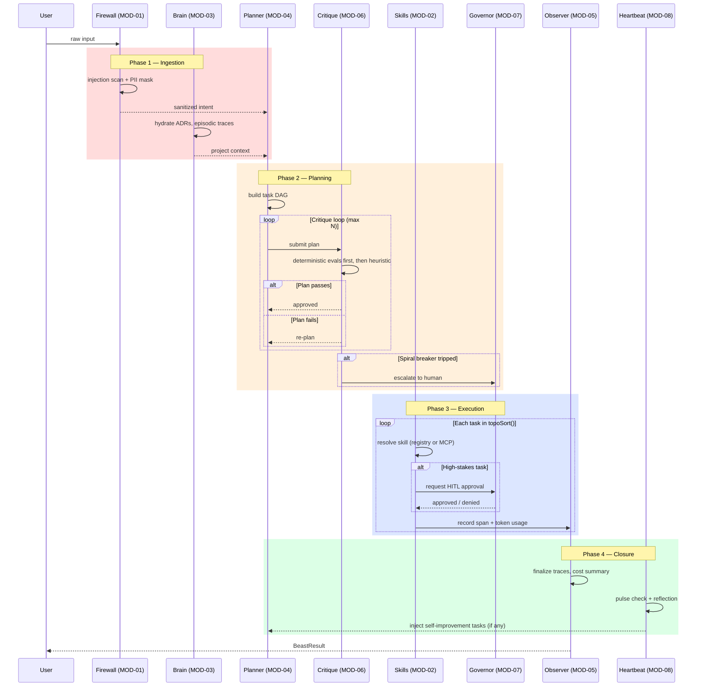
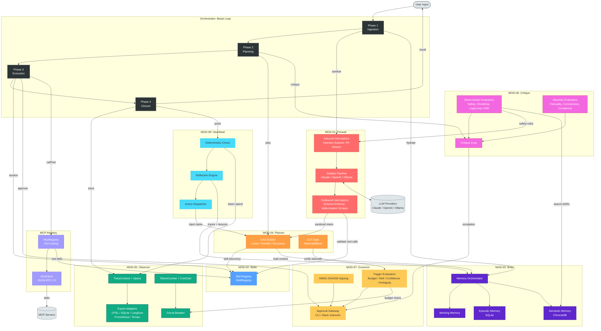

# Frankenbeast

<p align="center">
  
</p>


[](https://github.com/djm204/frankenbeast/releases/latest)
[](https://github.com/djm204/frankenbeast/actions/workflows/daily-security-scan.yml)
[](.github/dependabot.yml)

**Deterministic guardrails for AI agents.**

Frankenbeast is a safety framework that enforces guardrails *outside* the LLM's context window. Every check that can be deterministic is deterministic — regex-based injection scanning, schema validation, dependency whitelisting, DAG cycle detection, HMAC signature verification. These do not hallucinate.

## 🚀 One-click onboarding

Starting from a fresh checkout? Use the [Frankenbeast onboarding checklist](ONBOARDING.md) for prerequisites, environment setup, and first-run validation, then run the repository bootstrap script:

```bash
npm run bootstrap -- --no-docker
```

The bootstrap command delegates to [`scripts/bootstrap.sh`](scripts/bootstrap.sh), which validates Node.js, npm/Corepack, `.env` defaults, dependencies, and optional Docker services. Pass `--services` when you want bootstrap to start the optional Docker compose stack after dependency installation. To preview the checks without changing files or installing packages, run:

```bash
./scripts/bootstrap.sh --dry-run
```

## Latest release announcement

[Release v0.45.0](https://github.com/djm204/frankenbeast/releases/tag/v0.45.0) is the latest Frankenbeast release line. It packages the recent one-click onboarding cleanup, security hardening across MCP, observer, orchestrator, governor, and web surfaces, plus deterministic mode improvements for repeatable validation, recovery, and release gates.

Highlights:

- **One-click onboarding:** refreshed init, MCP setup, dashboard, provider, and quickstart guidance so operators can choose the right setup path without mixing local-checkout and published-package commands.
- **Security hardening:** tightened path containment, webhook/token handling, approval signing, chat/dashboard auth, config validation, and persisted-state hydration safeguards.
- **Deterministic mode:** expanded root/package verification, release checks, replay validation, and schema guards so CI and operators catch drift before runtime.

Community announcement target: share this release summary in the Frankenbeast Discord once the v0.45.0 GitHub release is published.

## Modes

- `MCP mode`: Claude Code plugin/tool-provider surface via `@franken/mcp-suite`
- `Beast mode`: standalone orchestrator path with dashboard-first control and CLI parity

Both modes share `.fbeast/beast.db`.

## Why This Exists

LLM-based agents routinely lose safety constraints when context windows compress, hallucinate tool calls that violate architectural rules, and take destructive actions without human oversight. Frankenbeast solves this by placing safety enforcement in a deterministic pipeline that the LLM cannot bypass, forget, or summarise away.

**The key guarantee:** Safety constraints survive context-window compression because they are enforced by the firewall pipeline, not by the LLM prompt.

## Security

See [SECURITY.md](SECURITY.md) for vulnerability reporting, dependency update expectations, secret handling, HTTPS guidance, and runtime hardening recommendations.

## Architecture

Frankenbeast is currently organized as 10 npm workspace packages under `packages/*`. Several originally separate MOD packages have been consolidated into the orchestrator or MCP suite: firewall/security middleware, skills/provider loading, heartbeat/reflection, external comms, and MCP registration are current implementation surfaces inside `@franken/orchestrator` and `@franken/mcp-suite`, not standalone package directories.

The diagrams below describe the Beast-loop model and still use MOD labels as capability names. For the exact current package map, treat the package inventory table as authoritative.

See [docs/ARCHITECTURE.md](docs/ARCHITECTURE.md) for the full interconnection diagram.


### Beast Loop Sequence



### Module Interconnections



## Current workspace packages

| Package | Current role |
|---------|--------------|
| `@franken/brain` | SQLite-backed working memory, episodic event recall, recovery checkpoints, serialization/hydration. |
| `@franken/planner` | Intent-to-DAG planning primitives, linear/parallel/recursive strategies, HITL plan export, recovery task insertion. |
| `@franken/observer` | Trace/span lifecycle, token and cost tracking, circuit breaker, loop detection, export adapters, local trace viewing. |
| `@franken/critique` | Deterministic/heuristic critique pipeline and correction-request loop; it evaluates and returns feedback for callers to apply. |
| `@franken/governor` | Trigger evaluation, approval gateway/channels, audit recording, HMAC/session-token helpers for HITL decisions. |
| `@franken/types` | Shared TypeScript types plus runtime Zod schemas. |
| `@franken/orchestrator` | Beast Loop, CLI, issue runner, provider registry, middleware, chat/network/comms/security/skills/dashboard/analytics HTTP routes. |
| `@franken/mcp-suite` | `fbeast` CLI, MCP servers, hooks, proxy server, shared `.fbeast/beast.db`, Beast-mode activation shim; see the [MCP suite README](packages/franken-mcp-suite/README.md#skill-health-endpoint) for skill health endpoint usage. |
| `@franken/web` | React dashboard for chat, tracked Beast agents, network controls, analytics/cost/safety views. |
| `@franken/live-bench` | Live CLI benchmark tooling. |

Historical docs and ADRs may still mention removed packages such as `frankenfirewall`, `franken-skills`, `franken-heartbeat`, `franken-mcp`, and `franken-comms`. Current code paths for those capabilities live in the packages above.

### Core Principles

- **Determinism over probabilism.** Regex-based injection scanning, schema validation, HMAC verification — these do not hallucinate.
- **LLM-agnostic.** Provider extension is split by surface: CLI execution/chat providers implement `ICliProvider` in `@franken/orchestrator`, while API-backed clients live in the provider registry and config loading paths.
- **Immutable safety constraints.** Guardrails live in the firewall pipeline, not in the LLM prompt. They cannot be compressed or forgotten.
- **Human-in-the-loop as a first-class primitive.** High-stakes actions require cryptographically signed human approval.
- **Full auditability.** Every decision is traced, costed, and exportable.

## HTTP surface

The shipped Hono HTTP surface is integrated in `@franken/orchestrator`'s chat server (`packages/franken-orchestrator/src/http/chat-app.ts` and `chat-server.ts`). The `frankenbeast chat-server` runtime always mounts chat (with WebSocket chat on `/v1/chat/ws`), network, and analytics routes; tracked Beast agents/SSE (`/v1/beasts/*`) routes mount only when an operator token resolves (loopback dev mode run without a token omits them), and skills/dashboard routes activate when a provider registry is configured. When comms channels are enabled, the CLI resolves comms secrets, passes `commsConfig` to `startChatServer()`, and auto-wires a `ChatRuntimeCommsAdapter`, which mounts `/comms/health`, `/v1/comms/inbound`, `/v1/comms/action`, and enabled `/webhooks/*` routes on the chat server. Security routes (`/api/security`) mount when `securityConfig` is supplied. The old standalone Firewall/Critique/Governor service table is historical rather than the current local runtime shape.

## Prerequisites

- **Node.js** `>=22.13.0 <23 || >=24.0.0 <26` (the local default is pinned in [.nvmrc](.nvmrc); npm enforces this with `engine-strict=true`, and CI exercises the same pinned baseline)
- **npm** 11.5.1 via the root `packageManager` pin

### Optional

- **ChromaDB** — required for semantic memory (MOD-03). Not needed for unit/integration tests.
- **LLM provider credentials** — `ANTHROPIC_API_KEY`, `OPENAI_API_KEY`, `GOOGLE_API_KEY`, or `GEMINI_API_KEY` for API-backed providers. `OLLAMA_BASE_URL` is documented for legacy/future Ollama-compatible builds, but it is not consumed by the current provider schema or Beast activation presets; the conventional local Ollama endpoint is `http://localhost:11434`.
- **Docker** — for running the local dev stack (ChromaDB, Grafana, Tempo).

### Beast project-root override

Beast runtime code has two related project-root decisions:

- **Service root:** `createBeastServices()` resolves `paths.root ?? process.env.FBEAST_ROOT ?? process.cwd()`. This root controls Beast service construction, host-process `cwd` containment, container `workspaceHostPath` mounts, worktree isolation, and run-config snapshots under `.fbeast/.build/run-configs`.
- **Per-run child working directory:** built-in Beast definitions resolve `config.projectRoot ?? process.env.FBEAST_ROOT ?? process.cwd()` for the child process `cwd` when the run config omits `projectRoot`.

For CLI entrypoints such as `frankenbeast chat-server`, `frankenbeast network`, and `frankenbeast beasts-daemon`, prefer passing the explicit project root (`--base-dir /absolute/path/to/project`) because the CLI parses `--base-dir` with a `process.cwd()` default before constructing services. Use `FBEAST_ROOT=/absolute/path/to/project` only for callers that construct Beast services or dispatch built-in Beast runs without an explicit `paths.root`/`config.projectRoot`, and keep it aligned with `--base-dir` when both are present so the service root and child `cwd` stay inside the same checkout. Historical ADRs and plan documents may mention `FBEAST_ROOT`, but this section is the operator-facing supported configuration reference.

## Quick Start

For a fresh checkout, follow the same supported first-run path as [ONBOARDING.md](ONBOARDING.md) and [docs/guides/quickstart.md](docs/guides/quickstart.md): use bootstrap so Node.js, npm/Corepack, `.env` defaults, dependency installation, and optional Docker-service checks stay in sync.

```bash
# Clone the repository
git clone <repo-url> frankenbeast
cd frankenbeast

# Run the canonical local setup path without optional Docker services
npm run bootstrap -- --no-docker

# Optional: scaffold a standalone quick-start example into ../my-frankenbeast-app
npm run create:project -- quick-start ../my-frankenbeast-app

# Build all modules
npm run build

# Run root-level integration tests
npm test

# Run root-level Vitest tests only
npm run test:root
```

For CI-style validation without mutating files or installing dependencies, run `./scripts/bootstrap.sh --dry-run`. If you intentionally need a manual dependency install instead of bootstrap, run it from the repository root with the Corepack-activated npm version from `packageManager`, copy or merge `.env.example` into `.env`, and note that you are skipping bootstrap's environment validation and optional Docker-service prompts.

The root Vitest suite also checks local Markdown links in README/docs/package READMEs. Local link targets are treated as untrusted input: keep them simple repository-relative paths and do not add shell metacharacters such as backticks, `$`, `;`, `&`, `|`, `<`, or `>`. External `http(s)` links and same-page anchors are ignored by that local filesystem check.

See [ONBOARDING.md](ONBOARDING.md) for the complete first-time setup checklist, including prerequisites, bootstrap, UI startup, troubleshooting, and secret backends. See [docs/guides/quickstart.md](docs/guides/quickstart.md) for the shorter setup guide including Docker services.

## Run the Dashboard with MCP Mode

Use this path when you installed `@franken/mcp-suite` and ran `fbeast mcp init`, and want a browser view of the same project telemetry. MCP servers, hooks, Beast mode, and the dashboard share the `.fbeast/beast.db` under the project root you point the backend at.

From the project where you initialized MCP:

```bash
# Install the suite persistently so `fbeast` and the `fbeast-*` MCP server
# binaries stay on PATH. A one-shot `npx` won't work here: `mcp init` registers
# servers as bare `fbeast-memory`/`fbeast-proxy` commands the AI client spawns
# later, so those binaries must remain installed after setup.
npm install -g @franken/mcp-suite

# One-time MCP setup. Add --hooks if you want tool-call governance and audit logs.
fbeast mcp init --hooks
```

From this Frankenbeast repo, start the dashboard backend against that same project root:

```bash
npm --workspace @franken/orchestrator run chat-server -- --base-dir /path/to/your-project
```

If you initialized MCP in this repo, omit `--base-dir`.

In a second terminal, start the web UI:

```bash
npm --workspace @franken/web run dev:chat
```

Open the Vite URL, usually `http://127.0.0.1:5173/`. By default the dashboard talks to the chat server through TLS-preferred API defaults and reads the same observer, governor, cost, and Beast data written by MCP mode in that project.

If you run the backend on a different port, keep browser requests same-origin and point the Vite dev proxy at that backend. Leave `VITE_API_URL` unset for local Vite development; the current dashboard ignores that legacy value, so it will not change the backend port. Use `VITE_API_PROXY_TARGET` instead so `/v1` and `/api` continue flowing through the dev proxy. If Beast controls use a separate backend, set `VITE_BEAST_API_PROXY_TARGET` for that target too.

```bash
npm --workspace @franken/orchestrator run chat-server -- --base-dir /path/to/your-project --port 4242
VITE_API_PROXY_TARGET=http://127.0.0.1:4242 npm --workspace @franken/web run dev
```

For Beast controls, set the operator token once in the repo root `.env` so the backend and Vite dev proxy can read it server-side:

```env
FRANKENBEAST_BEAST_OPERATOR_TOKEN=<token-from-frankenbeast-init>
```

See [Run the Dashboard Chat](docs/guides/run-dashboard-chat.md) for provider overrides and troubleshooting.

## Usage

The CLI is available as `frankenbeast`, `franken`, or `frkn` — all are identical.

### Interactive Session (idea to PR)

```bash
# Start from scratch — interview, design, plan, execute
frankenbeast

# Start from an existing design document
frankenbeast --design-doc docs/my-feature-design.md

# Start from existing chunk files
frankenbeast --plan-dir ./my-chunks/
```

Cold `frankenbeast run` clears checkpoint/chunk-session state before execution. Use `frankenbeast run --resume` only when a previous run was interrupted and saved checkpoint state exists; the run resumes from that checkpoint/chunk-session data. If the checkpoint is missing, the resume command fails fast with a missing-checkpoint error instead of silently starting a cold run.

### Subcommands

```bash
# Interview only — generates .fbeast/plans/design.md
frankenbeast interview

# Plan only — decomposes design doc into chunk files
frankenbeast plan --design-doc design.md

# Run only — executes chunks from .fbeast/plans/
frankenbeast run

# Interactive chat — two-tier REPL (conversational + execution)
frankenbeast chat

# Chat server — HTTP + WebSocket for franken-web dashboard
frankenbeast chat-server --port 3737

# GitHub issues — fetch, triage, and fix issues autonomously
frankenbeast issues --label bug --repo owner/repo
```

### Options

```
--base-dir <path>       Project root (default: cwd)
--base-branch <name>    Git base branch (default: main)
--budget <usd>          Budget limit in USD (default: 10)
--provider <name>       claude | codex | gemini | aider (default: claude)
--providers <list>      Comma-separated fallback chain (e.g. claude,gemini,aider)
--design-doc <path>     Path to design document
--plan-dir <path>       Path to chunk files directory
--config <path>         Path to config file (JSON)
--no-pr                 Skip PR creation after execution
--verbose               Debug logs + trace viewer on :4040
--reset                 Clear checkpoint and traces
--resume                Resume from an existing checkpoint for the selected plan
--cleanup               Remove all build artifacts from .fbeast/.build/
--help                  Show help
```

**Issues-specific flags:**

```
--label <labels>        Comma-separated labels (e.g. critical,high)
--search <query>        GitHub search syntax
--milestone <name>      Filter by milestone
--assignee <user>       Filter by assignee
--limit <n>             Max issues to fetch (default: 30)
--repo <owner/repo>     Target repository (auto-inferred if omitted)
--target-upstream       Use the checkout's upstream remote as the target repo
--dry-run               Preview triage without executing
```

Execution controls such as `--budget`, `--provider`, `--providers`, and `--no-pr` are global options that also affect `frankenbeast issues` runs; see [Fix GitHub Issues](docs/guides/fix-github-issues.md#all-flags) for the complete issue workflow flag table.

**Chat server flags:**

```
--host <addr>           Server bind address (default: localhost)
--port <n>              Server port (default: 3737)
--allow-origin <url>    CORS origin for dashboard
```

### Runtime config and environment overrides

`frankenbeast run` loads orchestrator config from defaults, an optional JSON config file (`--config <path>` or the project-local `.fbeast/config.json`), `FRANKEN_*` environment variables, and CLI flags. When the same field is set in more than one place, precedence is: CLI flags > `FRANKEN_*` env vars > config file > built-in defaults.

| Environment variable | Config field | Type and accepted values | Default / validation |
|----------------------|--------------|--------------------------|----------------------|
| `FRANKEN_MAX_TOTAL_TOKENS` | `maxTotalTokens` | integer token budget | default `100000`; must be at least `10000` |
| `FRANKEN_MAX_DURATION_MS` | `maxDurationMs` | integer milliseconds | default `300000`; must be at least `1000` and at least `maxCritiqueIterations * 10000` |
| `FRANKEN_MAX_CRITIQUE_ITERATIONS` | `maxCritiqueIterations` | integer critique passes | default `3`; valid range `1` through `10` |
| `FRANKEN_ENABLE_HEARTBEAT` | `enableHeartbeat` | boolean string; only `true` enables it | default `false` |
| `FRANKEN_ENABLE_TRACING` | `enableTracing` | boolean string; only `true` enables it | default `false`; `--verbose` also enables tracing and wins over env/config |
| `FRANKEN_ENABLE_REFLECTION` | `enableReflection` | boolean string; only `true` enables it | default `false` |
| `FRANKEN_MIN_CRITIQUE_SCORE` | `minCritiqueScore` | numeric score | default `0.7`; must be `>= 0` and `< 1` |

Numeric env values are parsed as numbers and then validated with the same schema as JSON config files. Unset numeric variables leave the lower-priority source in effect. Boolean env overrides apply whenever the variable is present; set the value to `true` to enable the field, and any other present value disables it.

If `stateDir` is set to a path inside a sibling Hermes profile such as `.hermes/profiles/<profile>/...`, Frankenbeast fails closed by default when `<profile>` does not match the active `HERMES_PROFILE` (or `default` when unset). Set `allowCrossProfileStateAccess: true` in an operator-owned config file outside the checked-out repository only for deliberate migrations/imports that must read or write another profile's state; repository-local `.fbeast/config.json` cannot self-approve this opt-in.

### Operator environment variables

Set `FRANKENBEAST_PLAIN_BANNER=1` to force the CLI startup banner to use the plain ASCII fallback instead of the image-rendered graphic banner. This is useful for CI logs, terminals with limited image rendering support, and log processors that should receive a text-only banner layout. The fallback banner may still include ANSI color codes; leave the variable unset, or set it to any value other than `1`, to keep the normal graphic banner path.

`FRANKENBEAST_NETWORK_MANAGED=1` is an internal child-process marker owned by `frankenbeast network`. The supervisor sets it for managed services such as `chat-server`; operators normally should not export it for standalone local debugging. Managed children suppress the normal CLI startup banner, and managed `chat-server` fails closed without an operator token even on loopback. If a standalone `chat-server` run unexpectedly asks for an operator token on `127.0.0.1` or `localhost`, unset `FRANKENBEAST_NETWORK_MANAGED`; if you intentionally exercise managed semantics, provide `FRANKENBEAST_BEAST_OPERATOR_TOKEN` or the configured secret-store token reference.

### Project Layout

Running `frankenbeast` in any project creates:

```
your-project/
  .fbeast/
    config.json              # optional project config
    plans/
      design.md              # generated by interview
      01_chunk.md, 02_...    # generated from design
    .build/
      <plan-name>.checkpoint              # plan-scoped execution state
      <plan-name>-<datetime>-build.log    # plan-scoped session log (crash-safe, written incrementally)
      build-traces.db                     # observer traces
```

## Running Tests

```bash
# All package tests through Turborepo
npm test

# Per-package tests via Turborepo
npx turbo run test --filter=franken-brain

# Orchestrator E2E tests (sets E2E=true and delegates to @franken/orchestrator)
npm run test:e2e
```

The E2E suites are opt-in and remain outside the regular `npm test` path. Before
running them from a clean checkout, run the dependency-aware root build with
`npm run build`, install a real `claude` CLI on `PATH`, and provide a valid
`ANTHROPIC_API_KEY` in the environment. The root `test:e2e` script delegates to
the workspace script, which sets `E2E=true` for the gated suites and forwards
Vitest arguments after `--`.

## Local Dev Environment

For first-time setup, use the onboarding checklist and bootstrap script:

```bash
# Validate prerequisites and create .env without starting optional services.
npm run bootstrap -- --no-docker

# CI-style prerequisite validation without mutating files or installing packages.
./scripts/bootstrap.sh --dry-run

# Generate a unique Grafana password before starting the full compose stack;
# Grafana requires GRAFANA_USER=admin with a non-default password.
$EDITOR .env  # uncomment GRAFANA_USER=admin, set a unique GRAFANA_PASSWORD, and adjust CHROMA_URL if needed

# .env.example defaults CHROMA_URL to http://localhost:8000 for local compose.
# Override it only when ChromaDB runs at a different local port/host or a remote
# TLS-terminated endpoint, then export that same endpoint before seed/verify.
# export CHROMA_URL=https://chromadb.example.com

# Start supporting services (ChromaDB, Grafana, Tempo) through bootstrap. The
# compose file pins image versions and mounts ./tempo.yaml so local tracing
# starts deterministically.
npm run bootstrap -- --services

# Local Tempo exposes OTLP/HTTP writes on http://localhost:4318 for TempoAdapter
# and readiness on http://localhost:3200/ready for verify-setup. The root
# .env.example intentionally does not define a TEMPO_ENDPOINT override; pass
# custom Tempo endpoints through TempoAdapter options instead.

# Seed ChromaDB with initial collections. This uses CHROMA_URL from the environment.
npm run local:seed

# Verify everything is running. This probes the same CHROMA_URL endpoint,
# plus fixed compose defaults for Grafana (http://localhost:3000/api/health)
# and Tempo readiness (http://localhost:3200/ready).
npm run local:verify-setup
```

## Secret Management

Frankenbeast stores secrets outside the config file. The config references secrets by **logical key** — a short string like `frankenbeast/operator-token` — and resolves them at boot via the configured `secureBackend`.

### How it works

1. `frankenbeast init` runs an interactive wizard that generates the operator token and persists it to your chosen backend.
2. The config file stores logical keys (not the secret values) under `network.operatorTokenRef`, `comms.orchestratorTokenRef`, and channel `*Ref` fields.
3. At startup, `SecretResolver` reads those keys from `ISecretStore` and injects the resolved values into the service dependencies.

### Backend options

| Backend | Key | Best for |
|---------|-----|----------|
| Local encrypted file | `local-encrypted` | Default backend; zero-install local dev, CI/CD, offline, or minimal environments |
| OS keychain (Keychain/GNOME/DPAPI) | `os-keychain` | Explicit opt-in for single-machine local dev when you want OS-managed storage and no passphrase prompt |
| 1Password | `1password` | Teams using 1Password vaults |
| Bitwarden | `bitwarden` | Teams using Bitwarden |

Copy the relevant settings from `frankenbeast.example.json` into `.fbeast/config.json`, then set `network.secureBackend` there. If you omit `network.secureBackend`, the config schema and init flow use `local-encrypted`; `os-keychain` is never selected automatically. `frankenbeast init` reads and updates `.fbeast/config.json`.

### Setup per backend

**Local encrypted file (the default):**
```bash
frankenbeast init   # interactive — prompts for a passphrase, generates and stores the token
```
When `network.secureBackend` is unset, init defaults to `local-encrypted`: the passphrase encrypts the local vault at `.fbeast/secrets.enc`, with key-derivation metadata in `.fbeast/secrets.meta.json`. For CI/headless runtime flows, mount or persist `.fbeast/config.json` (which selects the backend and stores logical refs), `.fbeast/secrets.enc`, and `.fbeast/secrets.meta.json` — or persist the whole `.fbeast` secret-store state — then set `FRANKENBEAST_PASSPHRASE` in the environment so runtime commands can decrypt the vault without prompting; this is used by commands like `frankenbeast run`, not as a replacement for interactive setup.

**OS keychain:**
```json
{ "network": { "secureBackend": "os-keychain" } }
```
Set this in `.fbeast/config.json` before running `frankenbeast init` when you want local secrets in the native macOS Keychain, GNOME Secret Service, or Windows Credential Manager instead of the default encrypted file. The token is generated and stored in the OS keychain automatically (no passphrase prompt). Use `os-keychain` only when you explicitly select it; it is convenient for single-machine local development, but it is not the default backend.

**1Password / Bitwarden:**
```json
{ "network": { "secureBackend": "1password" } }
```
```json
{ "network": { "secureBackend": "bitwarden" } }
```
Set one of those values in `.fbeast/config.json`, then run `frankenbeast init`. You can also use the current CLI shortcut `frankenbeast init --backend 1password` or `frankenbeast init --backend bitwarden`; it applies the same `network.secureBackend` choice before the wizard writes `.fbeast/config.json`.

For 1Password, create or use a vault literally named `frankenbeast`; init-created items use titles like `frankenbeast/network.operatorTokenRef`. For Bitwarden, run `bw login`/`bw unlock` and export `BW_SESSION` first; init-created secure notes use the same `frankenbeast/` title prefix. The CLI uses the official 1Password/Bitwarden CLI under the hood.

### Operator token setup

`frankenbeast init` generates a strong random operator token and stores it in the backend. The franken-web dashboard must not receive that long-lived token in browser-readable `VITE_*` env. To wire local dashboard development:

1. Run `frankenbeast init` — it prints the token once after generation.
2. Keep the token server-side: use the configured secret store or set `FRANKENBEAST_BEAST_OPERATOR_TOKEN=<token>` in a local, uncommitted env file.
3. Run the dashboard through same-origin backend routes. In Vite dev mode, use `VITE_API_PROXY_TARGET`/`VITE_BEAST_API_PROXY_TARGET` so the Vite server attaches the token to proxy requests without exposing it to the browser bundle.

### Init backend setup flow

`frankenbeast init` configures the orchestrator/backend control plane. It is separate from `fbeast mcp init`, which only registers MCP servers and optional hooks for an AI client in the current project. Run `frankenbeast init` before enabling Beast controls in the dashboard so the backend has module settings, a secret backend, and `network.operatorTokenRef` ready for the Vite proxy or production BFF.

Common forms:

```bash
frankenbeast init                  # interactive setup wizard
frankenbeast init --verify         # validate .fbeast/config.json and .fbeast/init-state.json
frankenbeast init --repair         # re-run repair wizard paths; review token prompts carefully
frankenbeast init --non-interactive       # safe only after config and init state are complete
```

Choose the secret backend before the first init run by writing `network.secureBackend` in `.fbeast/config.json`, for example `{ "network": { "secureBackend": "os-keychain" } }`. Keeping the config choice ahead of init ensures the generated operator token is written to the same backend that later runtime and dashboard processes will read.

During the interactive wizard, expect prompts for the Chat, Dashboard, and Comms modules; the default provider; the `secure`/`insecure` network mode; optional Slack, Discord, Telegram, or WhatsApp credentials when Comms is enabled; and an operator token prompt that can be left blank to auto-generate a token. Sensitive values are stored in the selected secret backend and referenced from `.fbeast/config.json`; the raw operator token is printed once when auto-generated so you can copy it into a local server-side `.env` if you are not resolving it through the configured backend.

For the default `local-encrypted` backend, interactive init needs a passphrase to create or update the encrypted vault. In CI or other headless runtime paths, export only that variable before commands that actually resolve stored secrets, such as a run or dashboard backend process:

```bash
export FRANKENBEAST_PASSPHRASE=<passphrase>
frankenbeast run --config .fbeast/config.json
```

Use `frankenbeast init --non-interactive` only when `.fbeast/config.json`, `.fbeast/init-state.json`, and the selected backend entries already exist. It checks the config/init-state files and selected ref fields, but it does not prove every completed step, create a fresh vault, answer wizard prompts, decrypt the secret vault, or resolve secret refs. Likewise, `frankenbeast init --verify` validates init config and state files but does not resolve secret refs, so keep a runtime smoke check in CI when you need to prove operator-token resolution works. During `--repair`, review the operator-token prompt before accepting defaults; leaving it blank can generate a replacement token and rotate the dashboard/control-plane credential.

### Non-interactive / CI usage

```bash
export FRANKENBEAST_PASSPHRASE=<passphrase>
frankenbeast run
```

With `local-encrypted` backend and `FRANKENBEAST_PASSPHRASE` set, the orchestrator decrypts the vault from `.fbeast/config.json` without prompting. If you run with `--config <path>`, keep that file in sync with the backend and token refs written by `frankenbeast init`.

Required HITL approvals fail closed when a run has no interactive TTY. In trusted CI/headless automation that intentionally allows required HITL-gated skills, set `FRANKENBEAST_ALLOW_NONINTERACTIVE_APPROVAL=1`; otherwise rerun in an interactive TTY and approve the prompt.

### References

- [ADR-018](docs/adr/018-secret-store-architecture.md) — secret store design and backend selection rationale
- [ADR-017](docs/adr/017-network-operator-control-plane.md) — network operator control plane and token auth

## Configuration

### Environment Variables

| Variable | Module | Required | Description |
|----------|--------|----------|-------------|
| `ANTHROPIC_API_KEY` | MOD-01 | Runtime only | Claude adapter API key |
| `OPENAI_API_KEY` | MOD-01 | Runtime only | OpenAI adapter API key |
| `GOOGLE_API_KEY` | MOD-01 | Runtime only | Gemini adapter API key (Google AI Studio name) |
| `GEMINI_API_KEY` | MOD-01 | Runtime only | Gemini adapter API key (alternative name) |
| `OLLAMA_BASE_URL` | Provider registry | Not consumed by the current provider schema; legacy/future Ollama-compatible builds only | Ollama daemon base URL, usually `http://localhost:11434`; set a different HTTP(S) endpoint for remote or non-default daemons only in builds that actually support an Ollama provider. It is intentionally absent from `.env.example` because the default local setup, current provider schema, and current `fbeast mcp beast` presets do not consume it. |
| `CHROMA_URL` | MOD-03 | If using semantic memory | ChromaDB base URL used by `scripts/seed.ts` and `scripts/verify-setup.ts` (default: `http://localhost:8000`) |
| `SLACK_WEBHOOK_URL` | MOD-07 | If using Slack approvals | Slack webhook for HITL notifications |
| `FRANKENBEAST_MODULE_MEMORY` | MOD-03 | Optional | Memory module config fallback and Beast child-env toggle. Only the literal value `false` records it as disabled when the `memory` config key is unset; current local CLI wiring still constructs the real memory adapter. |
| `FRANKENBEAST_MODULE_PLANNER` | MOD-04 | Optional | Planner module config fallback and Beast child-env toggle. Only literal `false` records it as disabled when the `planner` config key is unset; current local CLI wiring still uses the graph-builder path. |
| `FRANKENBEAST_MODULE_CRITIQUE` | MOD-06 | Optional | Active critique safety-module toggle. Only literal `false` disables critique when the `critique` config key is unset; otherwise it is enabled by default. |
| `FRANKENBEAST_MODULE_GOVERNOR` | MOD-07 | Optional | Active governor safety-module toggle. Only literal `false` disables governor when the `governor` config key is unset; otherwise it is enabled by default. |
| `FRANKENBEAST_ALLOW_MISSING_SAFETY_MODULES` | MOD-06/MOD-07 | Unsafe override | Set to literal `1` to allow enabled critique/governor packages that are not installed to fall back to all-pass stubs. Leave unset unless intentionally accepting degraded safety in local/debug runs. |
| `FRANKENBEAST_ALLOW_NONINTERACTIVE_APPROVAL` | MOD-07 | Trusted CI/headless only | Set to literal `1` to allow required HITL approvals in non-interactive runs. Without it, required HITL gates fail closed outside an interactive TTY. |

See [.env.example](.env.example) for the full local-development list. Keep `.env.example` and this table aligned when adding operator-facing environment controls.

### Module Configuration

Runtime modules use **dependency injection** first: explicit constructor, CLI, or run-config inputs win over environment variables. For the local CLI path, selected operator controls then fall back to environment variables, and defaults apply last. Module enablement precedence is:

1. Explicit value for that module key (`modules.memory`, `modules.planner`, `modules.critique`, or `modules.governor`) in run config or CLI dependency options.
2. The matching environment fallback (`FRANKENBEAST_MODULE_MEMORY`, `FRANKENBEAST_MODULE_PLANNER`, `FRANKENBEAST_MODULE_CRITIQUE`, or `FRANKENBEAST_MODULE_GOVERNOR`) when that specific module key is unset.
3. Enabled-by-default behavior when neither the module key nor a literal `false` env toggle is provided.

Safety-critical critique/governor imports fail closed when the module is enabled but its package is missing. `FRANKENBEAST_ALLOW_MISSING_SAFETY_MODULES=1` is the explicit unsafe escape hatch that keeps the run going with passthrough stubs; prefer installing the package or setting an explicit module config instead.

```typescript
// Orchestrator — via config file or CLI flags
frankenbeast plan --design-doc docs/my-feature-design.md --config frankenbeast.config.json

// Orchestrator chat/dashboard HTTP server
npm --workspace @franken/orchestrator run chat-server -- --port 3737
```

## The Beast Loop

The orchestrator manages execution through four phases with circuit breakers at each stage.

### Phase 1: Ingestion & Hydration

**Modules:** MOD-01 (Firewall) + MOD-03 (Memory)

Raw user input is scrubbed for PII and scanned for injection attacks by the firewall. Relevant ADRs and episodic traces are loaded from memory to give the agent contextual wisdom.

### Phase 2: Recursive Planning

**Modules:** MOD-04 (Planner) + MOD-06 (Critique)

The Planner generates a Task DAG. The Critique module audits it with 8 evaluators (deterministic evaluators run first, then heuristic). If critique fails, the orchestrator forces a re-plan (max 3 iterations). After 3 failures, it escalates to a human via MOD-07.

#### Lesson rollback workflow

Critique lessons recorded after a recovered failure include a `rollbackWorkflow` object for PM/liveness consumers. Use it when a lesson is later found to be incorrect, stale, over-broad, or harmful:

1. Quarantine the target lesson so it stops being promoted into new worker handoffs.
2. Attach the rollback reason, evidence URLs, and verifier command to the lesson audit trail.
3. Either record a replacement lesson with fresh traceability evidence or retire the original lesson with no replacement.
4. Run the verifier command and include the result in the PM handoff before removing the rollback block.

Rollback requests must provide a stable lesson id, a concrete rollback reason, evidence such as a review comment/regression/operator report, and a verification command. If any of that evidence is missing, PM tooling should keep the lesson blocked instead of silently retiring or replacing it.

### Phase 3: Validated Execution

**Modules:** MOD-02 (Skills) + MOD-07 (Governor)

Tasks execute in topological order from the DAG. High-stakes tasks pause for human approval via the Governor's trigger evaluators (budget, skill, confidence, ambiguity). Every task result is recorded to memory and traced.

### Phase 4: Observability & Closure

**Modules:** MOD-05 (Observer) + MOD-08 (Heartbeat)

The trace is closed and token spend summarised. In the current local CLI path, `@franken/orchestrator/src/cli/create-beast-deps.ts` builds a real `ReflectionHeartbeatAdapter`: it wires the provider registry through the middleware chain and runs the reflection evaluator when dependency config keeps reflection enabled. The lower-level adapter can fall back to a static summary when constructed without a reflection function, but the legacy CLI bridge currently passes `reflection: true`; treat heartbeat-driven self-improvement beyond that per-run reflection adapter as target architecture rather than a fully verified end-to-end local learning loop.

### Circuit Breakers

| Trigger | Action |
|---------|--------|
| Injection detected (MOD-01) | Immediate halt |
| Budget exceeded (MOD-05) | Escalate to HITL |
| Critique fails 3x (MOD-06) | Escalate to human |

### Resilience

- **Context serialization** — BeastContext snapshots saved to disk for crash recovery
- **Graceful shutdown** — SIGTERM/SIGINT handlers save state before exit
- **Module health checks** — all 8 modules probed on startup

## Adding a New LLM Provider

Frankenbeast is LLM-agnostic through the orchestrator provider registry. CLI providers live under `packages/franken-orchestrator/src/skills/providers`, API providers live under `packages/franken-orchestrator/src/providers`, and configuration schemas live under `packages/franken-orchestrator/src/config`. See [docs/guides/add-llm-provider.md](docs/guides/add-llm-provider.md) for the current extension points.

## Wrapping External Agents

The currently shipped integration path is to call the orchestrator runtime, use `@franken/mcp-suite` tools/hooks, or implement BeastLoop dependencies around your agent components. The old standalone firewall HTTP proxy guide is historical; see [docs/guides/wrap-external-agent.md](docs/guides/wrap-external-agent.md) for current options and caveats.

## Examples

Use the root scaffolding script to copy an example into a fresh standalone folder, create `.env` from the example's `.env.example`, and run `npm ci` in the new project:

```bash
npm run create:project -- quick-start ../my-frankenbeast-app
cd ../my-frankenbeast-app
npm start
```

Pass another example name when more directories are added under `examples/`. The target directory is optional and defaults to `./<example-name>-project` from your current working directory.

Package READMEs, `docs/guides/quickstart.md`, `docs/guides/run-cli-beast.md`, `docs/guides/run-dashboard-chat.md`, and implementation-adjacent tests remain useful runnable examples for the full monorepo. Older references to provider quickstarts or an OpenClaw/firewall-proxy example are pre-consolidation documentation.

## Martin Loop Build System

Frankenbeast includes an observer-powered autonomous build runner (MartinLoop) integrated into the orchestrator — iterative AI loops that process chunk files with deterministic completion detection.

Features:
- **Observer tracing** — TraceContext spans per iteration, TokenCounter + CostCalculator per chunk
- **Budget enforcement** — CircuitBreaker stops execution when spend exceeds limit
- **Loop detection** — LoopDetector identifies stuck sessions
- **Checkpoint/resume** — crash recovery via FileCheckpointStore
- **Chunk sessions** — canonical execution state with pre-compaction snapshots and context-window-aware compaction at >= 85% usage
- **Rate limit handling** — automatic provider fallback chain (e.g. Claude → Gemini → Aider)
- **Git isolation** — per-chunk branches via GitBranchIsolator, auto-commit, merge back to base
- **4 pluggable providers** — Claude, Codex, Gemini, Aider via ProviderRegistry

See [docs/beast-loop-explained.md](docs/beast-loop-explained.md) for the full iteration mechanics.

## Chat System

The `frankenbeast chat` REPL provides a two-tier interactive experience:

- **Tier 1 (Conversational)** — cheap model with session continuation, quirky spinner, colored output (cyan prompt, green replies)
- **Tier 2 (Execution)** — `/run <desc>` spawns a full-permissions CLI agent. `/plan <desc>` dispatches to planning. Natural language triggers execution via IntentRouter → EscalationPolicy
- **Output sanitization** — strips raw web search JSON blobs and REMINDER instruction blocks from Claude CLI output
- **Session persistence** — file-backed session store for conversation history across restarts

The `frankenbeast chat-server` exposes the same runtime over HTTP + WebSocket for the `franken-web` dashboard.

## Communications Gateway

External communications are implemented in `@franken/orchestrator` under `packages/franken-orchestrator/src/comms`; there is no current standalone `franken-comms` workspace package. The gateway keeps deterministic session mapping for supported channels:

| Channel | Transport | Security |
|---------|-----------|----------|
| Slack | Events API + Interactivity | HMAC-SHA256 signature verification |
| Discord | Gateway events | ED25519 signature verification |
| Telegram | Webhook | Token-based authentication |
| WhatsApp | Cloud API | SHA256 signature verification |

Channels route through the orchestrator comms pipeline. See [ADR-016](docs/adr/016-external-comms-gateway.md) for the original gateway decision and the orchestrator comms source for current implementation details.

Delivery-channel sensitivity defaults fail-closed: runtime replies marked with `sensitivity: "sensitive"` or metadata `deliverySensitivity: "sensitive"` are withheld from Slack, Discord, Telegram, and WhatsApp unless that channel explicitly sets `allowSensitiveDelivery: true`. Unknown sensitivity labels are treated as sensitive. Withheld messages send a generic operator guidance notice and route metadata only, never the sensitive payload or interactive actions.

## Project Status

| Phase | Description | Status |
|-------|-------------|--------|
| 1 | Individual Module Implementation | Complete |
| 2 | LLM-Agnostic Adapter Layer | Complete (PRs 15-18) |
| 3 | Inter-Module Contracts & Shared Types | Complete (PRs 19-24) |
| 4 | The Orchestrator ("Beast Loop") | Complete (PRs 25-30) |
| 5 | Guardrails as a Service (HTTP) | Complete (PRs 31-35) |
| 6 | End-to-End Testing & Hardening | Complete (PRs 36-39) |
| 7 | CLI & Developer Experience | Complete (PRs 40-42) |
| 8 | CLI Skill Execution (Martin Loop) | Complete |
| 9 | Interactive Chat & Two-Tier Dispatch | Complete |
| 10 | Chat Server (HTTP + WebSocket) | Complete |
| 11 | External Comms (Slack/Discord/Telegram/WhatsApp) | Complete |
| 12 | GitHub Issues Pipeline | Complete |

Run `npm test`, `npm run typecheck`, and `npm run build` for the current baseline. The workspace currently contains 10 package manifests under `packages/*`; avoid relying on stale static test-count claims in older docs.

See [docs/PROGRESS.md](docs/PROGRESS.md) for the full PR-by-PR breakdown.

### In Progress

- **Web Dashboard** — React-based UI (`franken-web`) for chat, tracked Beast agents, network control, analytics/cost/safety views, and settings.
- **Escalation Policy Hardening** — Refining intent routing and tier escalation logic for the chat REPL.

## Development

### Working on a package

All packages live under `packages/` in the monorepo:

```bash
# Build and test a single package
npx turbo run test --filter=franken-brain
npx turbo run build --filter=franken-brain

# Or work directly in the package
cd packages/franken-brain && npm test
```

### Testing patterns

All modules follow the same patterns:

- **Vitest** as test runner
- **Dependency injection** — all external deps are constructor-injected
- **Mock factories** — `vi.fn()` stubs for port interfaces
- **No I/O in unit tests** — real SQLite only in integration tests (`:memory:` mode)
- **Zod validation** at all system boundaries

### Project structure

```
frankenbeast/
├── README.md
├── package.json                 # Root workspace + Turborepo scripts
├── turbo.json                   # Build orchestration (build, test, typecheck)
├── docker-compose.yml           # Local dev stack (ChromaDB, Grafana, Tempo)
├── frankenbeast.config.example.json
├── assets/img/                  # Project logos
├── docs/
│   ├── ARCHITECTURE.md          # System overview with Mermaid diagrams
│   ├── PROGRESS.md              # PR-by-PR implementation tracker
│   ├── RAMP_UP.md               # Concise agent onboarding doc
│   ├── CONTRACT_MATRIX.md       # Port interface compatibility matrix
│   ├── beast-loop-explained.md  # Iteration mechanics deep dive
│   ├── adr/                     # Architecture Decision Records (see docs/adr/*.md)
│   ├── guides/                  # Quickstart, run/deploy, provider, agent, verification, and issue-workflow guides
│   └── plans/                   # Design docs and implementation plans
├── tests/                       # Root-level integration tests
├── scripts/                     # seed.ts, verify-setup.ts
├── packages/
│   ├── franken-brain/           # MOD-03: Memory Systems
│   ├── franken-planner/         # MOD-04: Planning & Decomposition
│   ├── franken-observer/        # MOD-05: Observability
│   ├── franken-critique/        # MOD-06: Self-Critique & Reflection
│   ├── franken-governor/        # MOD-07: HITL & Governance
│   ├── franken-types/           # Shared type definitions
│   ├── franken-orchestrator/    # The Beast Loop & CLI (bin: frankenbeast)
│   ├── franken-mcp-suite/       # MCP suite CLI, servers, hooks, proxy
│   ├── live-bench/              # Live CLI benchmark tooling
│   └── franken-web/             # React web dashboard (dev tool)
└── .fbeast/               # Project-scoped runtime state (gitignored)
```

## Documentation

- [Architecture](docs/ARCHITECTURE.md) — system overview with Mermaid diagrams
- [Beast Loop Explained](docs/beast-loop-explained.md) — the 5 interlocking loops and their mechanics
- [Quickstart Guide](docs/guides/quickstart.md) — get running in 7 steps
- [Run the Dashboard Chat](docs/guides/run-dashboard-chat.md) — start the WebSocket chat server and dashboard locally
- [Run the Network Operator](docs/guides/run-network-operator.md) — start Frankenbeast request-serving services through `frankenbeast network`
- [Add an LLM Provider](docs/guides/add-llm-provider.md) — add CLI execution providers through `ICliProvider` or API-backed clients through the provider registry
- [Wrap an External Agent](docs/guides/wrap-external-agent.md) — firewall-as-proxy or full orchestration
- [Contract Matrix](docs/CONTRACT_MATRIX.md) — all port interfaces documented
- [ADRs](docs/adr/) — architectural decisions and rationale
- [Design Plans](docs/plans/) — design docs and implementation plans

## License

MIT
