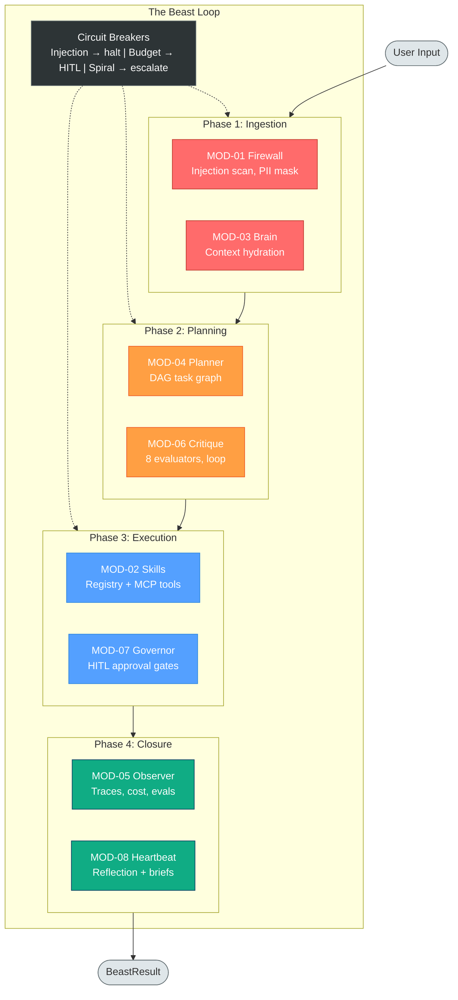
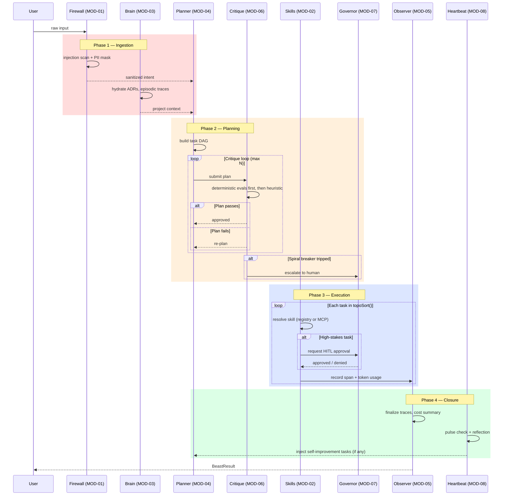

# Frankenbeast

<p align="center">
  
</p>


**Deterministic guardrails for AI agents.**

Frankenbeast is a safety framework that enforces guardrails *outside* the LLM's context window. Every check that can be deterministic is deterministic — regex-based injection scanning, schema validation, dependency whitelisting, DAG cycle detection, HMAC signature verification. These do not hallucinate.

## Modes

- `MCP mode`: Claude Code plugin/tool-provider surface via `@fbeast/mcp-suite`
- `Beast mode`: standalone orchestrator path with dashboard-first control and CLI parity

Both modes share `.fbeast/beast.db`.

## Why This Exists

LLM-based agents routinely lose safety constraints when context windows compress, hallucinate tool calls that violate architectural rules, and take destructive actions without human oversight. Frankenbeast solves this by placing safety enforcement in a deterministic pipeline that the LLM cannot bypass, forget, or summarise away.

**The key guarantee:** Safety constraints survive context-window compression because they are enforced by the firewall pipeline, not by the LLM prompt.

## Architecture

Frankenbeast is currently organized as 10 npm workspace packages under `packages/*`. Several originally separate MOD packages have been consolidated into the orchestrator or MCP suite: firewall/security middleware, skills/provider loading, heartbeat/reflection, external comms, and MCP registration are current implementation surfaces inside `franken-orchestrator` and `@fbeast/mcp-suite`, not standalone package directories.

The diagrams below describe the Beast-loop model and still use MOD labels as capability names. For the exact current package map, treat the package inventory table as authoritative.

See [docs/ARCHITECTURE.md](docs/ARCHITECTURE.md) for the full interconnection diagram.



### Beast Loop Sequence



### Module Interconnections


## Current workspace packages

| Package | Current role |
|---------|--------------|
| `franken-brain` | SQLite-backed working memory, episodic event recall, recovery checkpoints, serialization/hydration. |
| `franken-planner` | Intent-to-DAG planning primitives, linear/parallel/recursive strategies, HITL plan export, recovery task insertion. |
| `@frankenbeast/observer` | Trace/span lifecycle, token and cost tracking, circuit breaker, loop detection, export adapters, local trace viewing. |
| `@franken/critique` | Deterministic/heuristic critique pipeline and correction-request loop; it evaluates and returns feedback for callers to apply. |
| `@franken/governor` | Trigger evaluation, approval gateway/channels, audit recording, HMAC/session-token helpers for HITL decisions. |
| `@franken/types` | Shared TypeScript types plus runtime Zod schemas. |
| `franken-orchestrator` | Beast Loop, CLI, issue runner, provider registry, middleware, chat/network/comms/security/skills/dashboard/analytics HTTP routes. |
| `@fbeast/mcp-suite` | `fbeast` CLI, MCP servers, hooks, proxy server, shared `.fbeast/beast.db`, Beast-mode activation shim. |
| `@frankenbeast/web` | React dashboard for chat, tracked Beast agents, network controls, analytics/cost/safety views. |
| `@fbeast/live-bench` | Live CLI benchmark tooling. |

Historical docs and ADRs may still mention removed packages such as `frankenfirewall`, `franken-skills`, `franken-heartbeat`, `franken-mcp`, and `franken-comms`. Current code paths for those capabilities live in the packages above.

### Core Principles

- **Determinism over probabilism.** Regex-based injection scanning, schema validation, HMAC verification — these do not hallucinate.
- **LLM-agnostic.** The firewall is a model-agnostic proxy. Adding a new provider means implementing one `IAdapter` interface.
- **Immutable safety constraints.** Guardrails live in the firewall pipeline, not in the LLM prompt. They cannot be compressed or forgotten.
- **Human-in-the-loop as a first-class primitive.** High-stakes actions require cryptographically signed human approval.
- **Full auditability.** Every decision is traced, costed, and exportable.

## HTTP surface

The shipped Hono HTTP surface is integrated in `franken-orchestrator`'s chat server (`packages/franken-orchestrator/src/http/chat-app.ts` and `chat-server.ts`). The `frankenbeast chat-server` runtime always mounts chat (with WebSocket chat on `/v1/chat/ws`), network, and analytics routes; tracked Beast agents/SSE (`/v1/beasts/*`) routes mount only when an operator token resolves (loopback dev mode run without a token omits them), and skills/dashboard routes activate when a provider registry is configured. The comms (`/api/comms`) and security (`/api/security`) routes are mounted only when `createChatApp()` is given `commsConfig`/`commsRuntime` and `securityConfig` respectively — the default `chat-server` CLI path does not pass those, so those endpoints are not exposed there. The old standalone Firewall/Critique/Governor service table is historical rather than the current local runtime shape.

## Prerequisites

- **Node.js** >= 20.0.0 for root package metadata; orchestrator/dashboard runtime workflows require Node.js >= 22.0.0
- **npm** >= 10.0.0

### Optional

- **ChromaDB** — required for semantic memory (MOD-03). Not needed for unit/integration tests.
- **LLM API key** — `ANTHROPIC_API_KEY` or `OPENAI_API_KEY` for runtime use. Not needed for tests (mocked).
- **Docker** — for running the local dev stack (ChromaDB, Grafana, Tempo).

## Quick Start

```bash
# Clone the repository
git clone <repo-url> frankenbeast
cd frankenbeast

# Install all dependencies
npm install

# Build all modules
npm run build

# Run root-level integration tests
npm test

# Run root-level Vitest tests only
npm run test:root
```

See [docs/guides/quickstart.md](docs/guides/quickstart.md) for the full setup guide including Docker services.

## Run the Dashboard with MCP Mode

Use this path when you installed `@fbeast/mcp-suite` and ran `fbeast mcp init`, and want a browser view of the same project telemetry. MCP servers, hooks, Beast mode, and the dashboard share the `.fbeast/beast.db` under the project root you point the backend at.

From the project where you initialized MCP:

```bash
# Install the suite persistently so `fbeast` and the `fbeast-*` MCP server
# binaries stay on PATH. A one-shot `npx` won't work here: `mcp init` registers
# servers as bare `fbeast-memory`/`fbeast-proxy` commands the AI client spawns
# later, so those binaries must remain installed after setup.
npm install -g @fbeast/mcp-suite

# One-time MCP setup. Add --hooks if you want tool-call governance and audit logs.
fbeast mcp init --hooks
```

From this Frankenbeast repo, start the dashboard backend against that same project root:

```bash
npm --workspace franken-orchestrator run chat-server -- --base-dir /path/to/your-project
```

If you initialized MCP in this repo, omit `--base-dir`.

In a second terminal, start the web UI:

```bash
npm --workspace @frankenbeast/web run dev:chat
```

Open the Vite URL, usually `http://127.0.0.1:5173/`. The dashboard talks to the chat server on `http://127.0.0.1:3737` and reads the same observer, governor, cost, and Beast data written by MCP mode in that project.

If you run the backend on a different port:

```bash
npm --workspace franken-orchestrator run chat-server -- --base-dir /path/to/your-project --port 4242
VITE_API_URL=http://127.0.0.1:4242 npm --workspace @frankenbeast/web run dev
```

For Beast controls, set the operator token once in the repo root `.env` so both the server and dashboard see it:

```env
FRANKENBEAST_BEAST_OPERATOR_TOKEN=<token-from-frankenbeast-init>
```

See [Run the Dashboard Chat](docs/guides/run-dashboard-chat.md) for provider overrides and troubleshooting.

## Usage

The CLI is available as `frankenbeast`, `franken`, or `frkn` — all are identical.

### Interactive Session (idea to PR)

```bash
# Start from scratch — interview, design, plan, execute
frankenbeast

# Start from an existing design document
frankenbeast --design-doc docs/my-feature-design.md

# Start from existing chunk files
frankenbeast --plan-dir ./my-chunks/
```

Rerunning against an existing `.fbeast/.build/.checkpoint` file can skip completed tasks. The `--resume` flag is parsed by the CLI, but it is not yet wired as a distinct resume mode.

### Subcommands

```bash
# Interview only — generates .fbeast/plans/design.md
frankenbeast interview

# Plan only — decomposes design doc into chunk files
frankenbeast plan --design-doc design.md

# Run only — executes chunks from .fbeast/plans/
frankenbeast run

# Interactive chat — two-tier REPL (conversational + execution)
frankenbeast chat

# Chat server — HTTP + WebSocket for franken-web dashboard
frankenbeast chat-server --port 3737

# GitHub issues — fetch, triage, and fix issues autonomously
frankenbeast issues --label bug --repo owner/repo
```

### Options

```
--base-dir <path>       Project root (default: cwd)
--base-branch <name>    Git base branch (default: main)
--budget <usd>          Budget limit in USD (default: 10)
--provider <name>       claude | codex | gemini | aider (default: claude)
--providers <list>      Comma-separated fallback chain (e.g. claude,gemini,aider)
--design-doc <path>     Path to design document
--plan-dir <path>       Path to chunk files directory
--config <path>         Path to config file (JSON)
--no-pr                 Skip PR creation after execution
--verbose               Debug logs + trace viewer on :4040
--reset                 Clear checkpoint and traces
--cleanup               Remove all build artifacts from .fbeast/.build/
--help                  Show help
```

**Issues-specific flags:**

```
--label <labels>        Comma-separated labels (e.g. critical,high)
--search <query>        GitHub search syntax
--milestone <name>      Filter by milestone
--assignee <user>       Filter by assignee
--limit <n>             Max issues to fetch (default: 30)
--repo <owner/repo>     Target repository (auto-inferred if omitted)
--dry-run               Preview triage without executing
```

**Chat server flags:**

```
--host <addr>           Server bind address (default: localhost)
--port <n>              Server port (default: 3737)
--allow-origin <url>    CORS origin for dashboard
```

### Project Layout

Running `frankenbeast` in any project creates:

```
your-project/
  .fbeast/
    config.json              # optional project config
    plans/
      design.md              # generated by interview
      01_chunk.md, 02_...    # generated from design
    .build/
      <plan-name>.checkpoint              # plan-scoped execution state
      <plan-name>-<datetime>-build.log    # plan-scoped session log (crash-safe, written incrementally)
      build-traces.db                     # observer traces
```

## Running Tests

```bash
# All package tests through Turborepo
npm test

# Per-package tests via Turborepo
npx turbo run test --filter=franken-brain

# Orchestrator E2E tests
cd packages/franken-orchestrator && npm run test:e2e
```

## Local Dev Environment

```bash
# Start supporting services (ChromaDB, Grafana, Tempo)
cp .env.example .env
docker compose up -d

# Seed ChromaDB with initial collections
npx tsx scripts/seed.ts

# Verify everything is running
npx tsx scripts/verify-setup.ts
```

## Secret Management

Frankenbeast stores secrets outside the config file. The config references secrets by **logical key** — a short string like `frankenbeast/operator-token` — and resolves them at boot via the configured `secureBackend`.

### How it works

1. `frankenbeast init` runs an interactive wizard that generates the operator token and persists it to your chosen backend.
2. The config file stores logical keys (not the secret values) under `network.operatorTokenRef`, `comms.orchestratorTokenRef`, and channel `*Ref` fields.
3. At startup, `SecretResolver` reads those keys from `ISecretStore` and injects the resolved values into the service dependencies.

### Backend options

| Backend | Key | Best for |
|---------|-----|----------|
| OS keychain (Keychain/GNOME/DPAPI) | `os-keychain` | Local dev on macOS, Linux, Windows |
| 1Password | `1password` | Teams using 1Password vaults |
| Bitwarden | `bitwarden` | Teams using Bitwarden |
| Local encrypted file | `local-encrypted` | CI/CD or offline environments |

Copy the relevant settings from `frankenbeast.example.json` into `.fbeast/config.json`, then set `network.secureBackend` there. `frankenbeast init` reads and updates `.fbeast/config.json`.

### Setup per backend

**Local encrypted file (the default):**
```bash
frankenbeast init   # interactive — prompts for a passphrase, generates and stores the token
```
When `network.secureBackend` is unset, init defaults to `local-encrypted`: the passphrase encrypts the local vault at `.fbeast/secrets.enc`. For CI/CD, set `FRANKENBEAST_PASSPHRASE` in the environment; `frankenbeast init --non-interactive` verifies an already-complete `.fbeast/config.json` and init state rather than creating a fresh vault.

**OS keychain:**
```json
{ "network": { "secureBackend": "os-keychain" } }
```
Set this in `.fbeast/config.json`, then run `frankenbeast init` — the token is generated and stored in the OS keychain automatically (no passphrase prompt).

**1Password / Bitwarden:**
```json
{ "network": { "secureBackend": "1password" } }
```
Set the backend in `.fbeast/config.json`, then run `frankenbeast init` (there is no `--backend` CLI flag). For 1Password, create or use a vault literally named `frankenbeast`; items are stored with titles like `frankenbeast/operator-token`. Bitwarden stores secure-note items with the same `frankenbeast/` title prefix. The CLI uses the official 1Password/Bitwarden CLI under the hood.

### Operator token setup

`frankenbeast init` generates a strong random operator token and stores it in the backend. To wire the franken-web dashboard:

1. Run `frankenbeast init` — it prints the token once after generation.
2. Copy the token into `packages/franken-web/.env.local` as `VITE_BEAST_OPERATOR_TOKEN=<token>`.
3. The orchestrator resolves the same token from the secret store on startup — both sides must match.

### Non-interactive / CI usage

```bash
export FRANKENBEAST_PASSPHRASE=<passphrase>
frankenbeast run --config frankenbeast.config.json
```

With `local-encrypted` backend and `FRANKENBEAST_PASSPHRASE` set, the orchestrator decrypts the vault without prompting.

### References

- [ADR-018](docs/adr/018-secret-store-architecture.md) — secret store design and backend selection rationale
- [ADR-017](docs/adr/017-network-operator-control-plane.md) — network operator control plane and token auth

## Configuration

### Environment Variables

| Variable | Module | Required | Description |
|----------|--------|----------|-------------|
| `ANTHROPIC_API_KEY` | MOD-01 | Runtime only | Claude adapter API key |
| `OPENAI_API_KEY` | MOD-01 | Runtime only | OpenAI adapter API key |
| `CHROMA_HOST` | MOD-03 | If using semantic memory | ChromaDB server host (default: `localhost`) |
| `CHROMA_PORT` | MOD-03 | If using semantic memory | ChromaDB server port (default: `8000`) |
| `SLACK_WEBHOOK_URL` | MOD-07 | If using Slack approvals | Slack webhook for HITL notifications |

See [.env.example](.env.example) for the full list.

### Module Configuration

All modules use **dependency injection** — configuration is passed via constructor arguments, not globals or environment variables.

```typescript
// Orchestrator — via config file or CLI flags
frankenbeast plan --design-doc docs/my-feature-design.md --config frankenbeast.config.json

// Orchestrator chat/dashboard HTTP server
npm --workspace franken-orchestrator run chat-server -- --port 3737
```

## The Beast Loop

The orchestrator manages execution through four phases with circuit breakers at each stage.

### Phase 1: Ingestion & Hydration

**Modules:** MOD-01 (Firewall) + MOD-03 (Memory)

Raw user input is scrubbed for PII and scanned for injection attacks by the firewall. Relevant ADRs and episodic traces are loaded from memory to give the agent contextual wisdom.

### Phase 2: Recursive Planning

**Modules:** MOD-04 (Planner) + MOD-06 (Critique)

The Planner generates a Task DAG. The Critique module audits it with 8 evaluators (deterministic evaluators run first, then heuristic). If critique fails, the orchestrator forces a re-plan (max 3 iterations). After 3 failures, it escalates to a human via MOD-07.

### Phase 3: Validated Execution

**Modules:** MOD-02 (Skills) + MOD-07 (Governor)

Tasks execute in topological order from the DAG. High-stakes tasks pause for human approval via the Governor's trigger evaluators (budget, skill, confidence, ambiguity). Every task result is recorded to memory and traced.

### Phase 4: Observability & Closure

**Modules:** MOD-05 (Observer) + MOD-08 (Heartbeat)

The trace is closed and token spend summarised. In the current local CLI path, heartbeat is a thin reflection adapter (`ReflectionHeartbeatAdapter`, wired in `franken-orchestrator/src/cli/create-beast-deps.ts`), so heartbeat-driven self-improvement beyond per-run reflection should be treated as target architecture rather than a verified end-to-end local flow.

### Circuit Breakers

| Trigger | Action |
|---------|--------|
| Injection detected (MOD-01) | Immediate halt |
| Budget exceeded (MOD-05) | Escalate to HITL |
| Critique fails 3x (MOD-06) | Escalate to human |

### Resilience

- **Context serialization** — BeastContext snapshots saved to disk for crash recovery
- **Graceful shutdown** — SIGTERM/SIGINT handlers save state before exit
- **Module health checks** — all 8 modules probed on startup

## Adding a New LLM Provider

Frankenbeast is LLM-agnostic through the orchestrator provider registry. CLI providers live under `packages/franken-orchestrator/src/skills/providers`, API providers live under `packages/franken-orchestrator/src/providers`, and configuration schemas live under `packages/franken-orchestrator/src/config`. See [docs/guides/add-llm-provider.md](docs/guides/add-llm-provider.md) for the current extension points.

## Wrapping External Agents

The currently shipped integration path is to call the orchestrator runtime, use `@fbeast/mcp-suite` tools/hooks, or implement BeastLoop dependencies around your agent components. The old standalone firewall HTTP proxy guide is historical; see [docs/guides/wrap-external-agent.md](docs/guides/wrap-external-agent.md) for current options and caveats.

## Examples

There is no current top-level `examples/` directory in this repo. Use the package READMEs, `docs/guides/quickstart.md`, `docs/guides/run-cli-beast.md`, `docs/guides/run-dashboard-chat.md`, and implementation-adjacent tests as runnable examples. Older references to provider quickstarts or an OpenClaw/firewall-proxy example are pre-consolidation documentation.

## Martin Loop Build System

Frankenbeast includes an observer-powered autonomous build runner (MartinLoop) integrated into the orchestrator — iterative AI loops that process chunk files with deterministic completion detection.

Features:
- **Observer tracing** — TraceContext spans per iteration, TokenCounter + CostCalculator per chunk
- **Budget enforcement** — CircuitBreaker stops execution when spend exceeds limit
- **Loop detection** — LoopDetector identifies stuck sessions
- **Checkpoint/resume** — crash recovery via FileCheckpointStore
- **Chunk sessions** — canonical execution state with pre-compaction snapshots and context-window-aware compaction at >= 85% usage
- **Rate limit handling** — automatic provider fallback chain (e.g. Claude → Gemini → Aider)
- **Git isolation** — per-chunk branches via GitBranchIsolator, auto-commit, merge back to base
- **4 pluggable providers** — Claude, Codex, Gemini, Aider via ProviderRegistry

See [docs/beast-loop-explained.md](docs/beast-loop-explained.md) for the full iteration mechanics.

## Chat System

The `frankenbeast chat` REPL provides a two-tier interactive experience:

- **Tier 1 (Conversational)** — cheap model with session continuation, quirky spinner, colored output (cyan prompt, green replies)
- **Tier 2 (Execution)** — `/run <desc>` spawns a full-permissions CLI agent. `/plan <desc>` dispatches to planning. Natural language triggers execution via IntentRouter → EscalationPolicy
- **Output sanitization** — strips raw web search JSON blobs and REMINDER instruction blocks from Claude CLI output
- **Session persistence** — file-backed session store for conversation history across restarts

The `frankenbeast chat-server` exposes the same runtime over HTTP + WebSocket for the `franken-web` dashboard.

## Communications Gateway

External communications are implemented in `franken-orchestrator` under `packages/franken-orchestrator/src/comms`; there is no current standalone `franken-comms` workspace package. The gateway keeps deterministic session mapping for supported channels:

| Channel | Transport | Security |
|---------|-----------|----------|
| Slack | Events API + Interactivity | HMAC-SHA256 signature verification |
| Discord | Gateway events | ED25519 signature verification |
| Telegram | Webhook | Token-based authentication |
| WhatsApp | Cloud API | SHA256 signature verification |

Channels route through the orchestrator comms pipeline. See [ADR-016](docs/adr/016-external-comms-gateway.md) for the original gateway decision and the orchestrator comms source for current implementation details.

## Project Status

| Phase | Description | Status |
|-------|-------------|--------|
| 1 | Individual Module Implementation | Complete |
| 2 | LLM-Agnostic Adapter Layer | Complete (PRs 15-18) |
| 3 | Inter-Module Contracts & Shared Types | Complete (PRs 19-24) |
| 4 | The Orchestrator ("Beast Loop") | Complete (PRs 25-30) |
| 5 | Guardrails as a Service (HTTP) | Complete (PRs 31-35) |
| 6 | End-to-End Testing & Hardening | Complete (PRs 36-39) |
| 7 | CLI & Developer Experience | Complete (PRs 40-42) |
| 8 | CLI Skill Execution (Martin Loop) | Complete |
| 9 | Interactive Chat & Two-Tier Dispatch | Complete |
| 10 | Chat Server (HTTP + WebSocket) | Complete |
| 11 | External Comms (Slack/Discord/Telegram/WhatsApp) | Complete |
| 12 | GitHub Issues Pipeline | Complete |

Run `npm test`, `npm run typecheck`, and `npm run build` for the current baseline. The workspace currently contains 10 package manifests under `packages/*`; avoid relying on stale static test-count claims in older docs.

See [docs/PROGRESS.md](docs/PROGRESS.md) for the full PR-by-PR breakdown.

### In Progress

- **Web Dashboard** — React-based UI (`franken-web`) for chat, tracked Beast agents, network control, analytics/cost/safety views, and settings.
- **Escalation Policy Hardening** — Refining intent routing and tier escalation logic for the chat REPL.

## Development

### Working on a package

All packages live under `packages/` in the monorepo:

```bash
# Build and test a single package
npx turbo run test --filter=franken-brain
npx turbo run build --filter=franken-brain

# Or work directly in the package
cd packages/franken-brain && npm test
```

### Testing patterns

All modules follow the same patterns:

- **Vitest** as test runner
- **Dependency injection** — all external deps are constructor-injected
- **Mock factories** — `vi.fn()` stubs for port interfaces
- **No I/O in unit tests** — real SQLite only in integration tests (`:memory:` mode)
- **Zod validation** at all system boundaries

### Project structure

```
frankenbeast/
├── README.md
├── package.json                 # Root workspace + Turborepo scripts
├── turbo.json                   # Build orchestration (build, test, typecheck)
├── docker-compose.yml           # Local dev stack (ChromaDB, Grafana, Tempo)
├── frankenbeast.config.example.json
├── assets/img/                  # Project logos
├── docs/
│   ├── ARCHITECTURE.md          # System overview with Mermaid diagrams
│   ├── PROGRESS.md              # PR-by-PR implementation tracker
│   ├── RAMP_UP.md               # Concise agent onboarding doc
│   ├── CONTRACT_MATRIX.md       # Port interface compatibility matrix
│   ├── beast-loop-explained.md  # Iteration mechanics deep dive
│   ├── adr/                     # Architecture Decision Records
│   ├── guides/                  # Quickstart, add-provider, wrap-agent, run-dashboard-chat
│   └── plans/                   # Design docs and implementation plans
├── tests/                       # Root-level integration tests
├── scripts/                     # seed.ts, verify-setup.ts
├── packages/
│   ├── franken-brain/           # MOD-03: Memory Systems
│   ├── franken-planner/         # MOD-04: Planning & Decomposition
│   ├── franken-observer/        # MOD-05: Observability
│   ├── franken-critique/        # MOD-06: Self-Critique & Reflection
│   ├── franken-governor/        # MOD-07: HITL & Governance
│   ├── franken-types/           # Shared type definitions
│   ├── franken-orchestrator/    # The Beast Loop & CLI (bin: frankenbeast)
│   ├── franken-mcp-suite/       # MCP suite CLI, servers, hooks, proxy
│   ├── live-bench/              # Live CLI benchmark tooling
│   └── franken-web/             # React web dashboard (dev tool)
└── .fbeast/               # Project-scoped runtime state (gitignored)
```

## Documentation

- [Architecture](docs/ARCHITECTURE.md) — system overview with Mermaid diagrams
- [Beast Loop Explained](docs/beast-loop-explained.md) — the 5 interlocking loops and their mechanics
- [Quickstart Guide](docs/guides/quickstart.md) — get running in 7 steps
- [Run the Dashboard Chat](docs/guides/run-dashboard-chat.md) — start the WebSocket chat server and dashboard locally
- [Run the Network Operator](docs/guides/run-network-operator.md) — start Frankenbeast request-serving services through `frankenbeast network`
- [Add an LLM Provider](docs/guides/add-llm-provider.md) — implement `IAdapter` in 4 steps
- [Wrap an External Agent](docs/guides/wrap-external-agent.md) — firewall-as-proxy or full orchestration
- [Contract Matrix](docs/CONTRACT_MATRIX.md) — all port interfaces documented
- [ADRs](docs/adr/) — architectural decisions and rationale
- [Design Plans](docs/plans/) — design docs and implementation plans

## License

ISC
