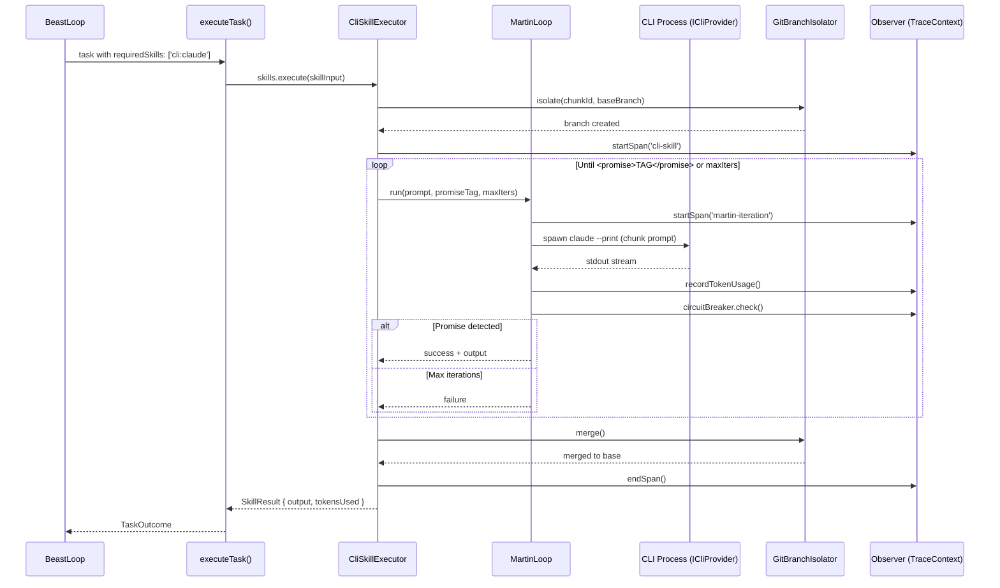
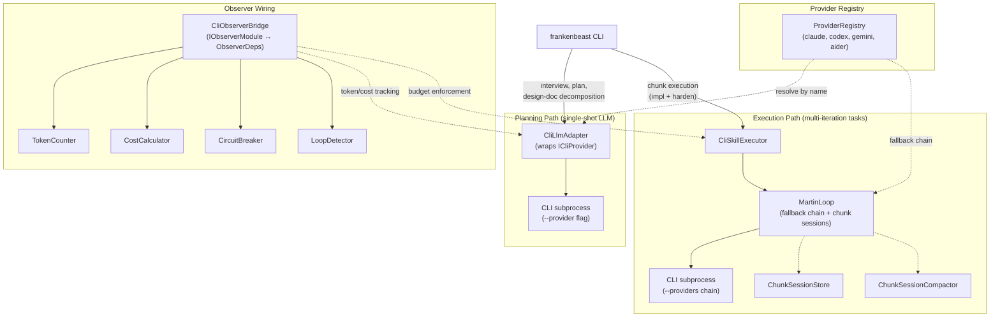
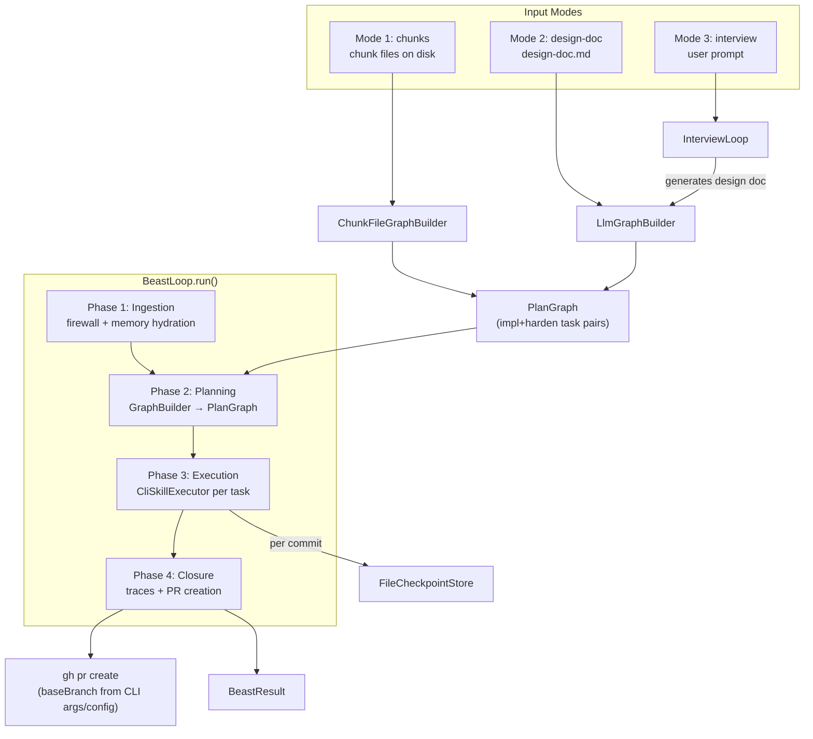
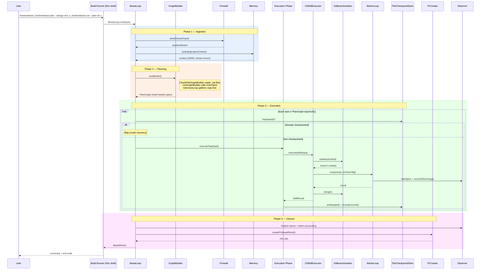
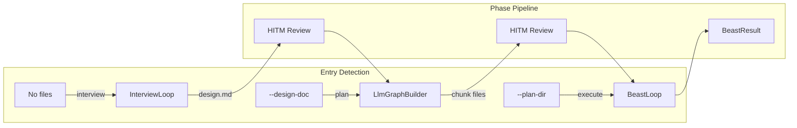
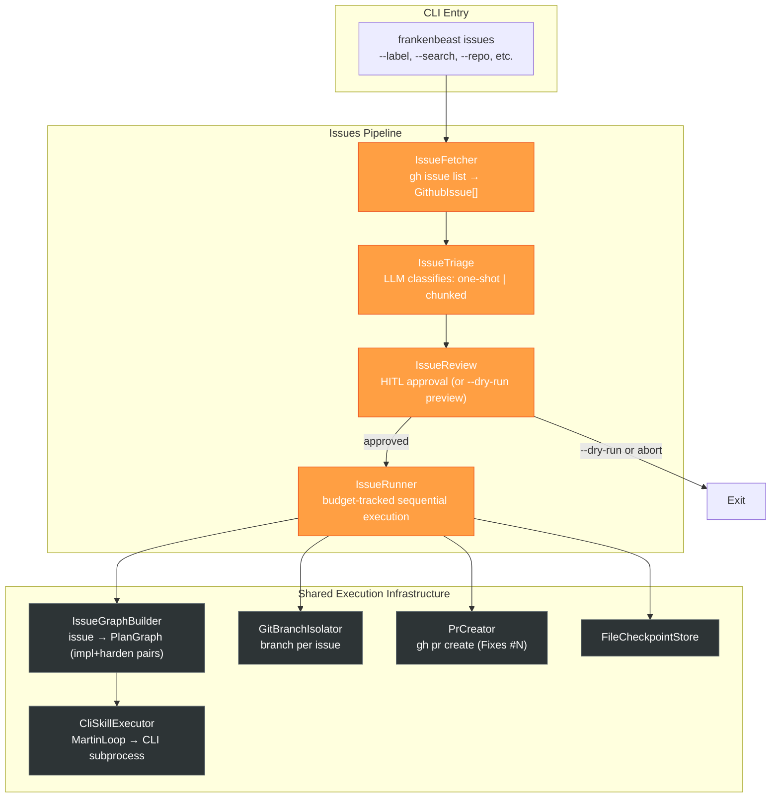
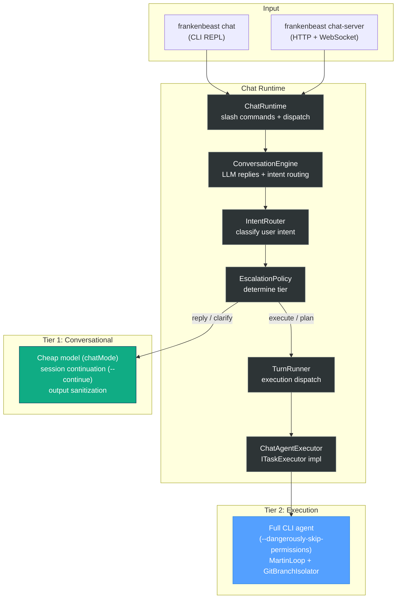
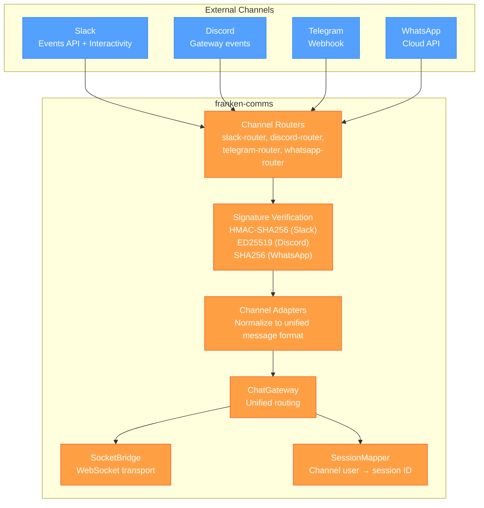
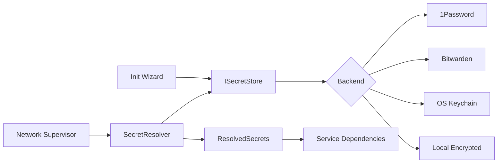

# Frankenbeast Architecture

## System Overview

Frankenbeast is a deterministic guardrails framework for AI agents, organized as an npm workspaces monorepo with Turborepo. All 13 packages live under `packages/`. See [ADR-011](adr/011-monorepo-migration.md).

This document mixes two views:

- **Current local CLI path**: what is actually wired in `franken-orchestrator` today
- **Target architecture**: the broader end-state diagrams for the full Frankenbeast system

Unless a section explicitly says otherwise, diagrams should be read as target architecture and the prose should call out current local limitations where they matter.

| Package | Role |
|---------|------|
| `frankenfirewall` | MOD-01: LLM proxy with injection detection, PII masking, and response validation |
| `franken-skills` | MOD-02: Skill registry and discovery |
| `franken-brain` | MOD-03: Working + Episodic + Semantic memory |
| `franken-planner` | MOD-04: DAG-based task planning with CoT gates |
| `franken-observer` | MOD-05: Tracing, cost tracking, and eval framework |
| `franken-critique` | MOD-06: Self-critique pipeline with deterministic + heuristic evaluators |
| `franken-governor` | MOD-07: Human-in-the-loop governance and approval gating |
| `franken-heartbeat` | MOD-08: Continuous improvement, reflection, and morning briefs |
| `franken-mcp` | MCP server registry — stdio transport, tool discovery, constraint-aware tool execution |
| `franken-types` | Shared type definitions (TaskId, Severity, Result, TokenSpend, etc.) |
| `franken-orchestrator` | The Beast Loop — wires all modules into a 4-phase agent pipeline |
| `franken-comms` | External communications gateway — Slack, Discord, Telegram, WhatsApp with signature verification |
| `franken-web` | React web dashboard — chat UI, tracked-agent launch/detail flow, configuration, metrics visualization (dev tool) |

## The Beast Loop (franken-orchestrator)

The orchestrator runs 4 sequential phases:

```
User Input → [1. Ingestion] → [2. Planning] → [3. Execution] → [4. Closure] → BeastResult
                  │                 │                │                │
              Firewall          Planner          Skills          Observer
              Memory            Critique         Governor        Heartbeat
                                                 MCP Registry
```

1. **Ingestion** — Firewall sanitizes input (injection/PII), Memory hydrates project context
2. **Planning** — Planner creates task DAG, Critique reviews in loop (max N iterations)
3. **Execution** — Tasks run in topological order with HITL governor gates. In the current local CLI path, `executionType: 'cli'` tasks run through `CliSkillExecutor`; MCP remains part of the target architecture unless a concrete `IMcpModule` is wired.
4. **Closure** — Token accounting, optional heartbeat pulse, result assembly

**Circuit breakers** halt execution on: injection detection (immediate halt), budget exceeded (HITL escalation), critique spiral (HITL escalation).

**Resilience**: Context serialization to disk, graceful SIGTERM/SIGINT handling, module health checks on startup.

### Current Local CLI Path

The current local CLI path is mixed rather than fully wired:

- Real: `CliLlmAdapter`, `CliObserverBridge`, `CliSkillExecutor`, `MartinLoop`, `GitBranchIsolator`, `FileCheckpointStore`, chunk-session store/renderer/compactor/GC
- Stubbed in `src/cli/dep-factory.ts`: firewall, skills registry, memory, planner port, critique, governor, heartbeat
- `--resume` is parsed but not wired as a distinct resume mode in `run.ts`
- PR creation is wired; the dep factory resolves target branch from CLI args/config via `baseBranch`
- The CLI path imports concrete observer classes from `@frankenbeast/observer`, so it is not purely ports-only today

## Orchestrator Internals

### CLI Skill Execution Path

The orchestrator supports `executionType: 'cli'` skills that spawn external CLI AI tools (claude, codex, gemini, aider) as child processes via the pluggable `ProviderRegistry`. This absorbs the Martin loop build runner into the orchestrator, reusing existing observer, planner, and circuit breaker infrastructure.

**Components:**

| Component | Location | Responsibility |
|-----------|----------|----------------|
| `ProviderRegistry` | `packages/franken-orchestrator/src/skills/providers/cli-provider.ts` | In-memory registry of `ICliProvider` implementations. `createDefaultRegistry()` registers all 4 built-in providers (claude, codex, gemini, aider). Lookup by name with `get(name)`. |
| `ICliProvider` | `packages/franken-orchestrator/src/skills/providers/cli-provider.ts` | Interface for CLI agent providers: `buildArgs`, `normalizeOutput`, `estimateTokens`, `isRateLimited`, `parseRetryAfter`, `filterEnv`, `supportsStreamJson`, native-session capability, default context-window size. |
| `ClaudeProvider` | `packages/franken-orchestrator/src/skills/providers/claude-provider.ts` | Claude CLI provider. `claude --print` with stream-json, strips `CLAUDE*` env vars. |
| `CodexProvider` | `packages/franken-orchestrator/src/skills/providers/codex-provider.ts` | Codex CLI provider. `codex exec --full-auto --json`. |
| `GeminiProvider` | `packages/franken-orchestrator/src/skills/providers/gemini-provider.ts` | Gemini CLI provider. `gemini -p --yolo` with stream-json, strips `GEMINI*`/`GOOGLE*` env vars. |
| `AiderProvider` | `packages/franken-orchestrator/src/skills/providers/aider-provider.ts` | Aider CLI provider. `aider --message --yes-always`. LiteLLM handles retries internally. |
| `CliLlmAdapter` | `packages/franken-orchestrator/src/adapters/cli-llm-adapter.ts` | Implements `IAdapter` by wrapping an `ICliProvider` for single-shot LLM completions. Used by plan/interview phases. Delegates env filtering and output normalization to the provider. |
| `CliObserverBridge` | `packages/franken-orchestrator/src/adapters/cli-observer-bridge.ts` | Bridges `IObserverModule` ↔ `ObserverDeps`. Wires real `TokenCounter`, `CostCalculator`, `CircuitBreaker`, `LoopDetector` from franken-observer into the CLI pipeline and estimates context-window usage for compaction. |
| `CliSkillExecutor` | `packages/franken-orchestrator/src/skills/cli-skill-executor.ts` | Implements skill execution for `executionType: 'cli'`. Spawns CLI tools, runs MartinLoop, manages recovery commits, and passes chunk-session services into the loop. |
| `MartinLoop` | `packages/franken-orchestrator/src/skills/martin-loop.ts` | Core loop: load or create canonical `ChunkSession`, render the provider request, capture output, snapshot before compaction, compact at `>= 85%` usage, and continue until `<promise>TAG</promise>` or max iterations. Rate-limit cascade still rotates through fallback providers. |
| `FileChunkSessionStore` | `packages/franken-orchestrator/src/session/chunk-session-store.ts` | Persists canonical chunk execution state under `.frankenbeast/.build/chunk-sessions/<plan>/<chunk>.json`. |
| `FileChunkSessionSnapshotStore` | `packages/franken-orchestrator/src/session/chunk-session-snapshot-store.ts` | Writes immutable pre-compaction rollback snapshots under `.frankenbeast/.build/chunk-session-snapshots/`. |
| `ChunkSessionRenderer` | `packages/franken-orchestrator/src/session/chunk-session-renderer.ts` | Converts canonical chunk-session state into provider-specific prompts and native-session flags. |
| `ChunkSessionCompactor` | `packages/franken-orchestrator/src/session/chunk-session-compactor.ts` | Summarizes older transcript history into a compacted execution summary while preserving promise-tag and unresolved-error context. |
| `ChunkSessionGc` | `packages/franken-orchestrator/src/session/chunk-session-gc.ts` | Removes expired chunk-session artifacts and orphaned snapshots; `--cleanup` removes them eagerly. |
| `GitBranchIsolator` | `packages/franken-orchestrator/src/skills/git-branch-isolator.ts` | Create feature branch, auto-commit dirty files, merge back to base branch. |

**Execution flow:**



#### CLI Adapter Paths

The CLI uses two distinct adapter paths depending on the operation:



**Observer integration:** Each iteration records spans via `TraceContext.startSpan()`, token usage via `SpanLifecycle.recordTokenUsage()`, and cost via `CostCalculator`. The `CircuitBreaker` checks budget before each CLI spawn. `LoopDetector` detects repeated failures. `CliObserverBridge` also estimates rendered context-window usage so chunk execution can snapshot and compact before exceeding the provider budget.

#### Canonical Chunk Sessions

Chunk execution no longer relies on provider-native history as the source of truth. The canonical state lives under `.frankenbeast/.build/chunk-sessions/` and contains normalized transcript entries, provider metadata, compaction generation, context-window usage, and recovery metadata such as `lastKnownGoodCommit`.

Provider-native session continuation is now an optimization only:

- if the active provider supports native resume and has not changed, the renderer may set `sessionContinue`
- if the provider changes or its native state is lost, the next provider replays from the canonical chunk session
- before compaction, MartinLoop writes a snapshot to `.frankenbeast/.build/chunk-session-snapshots/`
- at `>= 85%` rendered context usage, the loop compacts transcript history into a `compaction_summary` and resumes from that compacted state

**Design reference:** See `docs/plans/2026-03-05-beast-runner-design.md` and [ADR-007](adr/007-cli-skill-execution-type.md).

### Full Pipeline (Approach C)

The CLI exposes three entry modes. The current local path can drive them through the same shell, but the dependency wiring is still partial, so the diagrams below should be read as target architecture with current local caveats noted above.

#### Three Input Modes

| Mode | Input | Who Decomposes | GraphBuilder |
|------|-------|----------------|--------------|
| `chunks` | Pre-written `.md` chunk files on disk | Human (already done) | `ChunkFileGraphBuilder` |
| `design-doc` | A single design document | LLM via `LlmGraphBuilder` | `LlmGraphBuilder` |
| `interview` | Natural language goal/prompt | LLM interviews user, generates design doc, decomposes | `InterviewLoop` → `LlmGraphBuilder` |

All three modes produce a `PlanGraph` with impl+harden task pairs that execute through the same pipeline: `MartinLoop` → `GitBranchIsolator` → `CliSkillExecutor`. PR creation is wired through `PrCreator`, which resolves the target branch from CLI args/config via `baseBranch`.

#### Data Flow



#### Sequence Diagram — Full Pipeline



#### Two-Stage Task Model

Each chunk becomes two linked tasks in the `PlanGraph`:

```
impl:01_types → harden:01_types → impl:02_martin → harden:02_martin → ...
```

- **`impl:<chunkId>`** — TDD implementation. Depends on previous chunk's harden task.
- **`harden:<chunkId>`** — Review, test, fix. Depends on its own impl task.

This preserves the build-runner's impl+harden pattern inside the orchestrator's topological execution. The execution phase processes tasks in `PlanGraph.topoSort()` order — no special-casing needed.

#### Approach C Component Table

| Component | Location | Responsibility |
|-----------|----------|----------------|
| `FileCheckpointStore` | `packages/franken-orchestrator/src/checkpoint/file-checkpoint-store.ts` | Append-only checkpoint file for crash recovery. Records per-commit and milestone checkpoints. Plan-scoped: `.build/<plan-name>.checkpoint`. |
| `FileChunkSessionStore` | `packages/franken-orchestrator/src/session/chunk-session-store.ts` | JSON store for canonical chunk execution context. |
| `FileChunkSessionSnapshotStore` | `packages/franken-orchestrator/src/session/chunk-session-snapshot-store.ts` | Rollback snapshots written immediately before chunk compaction. |
| `ChunkFileGraphBuilder` | `packages/franken-orchestrator/src/planning/chunk-file-graph-builder.ts` | Reads numbered `.md` chunk files from a directory, produces `PlanGraph` with impl+harden task pairs. No LLM needed. |
| `LlmGraphBuilder` | `packages/franken-orchestrator/src/planning/llm-graph-builder.ts` | Takes a design doc string, calls `ILlmClient.complete()` with a decomposition prompt, parses response into a `PlanGraph`. |
| `InterviewLoop` | `packages/franken-orchestrator/src/planning/interview-loop.ts` | Interactive Q&A loop using `ILlmClient` to gather requirements, produces a design doc string, feeds into `LlmGraphBuilder`. |
| `PrCreator` | `packages/franken-orchestrator/src/closure/pr-creator.ts` | Runs `gh pr create`. Generates title + body from `BeastResult`. In the current local CLI dep wiring, target branch is still hardcoded to `main`. |
| `BeastLogger` | `packages/franken-orchestrator/src/logging/beast-logger.ts` | Color-coded logger with ANSI badges and service highlighting. Streams log entries to disk incrementally (crash-safe) as `.build/<plan-name>-<datetime>-build.log`. |
| `CLI args/config/run` | `packages/franken-orchestrator/src/cli/args.ts`, `config-loader.ts`, `run.ts` | Thin CLI shell (~150 lines): arg parsing, dep construction, `BeastLoop.run()`, summary display. |
| Execution checkpoint wiring | `packages/franken-orchestrator/src/phases/execution.ts` | Checks `checkpoint.has(taskId)` before each task, writes checkpoint after completion. Handles dirty-file resume. |
| Planning GraphBuilder wiring | `packages/franken-orchestrator/src/phases/planning.ts` | Uses `GraphBuilder.build()` when available, falls back to `IPlannerModule.createPlan()`. |

#### Crash Recovery

Per-commit checkpoints enable crash recovery. On resume:

| State on Resume | Action |
|-----------------|--------|
| Clean, HEAD matches last checkpoint | Continue from next iteration |
| Clean, no checkpoint for this task | Start task fresh |
| Dirty files, tests pass | Auto-commit as recovery commit, continue |
| Dirty files, tests fail | Reset to last checkpoint commit |

Chunk-session recovery complements file checkpoints:

- every chunk keeps canonical execution context in `.build/chunk-sessions/`
- recovery commits update `lastKnownGoodCommit` inside the chunk session
- compaction writes rollback snapshots before transcript surgery
- `ChunkSessionGc` prunes expired sessions and orphaned snapshots during CLI startup

**Design reference:** See [Approach C Full Pipeline Design](plans/2026-03-05-approach-c-full-pipeline-design.md) and [ADR-008](adr/008-approach-c-full-pipeline.md).

## CLI Pipeline

The `frankenbeast` CLI is the main local entrypoint. This section describes the current local CLI path, not the fully wired target architecture:



All project state lives in `.frankenbeast/` at the project root.

**Provider selection:** `--provider <name>` sets the primary CLI agent (default: `claude`). `--providers <list>` sets a comma-separated fallback chain for rate-limit cascading (e.g., `claude,gemini,aider`). The config file `providers` section supports `default`, `fallbackChain`, and per-provider `overrides` (command path, model, extra args). CLI args take precedence over config file values.

**Design reference:** See [CLI E2E Design](plans/2026-03-06-cli-e2e-design.md), [ADR-009](adr/009-global-cli-design.md), and [ADR-010](adr/010-pluggable-cli-providers.md).

## Issues Pipeline

The `frankenbeast issues` subcommand fetches GitHub issues and executes fixes autonomously. It runs as a separate pipeline from the chunk-based BeastLoop, reusing the same `CliSkillExecutor`, `GitBranchIsolator`, and `PrCreator` infrastructure.

### Pipeline Flow



### Component Table

| Component | Location | Responsibility |
|-----------|----------|----------------|
| `IssueFetcher` | `packages/franken-orchestrator/src/issues/issue-fetcher.ts` | Wraps `gh issue list` with filters (label, milestone, search, assignee, repo, limit). The canonical repo is resolved in the CLI/session layer from `--repo`, `--target-upstream`, or `gh repo view`. |
| `IssueTriage` | `packages/franken-orchestrator/src/issues/issue-triage.ts` | LLM-powered classification of issues as `one-shot` (single file, simple fix) or `chunked` (multi-file, architectural). Retries on parse failure. |
| `IssueGraphBuilder` | `packages/franken-orchestrator/src/issues/issue-graph-builder.ts` | Converts a triaged issue into a `PlanGraph`. One-shot issues get 2 tasks (impl + harden). Chunked issues are LLM-decomposed into N chunk pairs with linear dependencies. |
| `IssueReview` | `packages/franken-orchestrator/src/issues/issue-review.ts` | HITL triage review. Displays severity-sorted table, prompts for approval. Supports edit loop to remove specific issues. `--dry-run` previews without executing. |
| `IssueRunner` | `packages/franken-orchestrator/src/issues/issue-runner.ts` | Orchestrates execution: sorts by severity, tracks budget (1 USD = 1M tokens), executes via `CliSkillExecutor`, creates PRs per issue, records checkpoints. Skips remaining issues when budget is exhausted. |

### Interaction with Existing Infrastructure

The issues pipeline does not run through `BeastLoop`. Instead, `Session.runIssues()` directly orchestrates the pipeline and reuses shared components:

- **`CliSkillExecutor`** — spawns CLI agents via `MartinLoop` with the provider fallback chain
- **`GitBranchIsolator`** — creates `issue-{number}` branches, merges back on success
- **`PrCreator`** — generates PRs with `Fixes #{issueNumber}` in the body
- **`FileCheckpointStore`** — enables crash recovery for interrupted issue processing

## HTTP Services (Hono)

Four modules expose HTTP servers:

| Service | Port | Endpoints |
|---------|------|-----------|
| Firewall | 9090 | `POST /v1/chat/completions`, `POST /v1/messages`, `GET /health` |
| Critique | — | `POST /v1/review`, `GET /health` |
| Governor | — | `POST /v1/approval/request`, `POST /v1/approval/respond`, `POST /v1/webhook/slack`, `GET /health` |
| Chat Server | 3737 | `GET /v1/chat/ws` (WebSocket), `POST /v1/chat/message`, `GET /health` |

## Shared Types (@franken/types)

Canonical type definitions shared across all modules:
- `TaskId` (branded string), `ProjectId`, `SessionId`
- `Severity` superset with module-specific subsets
- `RationaleBlock`, `VerificationResult`
- `ILlmClient`, `IResultLlmClient`
- `Result<T, E>` monad
- `TokenSpend`

## Module Interconnections

```mermaid
    graph TB
        User([User Input])

        subgraph "MOD-01: Frankenfirewall"
            direction TB
            FW_IN["Inbound Interceptors<br/>• Injection Scanner<br/>• PII Masker<br/>• Project Alignment"]
            FW_ADAPT["Adapter Pipeline<br/>• ClaudeAdapter<br/>• OpenAIAdapter<br/>• OllamaAdapter<br/>• (Extensible)"]
            FW_OUT["Outbound Interceptors<br/>• Schema Enforcer<br/>• Deterministic Grounder<br/>• Hallucination Scraper"]
            FW_IN --> FW_ADAPT --> FW_OUT
        end

        subgraph "MOD-02: Franken Skills"
            direction TB
            SK_REG["Skill Registry<br/>ISkillRegistry"]
            SK_DISC["Discovery Service<br/>Global + Local"]
            SK_VAL["Skill Validator<br/>Zod Contracts"]
            SK_DISC --> SK_REG
            SK_VAL --> SK_REG
        end

        subgraph "MOD-03: Franken Brain"
            direction TB
            MEM_WORK["Working Memory<br/>In-process turns"]
            MEM_EPIS["Episodic Memory<br/>SQLite traces"]
            MEM_SEM["Semantic Memory<br/>ChromaDB vectors"]
            MEM_ORCH["Memory Orchestrator"]
            MEM_PII["PII Guards<br/>Decorator pattern"]
            MEM_ORCH --> MEM_WORK
            MEM_ORCH --> MEM_EPIS
            MEM_ORCH --> MEM_SEM
            MEM_PII -.-> MEM_EPIS
            MEM_PII -.-> MEM_SEM
        end

        subgraph "MOD-04: Franken Planner"
            direction TB
            PL_INTENT["Intent Parser"]
            PL_DAG["DAG Builder<br/>Graph + Cycle Detection"]
            PL_STRAT["Planning Strategies<br/>• Linear<br/>• Parallel<br/>• Recursive"]
            PL_COT["CoT Gate<br/>RationaleBlock"]
            PL_EXEC["Task Executor"]
            PL_RECOV["Recovery Controller<br/>Self-correction loop"]
            PL_HITL["Plan HITL Gate<br/>Markdown export"]
            PL_INTENT --> PL_DAG --> PL_STRAT
            PL_STRAT --> PL_HITL --> PL_EXEC
            PL_EXEC --> PL_COT
            PL_EXEC --> PL_RECOV
        end

        subgraph "MOD-05: Franken Observer"
            direction TB
            OB_TRACE["Trace Context<br/>Spans + Lifecycle"]
            OB_COST["Cost Tracking<br/>TokenCounter + CostCalc"]
            OB_CB["Circuit Breaker<br/>Budget guard"]
            OB_EXPORT["Export Adapters<br/>• OTEL • SQLite<br/>• Langfuse • Prometheus<br/>• Tempo"]
            OB_EVAL["Eval Framework<br/>• ToolCallAccuracy<br/>• ADR Adherence<br/>• Golden Trace<br/>• LLM Judge"]
            OB_LOOP["Loop Detector<br/>+ PostMortem"]
            OB_TRACE --> OB_EXPORT
            OB_COST --> OB_CB
        end

        subgraph "MOD-06: Franken Critique"
            direction TB
            CR_PIPE["Critique Pipeline"]
            CR_DET["Deterministic Evaluators<br/>• Safety • GhostDep<br/>• LogicLoop • ADR"]
            CR_HEUR["Heuristic Evaluators<br/>• Factuality • Conciseness<br/>• Complexity • Scalability"]
            CR_BREAK["Circuit Breakers<br/>• MaxIteration<br/>• TokenBudget<br/>• ConsensusFailure"]
            CR_LOOP["Critique Loop"]
            CR_LESSON["Lesson Recorder"]
            CR_DET --> CR_PIPE
            CR_HEUR --> CR_PIPE
            CR_PIPE --> CR_LOOP
            CR_BREAK --> CR_LOOP
        end

        subgraph "MOD-07: Franken Governor"
            direction TB
            GOV_TRIG["Trigger Evaluators<br/>• Budget • Skill<br/>• Confidence • Ambiguity"]
            GOV_GW["Approval Gateway"]
            GOV_CHAN["Approval Channels<br/>• CLI • Slack"]
            GOV_SEC["Security<br/>HMAC-SHA256 Signing<br/>Session Tokens"]
            GOV_AUDIT["Governor Audit<br/>Recorder"]
            GOV_TRIG --> GOV_GW
            GOV_CHAN --> GOV_GW
            GOV_SEC --> GOV_GW
        end

        subgraph "MOD-08: Franken Heartbeat"
            direction TB
            HB_DET["Phase 1: Deterministic Check<br/>Watchlist, Git, Tokens"]
            HB_REFL["Phase 2: Reflection Engine<br/>LLM-powered analysis"]
            HB_DISP["Phase 3: Action Dispatcher<br/>Inject tasks + alerts"]
            HB_BRIEF["Morning Brief<br/>Generator"]
            HB_DET --> HB_REFL --> HB_DISP --> HB_BRIEF
        end

        subgraph "franken-mcp"
            direction TB
            MCP_CFG["Config Loader<br/>Zod-validated mcp-servers.json"]
            MCP_REG["McpRegistry<br/>IMcpRegistry<br/>Tool → Client routing"]
            MCP_CLI["McpClient (per server)<br/>JSON-RPC 2.0 lifecycle"]
            MCP_TRANS["StdioTransport<br/>child_process.spawn"]
            MCP_CONST["Constraint Resolver<br/>Module → Server → Tool"]
            MCP_CFG --> MCP_REG
            MCP_REG --> MCP_CLI
            MCP_CLI --> MCP_TRANS
            MCP_CONST --> MCP_REG
        end

        MCP_SERVERS[(MCP Server Processes<br/>VSCode / Filesystem / ...)]

        LLM[(LLM Providers<br/>Claude / OpenAI / Ollama / ...)]

        subgraph "Orchestrator: The Beast Loop"
            direction LR
            BL_INGEST["Phase 1<br/>Ingestion"]
            BL_PLAN["Phase 2<br/>Planning"]
            BL_EXEC["Phase 3<br/>Execution"]
            BL_CLOSE["Phase 4<br/>Closure"]
            BL_BREAK["Circuit Breakers<br/>• Injection<br/>• Budget<br/>• Critique Spiral"]
            BL_INGEST --> BL_PLAN --> BL_EXEC --> BL_CLOSE
            BL_BREAK -.-> BL_INGEST
            BL_BREAK -.-> BL_PLAN
            BL_BREAK -.-> BL_EXEC
        end

        %% === Orchestrator wiring ===
        BL_INGEST -- "sanitize" --> FW_IN
        BL_INGEST -- "hydrate" --> MEM_ORCH
        BL_PLAN -- "plan" --> PL_INTENT
        BL_PLAN -- "critique" --> CR_LOOP
        BL_EXEC -- "resolve" --> SK_REG
        BL_EXEC -- "approve" --> GOV_GW
        BL_CLOSE -- "trace" --> OB_TRACE
        BL_CLOSE -- "pulse" --> HB_DET

        %% === USER FLOW ===
        User --> BL_INGEST
        FW_ADAPT --> LLM
        LLM --> FW_ADAPT

        %% === MOD-01 → MOD-04: Sanitized Intent ===
        FW_OUT -- "getSanitizedIntent()<br/>→ Intent" --> PL_INTENT

        %% === MOD-01 ↔ MOD-02: Tool call grounding ===
        FW_OUT -- "validateToolCalls()<br/>against registry" --> SK_REG

        %% === MOD-04 → MOD-02: Skill discovery ===
        PL_DAG -- "getAvailableSkills()<br/>hasSkill()" --> SK_REG

        %% === MOD-04 → MOD-03: Context loading ===
        PL_DAG -- "getADRs()<br/>getKnownErrors()<br/>getProjectContext()" --> MEM_ORCH
        PL_EXEC -- "recordToolResult()" --> MEM_EPIS

        %% === MOD-04 → MOD-07: CoT verification ===
        PL_COT -- "verifyRationale()<br/>RationaleBlock" --> GOV_TRIG

        %% === MOD-06 → MOD-01: Safety rules ===
        CR_DET -- "getSafetyRules()<br/>executeSandbox()" --> FW_IN

        %% === MOD-06 → MOD-03: ADRs + lessons ===
        CR_DET -- "searchADRs()" --> MEM_SEM
        CR_LESSON -- "recordLesson()" --> MEM_EPIS

        %% === MOD-06 → MOD-05: Token spend ===
        CR_BREAK -- "getTokenSpend()" --> OB_COST

        %% === MOD-06 → MOD-07: Escalation ===
        CR_LOOP -- "requestHumanReview()<br/>on escalation" --> GOV_GW

        %% === MOD-07 → MOD-03: Audit trail ===
        GOV_AUDIT -- "record audit<br/>EpisodicTrace" --> MEM_EPIS

        %% === MOD-07 → MOD-02: HITL skill check ===
        GOV_TRIG -- "requires_hitl?" --> SK_REG

        %% === MOD-07 → MOD-05: Budget trigger ===
        GOV_TRIG -- "budget check" --> OB_CB

        %% === MOD-08 → MOD-03: Traces + lessons ===
        HB_REFL -- "getRecentTraces()<br/>getSuccesses/Failures()<br/>recordLesson()" --> MEM_ORCH

        %% === MOD-08 → MOD-05: Observability ===
        HB_DET -- "getTraces()<br/>getTokenSpend()" --> OB_TRACE

        %% === MOD-08 → MOD-04: Task injection ===
        HB_DISP -- "injectTask()<br/>self-improvement" --> PL_EXEC

        %% === MOD-08 → MOD-06: Audit conclusions ===
        HB_REFL -- "auditConclusions()" --> CR_LOOP

        %% === MOD-08 → MOD-07: Alerts + brief ===
        HB_BRIEF -- "sendMorningBrief()<br/>notifyAlert()" --> GOV_GW

        %% === MOD-05 ← All: Span emission ===
        PL_EXEC -. "emit spans" .-> OB_TRACE
        FW_ADAPT -. "emit spans" .-> OB_TRACE
        CR_LOOP -. "emit spans" .-> OB_TRACE
        GOV_GW -. "emit spans" .-> OB_TRACE

        %% === franken-mcp connections ===
        MCP_TRANS -- "stdin/stdout<br/>JSON-RPC 2.0" --> MCP_SERVERS
        BL_EXEC -- "callTool()" --> MCP_REG
        MCP_REG -- "tool definitions<br/>as skills" --> SK_REG
        MCP_CONST -- "constraint check<br/>requires_hitl?" --> GOV_TRIG

        %% === Issues Pipeline ===
        subgraph "Issues Pipeline"
            direction TB
            IS_FETCH["IssueFetcher<br/>gh issue list"]
            IS_TRIAGE["IssueTriage<br/>LLM classification"]
            IS_REVIEW["IssueReview<br/>HITL approval"]
            IS_RUNNER["IssueRunner<br/>budget-tracked execution"]
            IS_GRAPH["IssueGraphBuilder<br/>issue → PlanGraph"]
            IS_FETCH --> IS_TRIAGE --> IS_REVIEW --> IS_RUNNER
            IS_RUNNER --> IS_GRAPH
        end

        IS_RUNNER -- "execute tasks" --> BL_EXEC
        IS_GRAPH -- "PlanGraph" --> IS_RUNNER
        User -- "frankenbeast issues" --> IS_FETCH

        %% === Output back to user ===
        GOV_GW -- "approval<br/>requests" --> User
        HB_BRIEF -- "morning<br/>brief" --> User
        BL_CLOSE -- "final<br/>result" --> User
        IS_RUNNER -- "IssueOutcome[]" --> User

        %% === STYLING ===
        classDef firewall fill:#ff6b6b,stroke:#c0392b,color:#fff
        classDef skills fill:#54a0ff,stroke:#2e86de,color:#fff
        classDef brain fill:#5f27cd,stroke:#341f97,color:#fff
        classDef planner fill:#ff9f43,stroke:#ee5a24,color:#fff
        classDef observer fill:#10ac84,stroke:#0a3d62,color:#fff
        classDef critique fill:#f368e0,stroke:#c44569,color:#fff
        classDef governor fill:#feca57,stroke:#f6b93b,color:#333
        classDef heartbeat fill:#48dbfb,stroke:#0abde3,color:#333
        classDef orchestrator fill:#2d3436,stroke:#636e72,color:#fff
        classDef mcp fill:#a29bfe,stroke:#6c5ce7,color:#fff
        classDef external fill:#dfe6e9,stroke:#636e72,color:#333

        class MCP_CFG,MCP_REG,MCP_CLI,MCP_TRANS,MCP_CONST mcp
        class BL_INGEST,BL_PLAN,BL_EXEC,BL_CLOSE,BL_BREAK orchestrator
        class FW_IN,FW_ADAPT,FW_OUT firewall
        class SK_REG,SK_DISC,SK_VAL skills
        class MEM_WORK,MEM_EPIS,MEM_SEM,MEM_ORCH,MEM_PII brain
        class PL_INTENT,PL_DAG,PL_STRAT,PL_COT,PL_EXEC,PL_RECOV,PL_HITL planner
        class OB_TRACE,OB_COST,OB_CB,OB_EXPORT,OB_EVAL,OB_LOOP observer
        class CR_PIPE,CR_DET,CR_HEUR,CR_BREAK,CR_LOOP,CR_LESSON critique
        class GOV_TRIG,GOV_GW,GOV_CHAN,GOV_SEC,GOV_AUDIT governor
        class HB_DET,HB_REFL,HB_DISP,HB_BRIEF heartbeat
        classDef issues fill:#ff9f43,stroke:#ee5a24,color:#fff
        class IS_FETCH,IS_TRIAGE,IS_REVIEW,IS_RUNNER,IS_GRAPH issues
        class User,LLM,MCP_SERVERS external
```



## Port Interfaces (Hexagonal Architecture)

Most inter-module communication uses typed port interfaces defined in each module. The BeastLoop contracts are still port-oriented, but the current local CLI path is not purely abstracted because `CliObserverBridge` imports concrete classes from `@frankenbeast/observer`. See [CONTRACT_MATRIX.md](CONTRACT_MATRIX.md) for the full compatibility matrix.

| Port | Defined In | Consumed By |
|------|-----------|-------------|
| `IAdapter` | frankenfirewall | Orchestrator (ingestion) |
| `ISkillRegistry` | franken-skills | Planner, Orchestrator (execution) |
| `IMemoryOrchestrator` | franken-brain | Planner, Orchestrator (hydration) |
| `GuardrailsPort` | franken-critique | Critique evaluators |
| `MemoryPort` | franken-critique | Critique evaluators |
| `ObservabilityPort` | franken-critique | Critique circuit breakers |
| `EscalationPort` | franken-critique | Critique loop |
| `ApprovalChannel` | franken-governor | Orchestrator (execution) |
| `TriggerEvaluator` | franken-governor | Governor gateway |
| `ILlmClient` | @franken/types | Brain, Heartbeat |
| `IMcpRegistry` | franken-mcp | Orchestrator (execution), Skills |
| `IMcpTransport` | franken-mcp | McpClient (internal) |

## Deployment Modes

```
┌─────────────────────────────────────────────────────┐
│  Mode 1: Full Orchestration                         │
│  CLI → BeastLoop → all modules + MCP → BeastResult  │
└─────────────────────────────────────────────────────┘

┌─────────────────────────────────────────────────────┐
│  Mode 2: Firewall-as-Proxy                          │
│  External Agent → Firewall HTTP → LLM Provider      │
│  (standalone safety layer, no orchestrator needed)   │
└─────────────────────────────────────────────────────┘

┌─────────────────────────────────────────────────────┐
│  Mode 3: Critique-as-a-Service                      │
│  Any client → POST /v1/review → evaluation results  │
└─────────────────────────────────────────────────────┘

┌─────────────────────────────────────────────────────┐
│  Mode 4: MCP Tool Bridge                            │
│  Orchestrator → McpRegistry → MCP Servers (stdio)   │
│  (constraint-aware external tool execution)         │
└─────────────────────────────────────────────────────┘
```

## franken-mcp (MCP Server Registry)

Standalone MCP (Model Context Protocol) client library. Manages persistent connections to MCP servers via stdio transport, discovers their tools, and exposes a constraint-aware interface for calling them.

MCP servers are **not** skills — they are the execution substrate that skills and workflows leverage for deterministic interaction with the environment (VSCode, filesystem, databases, etc.).

### Architecture

```
Config (mcp-servers.json)
    │
    ▼
┌──────────────────────────────────────────┐
│  McpRegistry (IMcpRegistry)              │
│  ┌─────────────┐  ┌─────────────┐       │
│  │  McpClient   │  │  McpClient   │ ...  │
│  │  (server A)  │  │  (server B)  │      │
│  └──────┬───────┘  └──────┬───────┘      │
│         │                 │              │
│  ┌──────┴───────┐  ┌──────┴───────┐      │
│  │ StdioTransport│  │ StdioTransport│     │
│  └──────┬───────┘  └──────┬───────┘      │
└─────────┼─────────────────┼──────────────┘
          │ stdin/stdout     │ stdin/stdout
          ▼                  ▼
    MCP Server A       MCP Server B
```

### Constraint Resolution

Three-level cascade (most conservative defaults):

1. **Module defaults**: `{ is_destructive: true, requires_hitl: true, sandbox_type: "DOCKER" }`
2. **Server-level**: Overrides defaults for all tools in that server
3. **Tool-level**: Highest priority, per-tool overrides via `toolOverrides`

### Key Types

| Type | Purpose |
|------|---------|
| `McpToolDefinition` | Tool metadata: name, serverId, description, inputSchema, merged constraints |
| `McpToolConstraints` | `is_destructive`, `requires_hitl`, `sandbox_type` (DOCKER / WASM / LOCAL) |
| `McpToolResult` | Content array (text / image / resource_link) + isError flag |
| `McpServerInfo` | Server id, connection status, tool count, version info |
| `McpRegistryError` | Error with code: CONFIG_INVALID, TOOL_NOT_FOUND, CALL_FAILED, etc. |

### Resilience

- **Partial startup**: If 3 servers configured and 1 fails, the other 2 still work
- **Configurable timeouts**: `initTimeoutMs` (default 10s) and `callTimeoutMs` (default 30s) per-server
- **Graceful shutdown**: SIGTERM → 5s wait → SIGKILL, idempotent

## Examples

The `examples/` directory provides quickstart guides and integration patterns.

### Quickstart Examples

| Example | Provider | Key Pattern |
|---------|----------|-------------|
| `quickstart/claude-hello` | Claude (`claude-sonnet-4-6`) | ClaudeAdapter → UnifiedRequest/Response |
| `quickstart/openai-hello` | OpenAI (`gpt-4o`) | OpenAIAdapter → same unified interface |
| `quickstart/ollama-hello` | Ollama (`llama3.2`, local) | OllamaAdapter → zero-cost, offline capable |
| `quickstart/custom-adapter` | Groq (test-only) | Template for building new adapters |

All quickstarts follow the same adapter flow:

```
Create Adapter → Build UnifiedRequest → transformRequest() → execute() → transformResponse() → UnifiedResponse
```

### Integration Examples

| Example | Purpose |
|---------|---------|
| `openclaw-integration` | Docker Compose: Frankenbeast firewall as proxy for OpenClaw agent framework |

## Chat System Architecture

The chat system provides a two-tier interactive experience available via CLI REPL and HTTP+WebSocket server.

### Two-Tier Dispatch



### Key Components

| Component | Location | Responsibility |
|-----------|----------|----------------|
| `ChatRuntime` | `src/chat/runtime.ts` | Orchestrates all turn processing: slash commands, engine dispatch, execution. Returns `ChatRuntimeResult` with display messages, events, tier |
| `ConversationEngine` | `src/chat/conversation-engine.ts` | LLM completions via PromptBuilder. Session continuation skips full prompt after first turn |
| `IntentRouter` | `src/chat/intent-router.ts` | Classifies user input as reply, execute, plan, or clarify |
| `EscalationPolicy` | `src/chat/escalation-policy.ts` | Determines model tier (cheap vs premium) based on intent |
| `ChatAgentExecutor` | `src/chat/chat-agent-executor.ts` | `ITaskExecutor` implementation that spawns full-permissions CLI agent |
| `ChatRepl` | `src/cli/chat-repl.ts` | CLI REPL with colored output (cyan prompt, green replies), quirky spinner, input blocking |
| `sanitizeChatOutput` | `src/chat/output-sanitizer.ts` | Strips web search JSON blobs and REMINDER instruction blocks from Claude CLI output |
| `createChatRuntime` | `src/chat/chat-runtime-factory.ts` | Factory wiring engine, runtime, and turn runner from config options |

### Chat Server (HTTP + WebSocket)

The `frankenbeast chat-server` subcommand exposes the ChatRuntime over HTTP and WebSocket for the `franken-web` dashboard.

| Component | Location | Responsibility |
|-----------|----------|----------------|
| `startChatServer` | `src/http/chat-server.ts` | Bootstrap: TCP binding, token auth, session persistence, WebSocket attachment |
| `ChatSocketController` | `src/http/ws-chat-server.ts` | WebSocket connection management, chunk-based content delivery, turn event streaming |
| `chat-app.ts` | `src/http/chat-app.ts` | Hono HTTP routes for REST-based chat interactions |

**Design reference:** See [ADR-014](adr/014-chat-two-tier-dispatch.md), [ADR-016](adr/016-chat-server-entrypoint.md), and [ADR-018](adr/018-tracked-agent-init-workflow.md).

### Beast Control and Tracked Agents

The beast control surface is now agent-centric rather than run-centric.

- `tracked_agents` exist before a Beast run is dispatched and carry init metadata such as `initAction`, `chatSessionId`, lifecycle status, and `dispatchRunId`
- Beast runs remain the execution record, linked back to the tracked agent through `trackedAgentId`
- chat-backed init flows (`design-interview`, `chunk-plan`) create tracked agents first, bind them to the active chat session, emit init events, then dispatch runs after init completes
- the dashboard Beasts tab now launches tracked agents, renders typed file/directory controls, and shows tracked-agent detail with startup events plus linked run logs

#### Beast Daemon Execution Pipeline

When the daemon dispatches a Beast run, it spawns a subprocess managed by `ProcessBeastExecutor`:

1. **Config passthrough**: `ProcessBeastExecutor.start()` serializes `configSnapshot` to `.frankenbeast/.build/run-configs/<runId>.json` and passes `FRANKENBEAST_RUN_CONFIG=<path>` to the subprocess. The spawned process loads and validates via `loadRunConfigFromEnv()`. Config file is cleaned up on run completion, stop, or spawn failure.

2. **Process lifecycle**: `ProcessSupervisor` manages the child process with a three-way exit gate (`stdout closed + stderr closed + exit event`) to ensure all buffered output is captured before `onExit` fires. Early stdout/stderr arriving before attempt creation are buffered and flushed (to both logs and SSE) once the attempt ID is set.

3. **SSE event bus**: `BeastEventBus` publishes real-time events (`run.status`, `run.log`, `agent.status`) to SSE subscribers. Events flow from executor → run service → SSE routes. `SseConnectionTicketStore` implements single-use connection tickets (ADR-030) for authenticating EventSource connections without exposing bearer tokens in URLs.

4. **Status sync**: `BeastRunService.syncTrackedAgent()` propagates run status changes to tracked agents with full idempotency (no-op when status unchanged). `BeastDispatchService.createRun(startNow=true)` publishes initial `agent.status` events for both success and failure paths.

5. **Stop/kill escalation**: `stop()` sends SIGTERM, waits up to `defaultStopTimeoutMs` (10s), then escalates to SIGKILL. A terminal-status guard in `handleProcessExit` prevents double-writes when SIGKILL fires after `finishAttempt` has already updated the attempt.

Current beast-control routes:

| Route | Purpose |
|-------|---------|
| `GET /v1/beasts/catalog` | Operator-facing catalog definitions with typed prompt metadata |
| `POST /v1/beasts/agents` | Create a tracked agent in `initializing` |
| `GET /v1/beasts/agents` | List tracked agents |
| `GET /v1/beasts/agents/:id` | Hydrate tracked-agent detail and init events |
| `POST /v1/beasts/runs` | Create or dispatch a Beast run, optionally linked to a tracked agent |
| `GET /v1/beasts/runs/:id` + `/logs` | Read linked run detail and execution logs |
| `POST /v1/beasts/events/ticket` | Issue a single-use SSE connection ticket (bearer token required) |
| `GET /v1/beasts/events/stream` | SSE event stream (ticket-authenticated) |

## Communications Gateway (franken-comms)

Multi-channel external communications with deterministic session mapping (SHA256-based). See [ADR-016](adr/016-external-comms-gateway.md).

### Architecture



### Channel Security

| Channel | Verification Method |
|---------|-------------------|
| Slack | HMAC-SHA256 signature over request body with signing secret |
| Discord | ED25519 signature over timestamp + body with public key |
| Telegram | Token-based authentication |
| WhatsApp | SHA256 signature over payload with app secret |

## Web Dashboard (franken-web)

React-based development tool for chat, tracked-agent launch/detail flows, configuration, and metrics visualization. Lives in `packages/franken-web/`, connects to `frankenbeast chat-server` via WebSocket, and uses authenticated Beast control HTTP routes for operator actions. Not published to npm; private monorepo package for local development.

## Secret Store

Frankenbeast stores secrets outside the config file. Config references secrets by **logical key** (e.g. `frankenbeast/operator-token`). At boot, `SecretResolver` reads those keys from `ISecretStore` and injects the resolved values into service dependencies.

### Backends

| Backend | `secureBackend` value | Best for |
|---------|----------------------|----------|
| OS keychain (Keychain / GNOME / DPAPI) | `os-keychain` | Local development |
| 1Password | `1password` | Teams using 1Password vaults |
| Bitwarden | `bitwarden` | Teams using Bitwarden |
| Local encrypted file | `local-encrypted` | CI/CD and offline environments |

### Architecture



- `ISecretStore` — four-method interface: `get(key)`, `set(key, value)`, `delete(key)`, `has(key)`
- `SecretResolver` — reads `*Ref` fields from `OrchestratorConfig`, resolves each key, returns a typed `ResolvedSecrets` record
- `frankenbeast init` — interactive wizard: generates operator token, writes to backend
- `FRANKENBEAST_PASSPHRASE` — env var for headless `local-encrypted` decryption (CI/CD)
- Legacy backend keys (`macos-keychain`, `windows-credential-manager`, `linux-secret-service`) are remapped to `os-keychain` at parse time

**Design reference:** See [ADR-018](adr/018-secret-store-architecture.md).
