# Frankenbeast Data Flow

This document maps how data moves through Frankenbeast today and how it is intended to move in the target architecture.

Two rules for reading this document:

- **Current** means the code-backed behavior in this repository as of `origin/main` at `b835f52` on 2026-03-13.
- **Target** means the accepted or proposed end-state described by the ADRs and architecture docs, even where the local CLI path is not fully wired yet.

## Scope

This document covers:

- CLI entry and Beast Loop execution
- chunk planning and MartinLoop chunk execution
- dashboard chat and websocket streaming
- tracked-agent and Beast run control flows
- issue execution
- network operator control flows
- persistent stores and long-lived artifacts
- target full-module orchestration, external comms, and observability flows

## Key Data Objects

| Object | Meaning | Current producers | Current consumers |
|---|---|---|---|
| `sanitizedIntent` | normalized goal/strategy/context derived from raw input | Firewall pipeline or stub firewall | planning phase |
| `PlanGraph` | ordered task graph for execution | `ChunkFileGraphBuilder`, `LlmGraphBuilder`, `IssueGraphBuilder` | execution phase |
| `PlanTask` | one executable task in the graph | graph builders | `runExecution()` |
| `SkillInput` | objective + context + dependency outputs for a task | execution phase | `CliSkillExecutor` or skills module |
| `ChunkSession` | canonical per-chunk execution transcript and metadata | `MartinLoop` | renderer, compactor, recovery logic |
| `ChatSession` | persisted dashboard/chat session state | chat routes and websocket controller | dashboard UI, chat runtime |
| `TrackedAgent` | durable lifecycle record above a Beast run | agent routes, chat init flow | dashboard UI, dispatch service |
| `BeastRun` | execution record for a launched beast | dispatch service | run service, dashboard UI |
| `Trace` / spans | observer telemetry, token spend, costs | `CliObserverBridge` and observer package | closure, trace viewer, observer adapters |

## Current Data Flows

### Current Runtime Surface Map

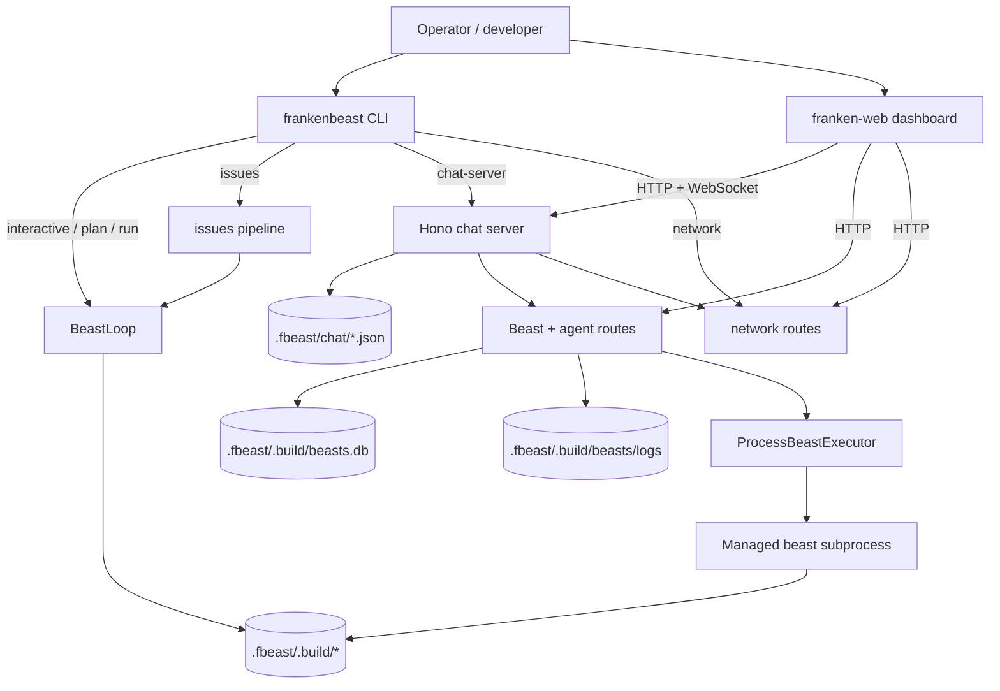

### Current Beast Loop in the Local CLI Path

The current local Beast Loop is no longer fully stubbed. `createCliDeps()` now attempts real wiring for `firewall`, `skills`, and `memory`, while `planner`, `critique`, `governor`, and `heartbeat` still fall back to stubs in the local dep factory.

That means the current path is:

- real ingestion sanitization when `@franken/firewall` is available and enabled
- real local skill discovery and skill execution adapter wiring when `@franken/skills` is available and enabled
- real episodic memory persistence through `franken-brain` when enabled
- graph-builder-driven planning for chunk files or design-doc decomposition
- real CLI task execution, chunk sessions, observer telemetry, checkpoints, PR creation
- stub planner/critique/governor/heartbeat unless a different integration path is added

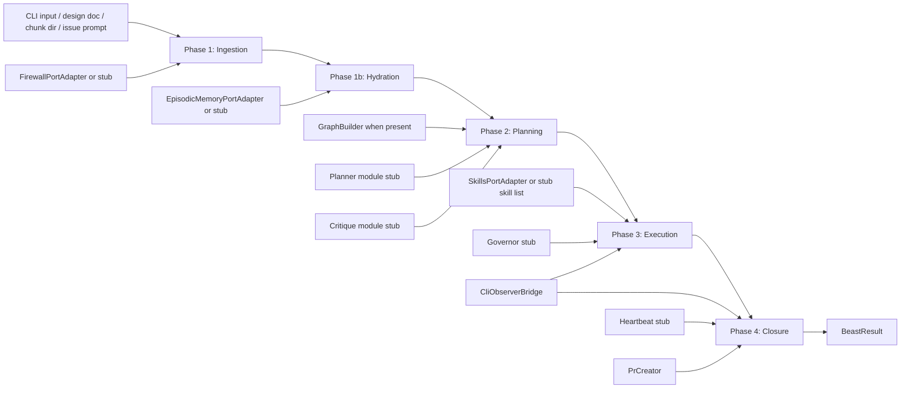

#### Current planning decision path

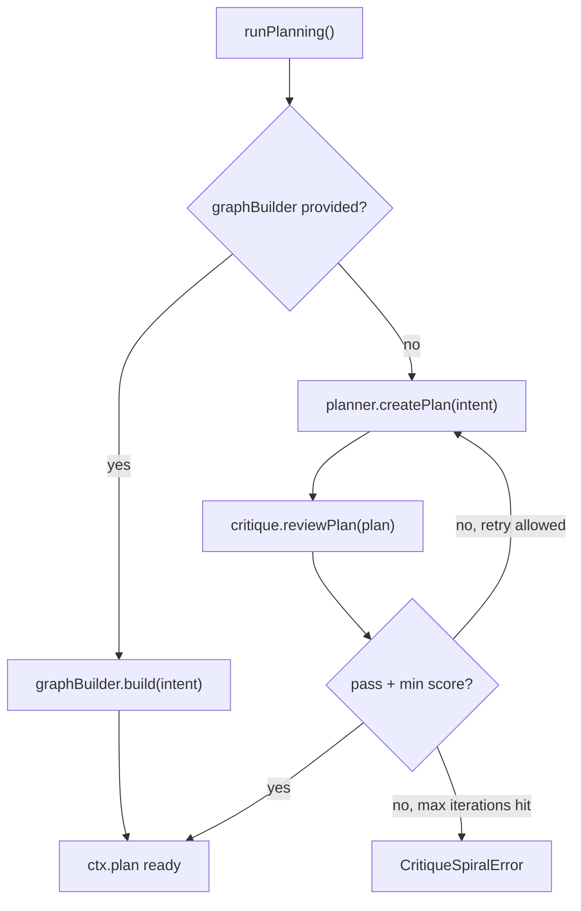

Today, most useful local execution paths avoid the planner stub by supplying a `GraphBuilder`:

- chunk directory -> `ChunkFileGraphBuilder`
- design doc -> `LlmGraphBuilder`
- issue chunk decomposition -> chunk files + `ChunkFileGraphBuilder`

### Current Chunk File and MartinLoop Execution Flow

The current executable unit is still the chunk pair:

- `impl:<chunkId>`
- `harden:<chunkId>`

Both are driven through CLI-backed skills and the canonical chunk-session state.

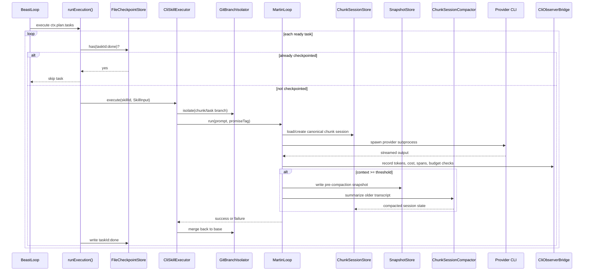

### Current Module Toggle Flow into Beast Subprocesses

One major current-state change is that module enablement can now be attached to tracked agents and Beast runs, then injected into the actual subprocess environment.

```mermaid
flowchart LR
    Dashboard["dashboard or API request"]
    Agent["TrackedAgent.moduleConfig"]
    Dispatch["BeastDispatchService.createRun()"]
    Run["BeastRun.configSnapshot.modules"]
    Exec["ProcessBeastExecutor"]
    Env["FRANKENBEAST_MODULE_* env vars"]
    Deps["createCliDeps() module resolution"]
    Modules["real adapter or stub per module"]

    Dashboard --> Agent --> Dispatch --> Run --> Exec --> Env --> Deps --> Modules
```

Resolution order in `createCliDeps()` is:

1. explicit `enabledModules` passed into the process
2. `FRANKENBEAST_MODULE_*` environment variables
3. default enabled

### Current Dashboard Chat Flow

The dashboard chat path is a combined HTTP bootstrap plus websocket streaming flow. Session state is persisted on disk as JSON under `.fbeast/chat/`.

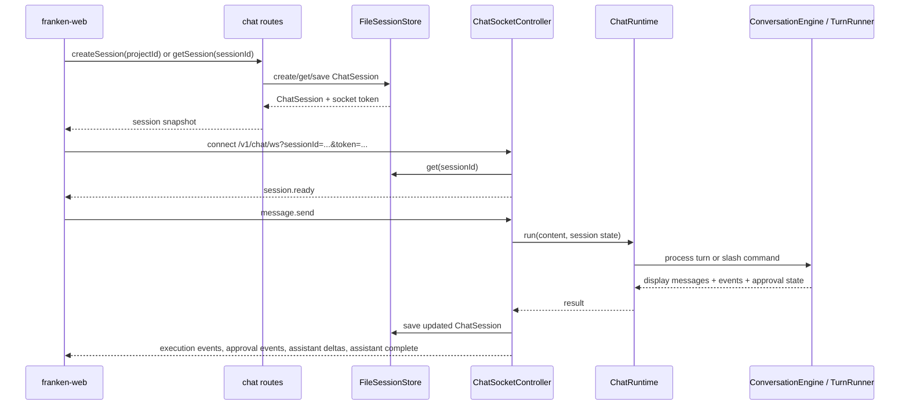

Current chat branching inside `ChatRuntime`:

- slash commands like `/plan` and `/run` go straight to `TurnRunner`
- freeform conversational prompts go through `ConversationEngine`
- beast-launch phrases can be intercepted first by `ChatBeastDispatchAdapter`

### Current Tracked-Agent and Beast Run Flow

Tracked agents are the current control-plane record for dashboard and chat-backed beast launches. Beast runs remain the execution record.

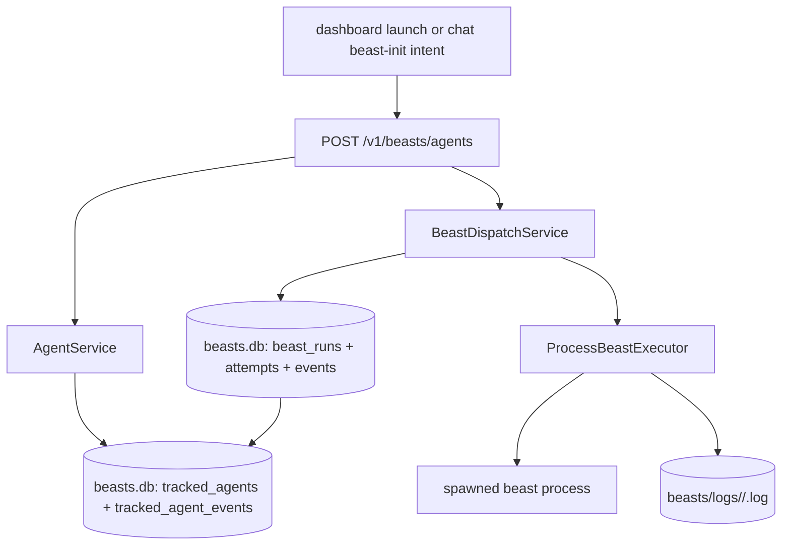

Key current behavior:

- tracked-agent creation records init metadata, source, chat linkage, and optional `moduleConfig`
- dispatch creates a `BeastRun` and links its `run.id` back to the tracked agent
- process execution spawns a separate beast subprocess
- run status changes are synchronized back into tracked-agent status
- logs are persisted separately from the SQLite state

### Current Chat-Backed Beast Launch Flow

When the chat surface detects a beast-launch intent, it can create a tracked agent before execution starts.

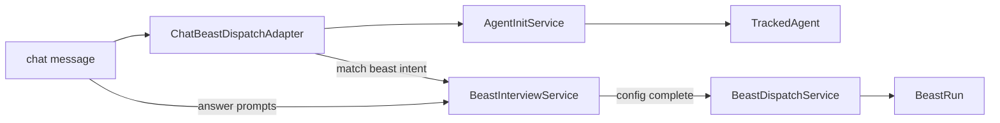

This is how current chat-backed init flows keep durable state before a run exists.

### Current Issue Execution Flow

Issue execution now standardizes around `BeastLoop` through a single chunk-file path.

The current implementation:

- triages the issue
- builds real chunk markdown for the issue
- writes those chunks into an issue-scoped plan directory
- rebuilds a `PlanGraph` from those chunk files
- runs the normal Beast Loop with issue-specific checkpoint, logging, and PR wiring

`one-shot` versus `chunked` complexity currently changes execution limits and decomposition shape, not the fact that real chunk files are written first.

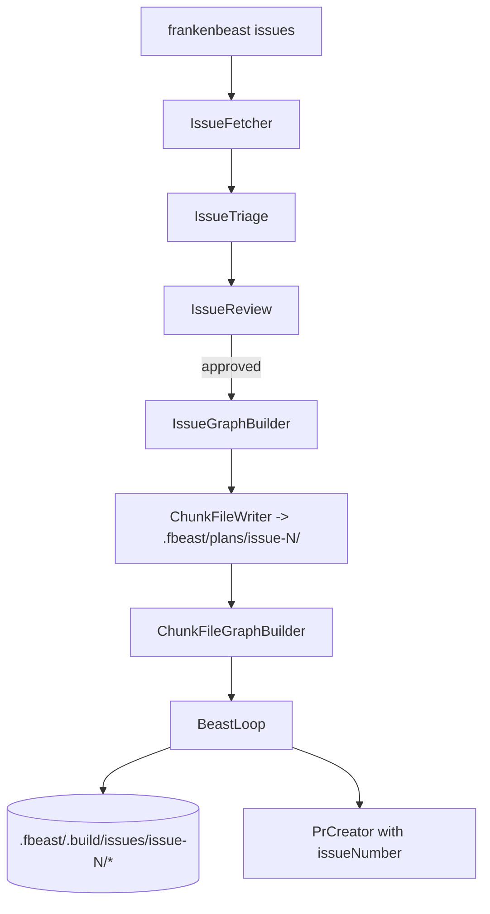

Issue-specific state fans out into:

- issue plan directory under `.fbeast/plans/issue-<n>/`
- issue checkpoint file under `.fbeast/.build/issues/issue-<n>/`
- issue build log under `.fbeast/.build/issues/issue-<n>/`
- normal chunk sessions and snapshots under the shared chunk-session roots

### Current Network Operator Flow

The network operator is the current local process control plane for chat server and dashboard-web, with room for comms to join the same model.

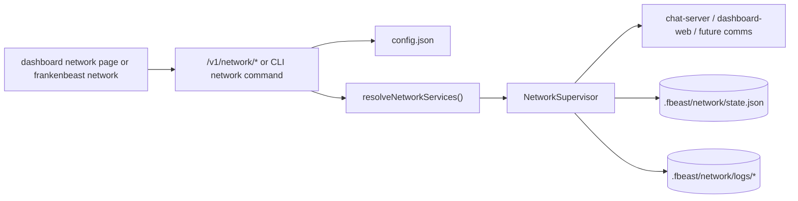

## Current Persistent Stores and Artifact Flows

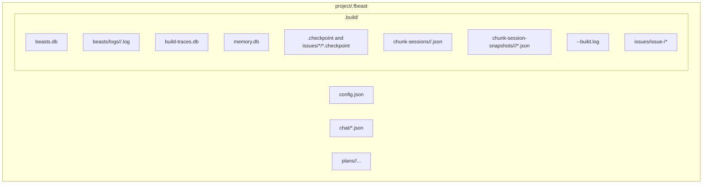

### Store-by-store notes

| Store | Primary writers | Primary readers | What flows through it |
|---|---|---|---|
| `.fbeast/chat/*.json` | chat routes, websocket controller | dashboard chat UI, chat runtime | transcript, beastContext, approval state, token totals |
| `.fbeast/.build/beasts.db` | agent, dispatch, run, interview services | dashboard Beast pages, process executor | tracked agents, runs, attempts, events, interview sessions |
| `.fbeast/.build/beasts/logs/*` | process executor, run service | dashboard logs panel | per-attempt structured log lines |
| `.fbeast/.build/build-traces.db` | observer bridge / trace viewer | trace viewer | spans, token usage, cost telemetry |
| `.fbeast/.build/memory.db` | episodic memory adapter | hydration and trace recording | episodic execution memory |
| `.fbeast/.build/*.checkpoint` | execution phase, issue runner | resume logic | task completion markers and recovery checkpoints |
| `.fbeast/.build/chunk-sessions/*` | MartinLoop | MartinLoop, renderer, compactor | canonical chunk conversation state |
| `.fbeast/.build/chunk-session-snapshots/*` | MartinLoop | recovery and rollback | pre-compaction rollback points |
| `.fbeast/plans/*` | design-doc decomposition, issue writer, operator flows | graph builders, humans | design docs, chunk markdown, cached LLM outputs |

## Target Data Flows

### Target End-to-End System Map

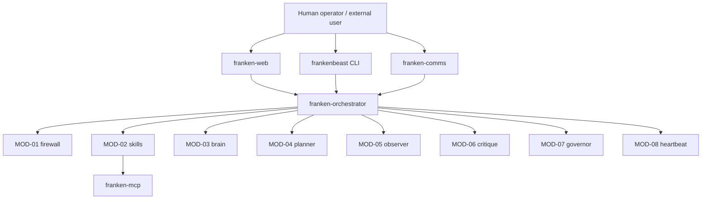

### Target Full Beast Loop

In the target architecture, all 8 modules participate as real components rather than a mix of graph builders and stubs.

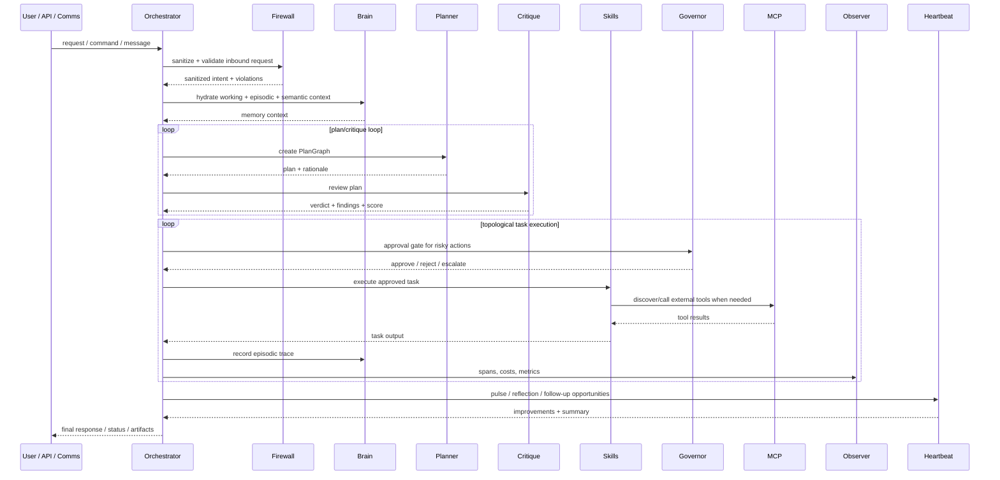

### Target Planning and Critique Loop

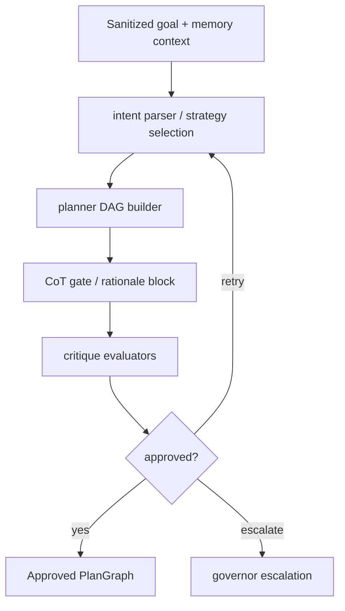

Target differences from current:

- planner owns task generation instead of relying mostly on external graph builders
- critique is a real loop, not a stub
- plan approval can escalate through governor instead of failing only as a local critique spiral

### Target Execution, Tooling, and Approval Flow

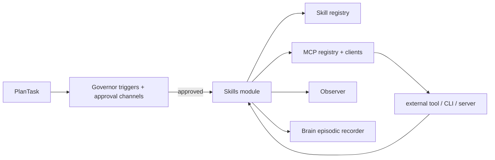

### Target External Comms Gateway Flow

This is the target shape described by ADR-016.

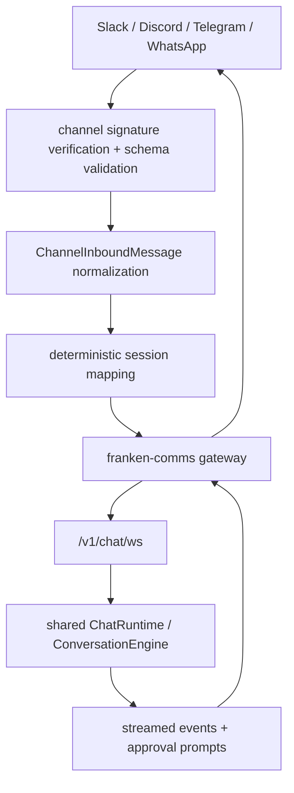

Target intent:

- all external channels reuse the same canonical conversation model
- the gateway handles platform verification and normalization at the edge
- the orchestrator remains the single source of runtime behavior

### Target Observability and Memory Flow

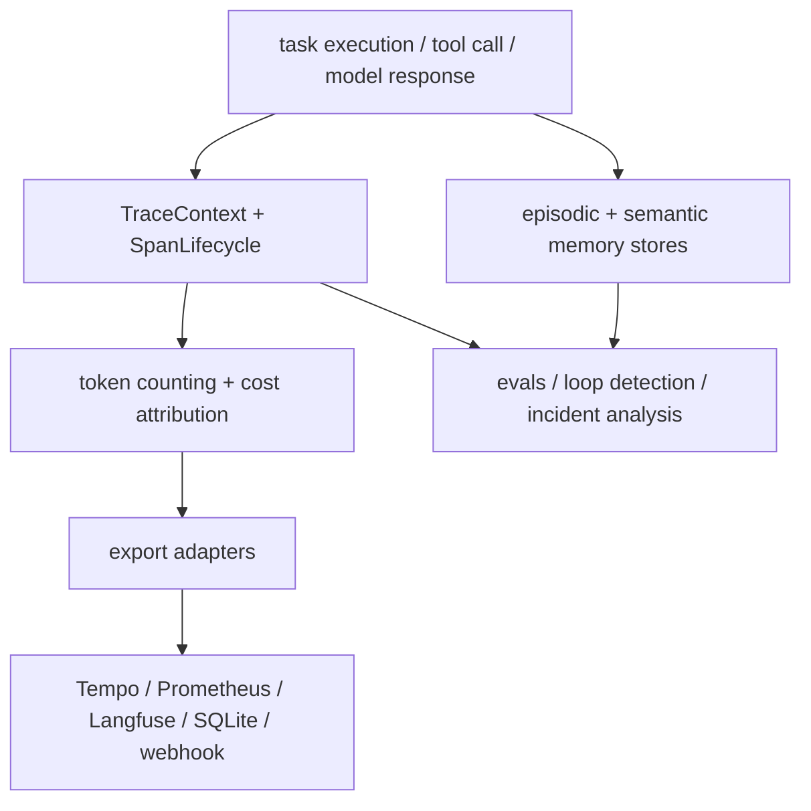

This is broader than the current local CLI path, where observer telemetry is real but the full memory and evaluation ecosystem is only partially wired into day-to-day execution.

### Target Operator Control Plane

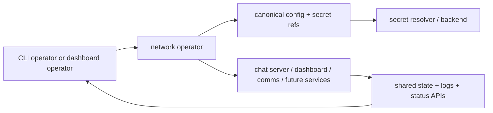

The target goal is one canonical service control model across CLI and dashboard, with secret resolution and service state handled consistently.

## Current vs Target Summary

| Area | Current | Target |
|---|---|---|
| Ingestion | real firewall possible through dep factory | fully wired firewall in all entry modes |
| Memory | episodic memory adapter can be real | full working + episodic + semantic memory |
| Planning | usually graph-builder driven; planner often stubbed | planner owns graph generation with critique loop |
| Critique | stubbed in local CLI dep path | real critique loop with escalation |
| Execution | real CLI execution, chunk sessions, checkpoints, observer | same plus broader tool and policy integrations |
| Governance | dashboard/operator auth and run control exist; local CLI governor still stubbed | true HITL gating inside task execution |
| Chat | real HTTP + websocket dashboard chat | same shared runtime extended to all channels |
| External comms | package exists but gateway shape is still target-oriented | normalized multi-channel ingress via comms gateway |
| Control plane | network operator manages local services | one canonical service model with secret-aware ops |

## Related Documents

- [docs/ARCHITECTURE.md](./ARCHITECTURE.md)
- [docs/RAMP_UP.md](./RAMP_UP.md)
- [docs/adr/017-network-operator-control-plane.md](./adr/017-network-operator-control-plane.md)
- [docs/adr/018-tracked-agent-init-workflow.md](./adr/018-tracked-agent-init-workflow.md)
- [docs/adr/020-standardized-issue-execution-path.md](./adr/020-standardized-issue-execution-path.md)
- [packages/franken-orchestrator/docs/RAMP_UP.md](../packages/franken-orchestrator/docs/RAMP_UP.md)
