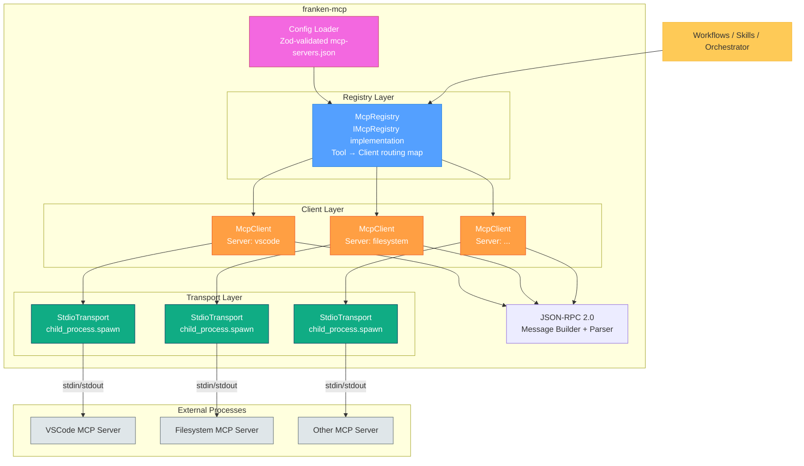
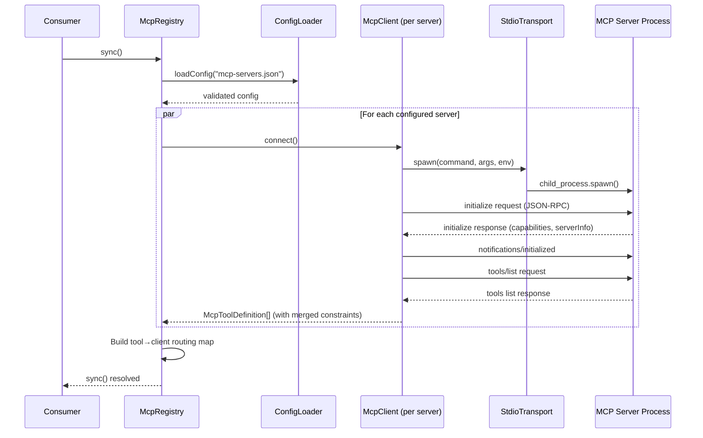
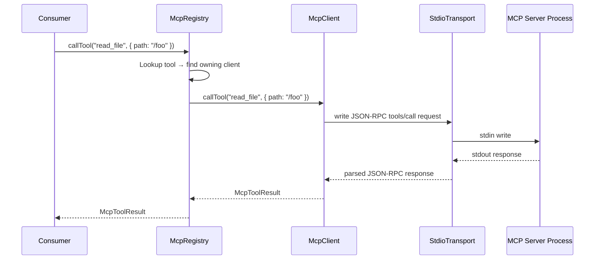
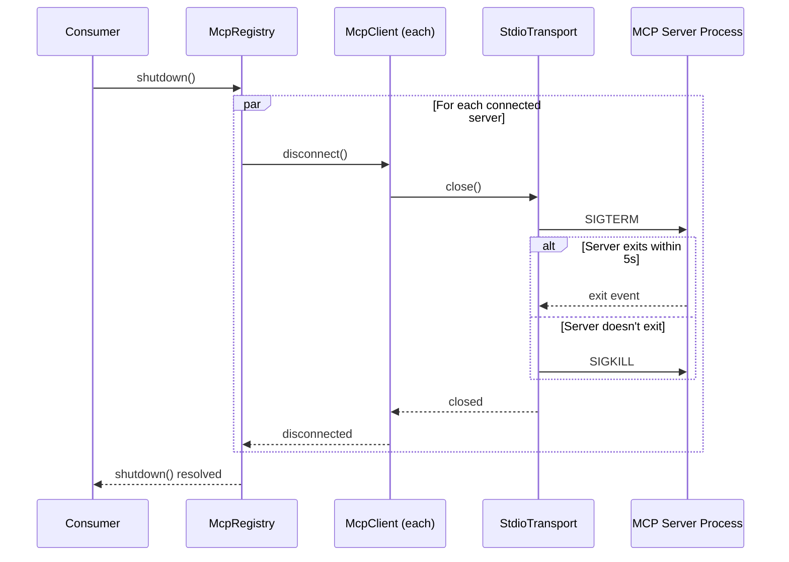
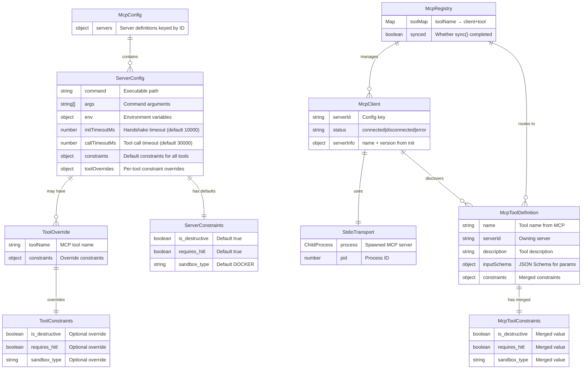

# franken-mcp Design Document

**Date:** 2026-03-04
**Module:** `franken-mcp` (`@franken/mcp`)
**Status:** Approved

## Purpose

franken-mcp is a standalone MCP (Model Context Protocol) server registry for Frankenbeast. It manages persistent connections to MCP servers via stdio transport, discovers their tools, and exposes a clean interface for calling those tools. It is infrastructure — designed to be consumed by workflows, skills, and other modules that need to interact with external tools (VSCode, filesystem, databases, etc.).

MCP servers are **not** skills. They are the execution substrate that skills and workflows leverage for deterministic interaction with the environment.

## Integration with Existing Ecosystem

Frankenbeast is a mature project with 10 modules, 1,572 tests, and 7 completed phases. franken-mcp is the 11th module. It follows established patterns:

- **Separate git repository** — like all other modules (franken-brain, franken-skills, etc.)
- **Port/adapter architecture** — `IMcpRegistry` is the public port; internals are not exported
- **Shared types** — imports from `@franken/types` where applicable (branded IDs, Result monad)
- **Dependency injection** — all config via constructor args, fully testable with mocks
- **Strict TypeScript** — `noUncheckedIndexedAccess`, `exactOptionalPropertyTypes`, ES2022 target, NodeNext modules
- **Vitest ^4.0.18** — matching root project versions
- **Zod validation** at config boundaries

The module is consumed by the orchestrator (`franken-orchestrator`) during Phase 3 (Execution) and by future workflow managers. It does **not** depend on any other Frankenbeast module — it is a leaf dependency.

## Architecture Overview



## Data Flow

### sync() — Startup Sequence



### callTool() — Execution Flow



### shutdown() — Cleanup Flow



## Entity Relationship Diagram



## Configuration

### mcp-servers.json

Located at project root. Validated with Zod on load.

```json
{
  "servers": {
    "vscode": {
      "command": "node",
      "args": ["./vscode-mcp-server/index.js"],
      "env": { "VSCODE_PORT": "3000" },
      "initTimeoutMs": 10000,
      "callTimeoutMs": 30000,
      "constraints": {
        "is_destructive": true,
        "requires_hitl": true,
        "sandbox_type": "LOCAL"
      }
    },
    "filesystem": {
      "command": "npx",
      "args": ["@modelcontextprotocol/server-filesystem", "/home/user/project"],
      "constraints": {
        "is_destructive": false,
        "requires_hitl": false,
        "sandbox_type": "LOCAL"
      },
      "toolOverrides": {
        "write_file": {
          "constraints": { "is_destructive": true, "requires_hitl": true }
        }
      }
    }
  }
}
```

### Constraint Resolution Order

1. Per-tool override in `toolOverrides` (highest priority)
2. Server-level `constraints` defaults
3. Module defaults: `{ is_destructive: true, requires_hitl: true, sandbox_type: "DOCKER" }` (most conservative)

## Public API

### Interfaces

```typescript
interface IMcpRegistry {
  sync(): Promise<void>;
  isSynced(): boolean;
  getServers(): McpServerInfo[];
  getTools(): McpToolDefinition[];
  getToolsForServer(serverId: string): McpToolDefinition[];
  hasTool(toolName: string): boolean;
  callTool(toolName: string, args: Record<string, unknown>): Promise<McpToolResult>;
  shutdown(): Promise<void>;
}

interface McpToolDefinition {
  name: string;
  serverId: string;
  description: string;
  inputSchema: Record<string, unknown>;
  constraints: McpToolConstraints;
}

interface McpToolConstraints {
  is_destructive: boolean;
  requires_hitl: boolean;
  sandbox_type: "DOCKER" | "WASM" | "LOCAL";
}

interface McpToolResult {
  content: McpContent[];
  isError: boolean;
}

type McpContent =
  | { type: "text"; text: string }
  | { type: "image"; data: string; mimeType: string }
  | { type: "resource_link"; uri: string };

interface McpServerInfo {
  id: string;
  status: "connected" | "disconnected" | "error";
  toolCount: number;
  serverInfo?: { name: string; version: string };
}
```

### Factory Function

```typescript
interface McpRegistryConfig {
  configPath?: string;  // Default: process.cwd() + "/mcp-servers.json"
}

function createMcpRegistry(config?: McpRegistryConfig): IMcpRegistry;
```

### Exports

```typescript
// Types
export type { IMcpRegistry } from "./registry/i-mcp-registry.js";
export type { McpToolDefinition } from "./types/mcp-tool-definition.js";
export type { McpToolResult, McpContent } from "./types/mcp-tool-result.js";
export type { McpToolConstraints } from "./types/mcp-tool-constraints.js";
export type { McpServerInfo } from "./types/mcp-server-info.js";
export type { McpRegistryConfig } from "./registry/create-mcp-registry.js";

// Classes
export { McpRegistryError } from "./types/mcp-registry-error.js";

// Functions
export { createMcpRegistry } from "./registry/create-mcp-registry.js";
```

## Internal Components

### Transport Layer — StdioTransport

Port interface:

```typescript
interface IMcpTransport {
  spawn(command: string, args: string[], env?: Record<string, string>): void;
  send(message: JsonRpcMessage): void;
  onMessage(handler: (message: JsonRpcMessage) => void): void;
  onError(handler: (error: Error) => void): void;
  onClose(handler: (code: number | null) => void): void;
  close(): Promise<void>;
  isAlive(): boolean;
}
```

Implementation uses `child_process.spawn` with `{ stdio: ['pipe', 'pipe', 'pipe'] }`. Reads stdout line-by-line, parses each line as JSON-RPC. Writes to stdin as newline-delimited JSON.

### Client Layer — McpClient

Manages one MCP server connection:

```typescript
class McpClient {
  constructor(serverId: string, transport: IMcpTransport, config: ServerConfig);

  async connect(): Promise<void>;        // spawn + initialize handshake
  async listTools(): Promise<McpToolDefinition[]>;  // tools/list
  async callTool(name: string, args: Record<string, unknown>): Promise<McpToolResult>;
  async disconnect(): Promise<void>;     // close transport

  getStatus(): "connected" | "disconnected" | "error";
  getServerInfo(): { name: string; version: string } | undefined;
}
```

Handles:
- JSON-RPC request ID generation and response correlation
- Initialize handshake (send `initialize`, wait for response, send `notifications/initialized`)
- `notifications/tools/list_changed` → automatic re-list
- Timeout enforcement per config

### JSON-RPC Layer

```typescript
interface JsonRpcRequest {
  jsonrpc: "2.0";
  id: number;
  method: string;
  params?: Record<string, unknown>;
}

interface JsonRpcResponse {
  jsonrpc: "2.0";
  id: number;
  result?: unknown;
  error?: { code: number; message: string; data?: unknown };
}

interface JsonRpcNotification {
  jsonrpc: "2.0";
  method: string;
  params?: Record<string, unknown>;
}

function buildRequest(id: number, method: string, params?: Record<string, unknown>): JsonRpcRequest;
function buildNotification(method: string, params?: Record<string, unknown>): JsonRpcNotification;
function parseMessage(raw: string): JsonRpcRequest | JsonRpcResponse | JsonRpcNotification;
```

## Error Handling

| Code | When | Behavior |
|------|------|----------|
| `CONFIG_INVALID` | Zod validation fails on mcp-servers.json | Fatal — sync() throws |
| `CONFIG_NOT_FOUND` | mcp-servers.json doesn't exist | Non-fatal — sync() succeeds with 0 servers, logs warning |
| `SERVER_SPAWN_FAILED` | Child process fails to start | Non-fatal — skip server, log error, continue others |
| `INIT_FAILED` | MCP handshake fails or times out | Non-fatal — kill process, skip server, log error |
| `TOOL_NOT_FOUND` | callTool() for unknown tool name | Thrown — caller must handle |
| `CALL_FAILED` | tools/call returns isError or transport error | Thrown — includes original error content |
| `SERVER_DISCONNECTED` | Process exits unexpectedly | Marks server disconnected, subsequent calls throw |
| `DUPLICATE_TOOL` | Two servers expose same tool name | Non-fatal — first wins, log warning |

### Resilience

- **Partial startup**: If 3 servers configured and 1 fails, other 2 still work.
- **Timeouts**: `initTimeoutMs` (default 10s) and `callTimeoutMs` (default 30s), configurable per-server.
- **No auto-reconnect (v1)**: Dead server marked `"disconnected"`. Call `sync()` again to restart all.
- **Graceful shutdown**: SIGTERM → 5s wait → SIGKILL. Idempotent.

## Module Structure

```
franken-mcp/
├── src/
│   ├── config/
│   │   ├── config-schema.ts           # Zod schema for mcp-servers.json
│   │   ├── load-config.ts             # Read + validate config file
│   │   └── load-config.test.ts
│   ├── transport/
│   │   ├── i-mcp-transport.ts         # Port interface
│   │   ├── stdio-transport.ts         # child_process.spawn implementation
│   │   └── stdio-transport.test.ts
│   ├── client/
│   │   ├── mcp-client.ts             # Single server connection lifecycle
│   │   ├── json-rpc.ts               # Message builder + parser
│   │   ├── json-rpc.test.ts
│   │   └── mcp-client.test.ts
│   ├── registry/
│   │   ├── i-mcp-registry.ts         # Public interface
│   │   ├── mcp-registry.ts           # Connection pool + tool routing
│   │   ├── create-mcp-registry.ts    # Factory function
│   │   └── mcp-registry.test.ts
│   ├── types/
│   │   ├── index.ts
│   │   ├── mcp-tool-definition.ts
│   │   ├── mcp-tool-result.ts
│   │   ├── mcp-tool-constraints.ts
│   │   ├── mcp-server-info.ts
│   │   └── mcp-registry-error.ts
│   └── index.ts                      # Public exports
├── tests/
│   ├── fixtures/
│   │   ├── echo-server.ts            # Minimal MCP server for integration tests
│   │   ├── valid-config.json
│   │   └── invalid-config.json
│   └── integration/
│       └── mcp-registry.integration.test.ts
├── docs/adr/
│   ├── 0001-persistent-connection-pool.md
│   ├── 0002-stdio-transport-only-v1.md
│   ├── 0003-conservative-constraint-defaults.md
│   └── 0004-partial-startup-resilience.md
├── package.json
├── tsconfig.json
├── vitest.config.ts
└── README.md
```

## Testing Strategy

### Unit Tests (mocked — no real processes)

| Area | Key Cases |
|------|-----------|
| Config | Valid JSON, invalid JSON, missing file, Zod failures, constraint merging, toolOverrides resolution |
| Transport | Mock child_process.spawn, verify stdin writes, stdout parsing, process exit/error events, timeout |
| JSON-RPC | Build requests/notifications, parse responses/errors, malformed messages, id correlation |
| Client | Mock transport, initialize handshake, tools/list parsing, tools/call routing, notification handling, timeout enforcement |
| Registry | Mock clients, tool routing map, duplicate tool names, partial server failure, shutdown lifecycle, sync guards |

### Integration Tests (real processes)

- **Echo MCP server fixture**: ~30 lines of Node.js that speaks JSON-RPC over stdio. Responds to `initialize`, `tools/list` (returns 2 test tools), `tools/call` (echoes args back).
- **Full flow**: spawn → initialize → list tools → call tool → verify result → shutdown
- **Process cleanup**: verify no orphan child processes after shutdown
- **Partial failure**: configure one real server + one bad command, verify partial startup

### Test Patterns

- Vitest with globals enabled
- `vi.fn()` mocks for all DI boundaries
- Mock factories: `makeTransport()`, `makeClient()`, `makeConfig()`
- Console spy pattern for log assertions
- No real I/O in unit tests
- Performance baseline: sync with 5 mock servers < 500ms

## Project Integration Checklist

When complete, franken-mcp must be wired into the existing project:

1. **Root `tsconfig.json`** — add `"@franken/mcp": ["./franken-mcp/src/index.ts"]` to paths
2. **Root `package.json`** — add `franken-mcp` to the build and test:all scripts
3. **`docs/ARCHITECTURE.md`** — add franken-mcp block to the Mermaid diagram, add to package table, add `IMcpRegistry` to port interfaces table
4. **`docs/CONTRACT_MATRIX.md`** — add `IMcpRegistry` port entry

## Future Considerations (Not In Scope)

- HTTP/SSE transport (v2)
- Auto-reconnect on server crash (v2)
- MCP resources and prompts support (v2)
- Tool change notification propagation to consumers (v2)
- Dashboard UI for config management (future workflow manager)
- Workflow manager — top-level lifecycle orchestration consuming MCP tools, skills, and LLMs
