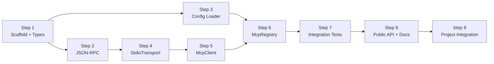

# franken-mcp Implementation Plan

**Design doc:** [2026-03-04-franken-mcp-design.md](./2026-03-04-franken-mcp-design.md)
**Module:** `franken-mcp` (`@franken/mcp`)

## Build Order

Each step produces a working, tested unit. Steps are ordered by dependency — each step only depends on code from previous steps.



---

## Step 1: Module Scaffold + Types

**Goal:** Create the module structure, package.json, tsconfig, vitest config, and all type definitions. This is the foundation everything else imports from.

**No dependencies on other steps.**

### 1.1 Create module directory and package.json

Create `franken-mcp/package.json`:

```json
{
  "name": "@franken/mcp",
  "version": "0.1.0",
  "type": "module",
  "main": "dist/index.js",
  "types": "dist/index.d.ts",
  "scripts": {
    "build": "tsc",
    "test": "vitest run",
    "test:watch": "vitest",
    "test:coverage": "vitest run --coverage"
  },
  "devDependencies": {
    "@types/node": "^25.3.0",
    "typescript": "^5.9.3",
    "vitest": "^4.0.18",
    "@vitest/coverage-v8": "^4.0.18"
  },
  "dependencies": {
    "zod": "^3.23.0"
  },
  "engines": {
    "node": ">=20.0.0"
  }
}
```

**tsconfig.json** — Match the root project's strict settings:

```json
{
  "compilerOptions": {
    "target": "ES2022",
    "module": "NodeNext",
    "moduleResolution": "NodeNext",
    "lib": ["ES2022"],
    "outDir": "dist",
    "rootDir": "src",
    "declaration": true,
    "strict": true,
    "noUncheckedIndexedAccess": true,
    "exactOptionalPropertyTypes": true,
    "noImplicitReturns": true,
    "noFallthroughCasesInSwitch": true,
    "forceConsistentCasingInFileNames": true,
    "esModuleInterop": true,
    "skipLibCheck": true
  },
  "include": ["src"],
  "exclude": ["node_modules", "dist", "**/*.test.ts"]
}
```

**vitest.config.ts** — Match project patterns (globals enabled, 80% coverage targets, `src/` includes). Reference existing modules for the exact config shape.

### 1.2 Create type definitions

Each type gets its own file in `src/types/`. All fields documented with JSDoc.

**`src/types/mcp-tool-constraints.ts`**
```typescript
export interface McpToolConstraints {
  is_destructive: boolean;
  requires_hitl: boolean;
  sandbox_type: "DOCKER" | "WASM" | "LOCAL";
}
```

**`src/types/mcp-tool-definition.ts`**
```typescript
import type { McpToolConstraints } from "./mcp-tool-constraints.js";

export interface McpToolDefinition {
  name: string;
  serverId: string;
  description: string;
  inputSchema: Record<string, unknown>;
  constraints: McpToolConstraints;
}
```

**`src/types/mcp-tool-result.ts`**
```typescript
export type McpContent =
  | { type: "text"; text: string }
  | { type: "image"; data: string; mimeType: string }
  | { type: "resource_link"; uri: string };

export interface McpToolResult {
  content: McpContent[];
  isError: boolean;
}
```

**`src/types/mcp-server-info.ts`**
```typescript
export interface McpServerInfo {
  id: string;
  status: "connected" | "disconnected" | "error";
  toolCount: number;
  serverInfo?: { name: string; version: string };
}
```

**`src/types/mcp-registry-error.ts`**

Follow the same pattern as `franken-skills/src/types/skill-registry-error.ts`:

```typescript
export type McpRegistryErrorCode =
  | "CONFIG_INVALID"
  | "CONFIG_NOT_FOUND"
  | "SERVER_SPAWN_FAILED"
  | "INIT_FAILED"
  | "TOOL_NOT_FOUND"
  | "CALL_FAILED"
  | "SERVER_DISCONNECTED"
  | "DUPLICATE_TOOL";

export class McpRegistryError extends Error {
  readonly code: McpRegistryErrorCode;
  readonly serverId?: string;
  readonly toolName?: string;

  constructor(code: McpRegistryErrorCode, message: string, serverId?: string, toolName?: string) {
    super(message);
    this.name = "McpRegistryError";
    this.code = code;
    this.serverId = serverId;
    this.toolName = toolName;
  }
}
```

**`src/types/index.ts`** — Re-export all types.

### 1.3 Create type tests

File: `src/types/mcp-types.test.ts`

Use `expectTypeOf` (from vitest) to verify interface shapes at compile time. Follow the pattern in `franken-skills/src/types/unified-skill-contract.test.ts`. Test that:

- `McpToolDefinition` has all required fields with correct types
- `McpToolResult.content` is a union type
- `McpRegistryError` extends `Error` and has `code`, `serverId`, `toolName`
- `McpServerInfo.status` is a union of the 3 literal strings
- `McpToolConstraints.sandbox_type` is a union of the 3 literal strings

### Deliverables
- [ ] `franken-mcp/` directory with package.json, tsconfig.json, vitest.config.ts
- [ ] All type files in `src/types/`
- [ ] Type tests passing
- [ ] `npm test` runs and passes

---

## Step 2: JSON-RPC Layer

**Goal:** Build the JSON-RPC 2.0 message builder and parser. This is a pure-function utility with no I/O — easy to test exhaustively.

**Depends on:** Step 1 (types only).

### 2.1 Implement message types and builder

File: `src/client/json-rpc.ts`

Define internal types:

```typescript
interface JsonRpcRequest {
  jsonrpc: "2.0";
  id: number;
  method: string;
  params?: Record<string, unknown>;
}

interface JsonRpcResponse {
  jsonrpc: "2.0";
  id: number;
  result?: unknown;
  error?: { code: number; message: string; data?: unknown };
}

interface JsonRpcNotification {
  jsonrpc: "2.0";
  method: string;
  params?: Record<string, unknown>;
}

type JsonRpcMessage = JsonRpcRequest | JsonRpcResponse | JsonRpcNotification;
```

Implement:

- `buildRequest(id: number, method: string, params?: Record<string, unknown>): JsonRpcRequest` — Constructs a request object. Omits `params` key if undefined.
- `buildNotification(method: string, params?: Record<string, unknown>): JsonRpcNotification` — Same but no `id` field.
- `parseMessage(raw: string): JsonRpcMessage` — `JSON.parse` the raw string, then discriminate:
  - Has `id` + `method` → Request
  - Has `id` + (`result` or `error`) → Response
  - Has `method` but no `id` → Notification
  - Otherwise → throw `McpRegistryError("CALL_FAILED", "Invalid JSON-RPC message")`
- `serializeMessage(message: JsonRpcMessage): string` — `JSON.stringify(message)` (single line, no formatting).

### 2.2 Tests

File: `src/client/json-rpc.test.ts`

Test cases:

| Case | Input | Expected |
|------|-------|----------|
| Build request with params | `buildRequest(1, "tools/list", { cursor: "abc" })` | `{ jsonrpc: "2.0", id: 1, method: "tools/list", params: { cursor: "abc" } }` |
| Build request without params | `buildRequest(1, "tools/list")` | No `params` key in output |
| Build notification | `buildNotification("notifications/initialized")` | No `id` key |
| Parse response with result | Valid JSON string | Returns typed response |
| Parse response with error | JSON with `error` field | Returns typed response with error |
| Parse notification | JSON without `id` | Returns typed notification |
| Parse invalid JSON | `"not json"` | Throws McpRegistryError |
| Parse missing jsonrpc field | `"{}"` | Throws McpRegistryError |
| Serialize roundtrip | Build → serialize → parse | Original message recovered |

### Deliverables
- [ ] `src/client/json-rpc.ts` with all functions exported
- [ ] `src/client/json-rpc.test.ts` with all cases passing
- [ ] No I/O, no dependencies beyond types

---

## Step 3: Config Loader

**Goal:** Read and validate `mcp-servers.json` using Zod. Pure I/O + validation — no MCP protocol knowledge.

**Depends on:** Step 1 (types).

### 3.1 Zod schema

File: `src/config/config-schema.ts`

```typescript
import { z } from "zod";

const constraintsSchema = z.object({
  is_destructive: z.boolean(),
  requires_hitl: z.boolean(),
  sandbox_type: z.enum(["DOCKER", "WASM", "LOCAL"]),
}).partial();  // All optional — missing fields use module defaults

const toolOverrideSchema = z.object({
  constraints: constraintsSchema.optional(),
});

const serverConfigSchema = z.object({
  command: z.string().min(1),
  args: z.array(z.string()).default([]),
  env: z.record(z.string()).optional(),
  initTimeoutMs: z.number().positive().optional(),
  callTimeoutMs: z.number().positive().optional(),
  constraints: constraintsSchema.optional(),
  toolOverrides: z.record(toolOverrideSchema).optional(),
});

export const mcpConfigSchema = z.object({
  servers: z.record(serverConfigSchema),
});

export type McpConfig = z.infer<typeof mcpConfigSchema>;
export type ServerConfig = z.infer<typeof serverConfigSchema>;
```

**Key detail:** `constraintsSchema` fields are all optional because missing values get filled with conservative defaults at the registry layer, not the config layer. This keeps config minimal for the user.

### 3.2 Config loader

File: `src/config/load-config.ts`

```typescript
import { readFile } from "node:fs/promises";
import { mcpConfigSchema, type McpConfig } from "./config-schema.js";
import { McpRegistryError } from "../types/mcp-registry-error.js";

export async function loadConfig(configPath: string): Promise<McpConfig> {
  let raw: string;
  try {
    raw = await readFile(configPath, "utf-8");
  } catch (err) {
    if ((err as NodeJS.ErrnoException).code === "ENOENT") {
      throw new McpRegistryError("CONFIG_NOT_FOUND", `Config file not found: ${configPath}`);
    }
    throw err;
  }

  let parsed: unknown;
  try {
    parsed = JSON.parse(raw);
  } catch {
    throw new McpRegistryError("CONFIG_INVALID", `Invalid JSON in config file: ${configPath}`);
  }

  const result = mcpConfigSchema.safeParse(parsed);
  if (!result.success) {
    throw new McpRegistryError(
      "CONFIG_INVALID",
      `Config validation failed: ${result.error.issues.map(i => `${i.path.join(".")}: ${i.message}`).join(", ")}`
    );
  }

  return result.data;
}
```

### 3.3 Constraint resolver utility

File: `src/config/resolve-constraints.ts`

Pure function that merges constraints in priority order:

```typescript
import type { McpToolConstraints } from "../types/mcp-tool-constraints.js";

const MODULE_DEFAULTS: McpToolConstraints = {
  is_destructive: true,
  requires_hitl: true,
  sandbox_type: "DOCKER",
};

export function resolveConstraints(
  serverConstraints?: Partial<McpToolConstraints>,
  toolOverrideConstraints?: Partial<McpToolConstraints>,
): McpToolConstraints {
  return {
    ...MODULE_DEFAULTS,
    ...serverConstraints,
    ...toolOverrideConstraints,
  };
}
```

### 3.4 Test fixtures

- `src/config/fixtures/valid-config.json` — 2 servers, one with toolOverrides
- `src/config/fixtures/invalid-config.json` — Missing `command` field
- `src/config/fixtures/empty-servers.json` — `{ "servers": {} }` (valid, zero servers)
- `src/config/fixtures/malformed.json` — Invalid JSON syntax

### 3.5 Tests

File: `src/config/load-config.test.ts`

| Case | Expected |
|------|----------|
| Valid config file | Returns parsed McpConfig with correct types |
| Missing file | Throws CONFIG_NOT_FOUND |
| Invalid JSON | Throws CONFIG_INVALID |
| Missing `command` | Throws CONFIG_INVALID with Zod path |
| Missing `servers` key | Throws CONFIG_INVALID |
| Empty servers `{}` | Returns valid config with 0 servers |
| Extra unknown fields | Zod strips them (default behavior) |
| Constraints partial | Returns only provided fields (no defaults here) |

File: `src/config/resolve-constraints.test.ts`

| Case | Expected |
|------|----------|
| No overrides | Returns MODULE_DEFAULTS |
| Server-level only | Server values override defaults |
| Tool-level only | Tool values override defaults |
| Both server + tool | Tool wins over server wins over defaults |
| Partial override | Only specified fields change, rest stay default |

### Deliverables
- [ ] `src/config/config-schema.ts` — Zod schema
- [ ] `src/config/load-config.ts` — File reader + validator
- [ ] `src/config/resolve-constraints.ts` — Constraint merger
- [ ] Fixtures in `src/config/fixtures/`
- [ ] Tests passing for all cases

---

## Step 4: Stdio Transport

**Goal:** Implement the child process transport layer. Spawns a process, writes JSON-RPC to stdin, reads JSON-RPC from stdout, handles lifecycle events.

**Depends on:** Step 2 (JSON-RPC types for message parsing).

### 4.1 Port interface

File: `src/transport/i-mcp-transport.ts`

```typescript
import type { JsonRpcMessage } from "../client/json-rpc.js";

export interface IMcpTransport {
  spawn(command: string, args: string[], env?: Record<string, string>): void;
  send(message: JsonRpcMessage): void;
  onMessage(handler: (message: JsonRpcMessage) => void): void;
  onError(handler: (error: Error) => void): void;
  onClose(handler: (code: number | null) => void): void;
  close(): Promise<void>;
  isAlive(): boolean;
}
```

### 4.2 Implementation

File: `src/transport/stdio-transport.ts`

Key implementation details:

- **Spawn:** Use `child_process.spawn(command, args, { stdio: ['pipe', 'pipe', 'pipe'], env: { ...process.env, ...customEnv } })`. Store the `ChildProcess` reference.
- **Reading stdout:** Accumulate data in a buffer. Split on `\n`. For each complete line, call `parseMessage()` from json-rpc.ts. Call the registered `onMessage` handler. **Important:** MCP messages are newline-delimited JSON. A single `data` event might contain partial lines or multiple lines.
- **Reading stderr:** Log to `console.error` with `[McpTransport:${serverId}]` prefix. Do not parse — stderr is for human-readable diagnostics.
- **Writing stdin:** `serializeMessage(message) + "\n"`. Write to `process.stdin`.
- **Error handling:** Listen for `error` event on the child process (spawn failures). Call `onError` handler.
- **Close event:** Listen for `close` event. Call `onClose` handler with exit code.
- **close():** Send SIGTERM. Set a 5-second timer. If process hasn't exited, send SIGKILL. Return a Promise that resolves when the process exits. If already dead, resolve immediately.
- **isAlive():** Check `process.exitCode === null && !process.killed`.

**Line buffering approach:**

```typescript
private buffer = "";

private handleStdoutData(chunk: Buffer): void {
  this.buffer += chunk.toString("utf-8");
  const lines = this.buffer.split("\n");
  this.buffer = lines.pop()!;  // Keep incomplete last line in buffer

  for (const line of lines) {
    const trimmed = line.trim();
    if (trimmed === "") continue;
    try {
      const message = parseMessage(trimmed);
      this.messageHandler?.(message);
    } catch (err) {
      this.errorHandler?.(err instanceof Error ? err : new Error(String(err)));
    }
  }
}
```

### 4.3 Tests

File: `src/transport/stdio-transport.test.ts`

Mock `child_process.spawn` using `vi.mock("node:child_process")`. Create mock stdin/stdout/stderr streams using `EventEmitter` or `PassThrough` streams.

| Case | How | Expected |
|------|-----|----------|
| spawn() calls child_process.spawn with correct args | Check mock call args | command, args, env merged with process.env |
| send() writes serialized JSON + newline to stdin | Check stdin.write calls | Correct JSON string |
| onMessage fires for complete line | Emit `data` event on mock stdout | Handler called with parsed message |
| Handles partial lines (buffering) | Emit split data across 2 events | Handler called once after second event completes the line |
| Handles multiple messages in one chunk | Emit data with 2+ newlines | Handler called once per message |
| onError fires on spawn error | Emit `error` on process | Handler called with Error |
| onClose fires on process exit | Emit `close` with code | Handler called with exit code |
| close() sends SIGTERM then SIGKILL | Call close() | kill('SIGTERM') called, then SIGKILL after timeout |
| close() resolves immediately if already dead | Process already exited | Promise resolves |
| isAlive() reflects process state | Various states | Returns correct boolean |
| stderr logged to console.error | Emit data on stderr | console.error called |

### Deliverables
- [ ] `src/transport/i-mcp-transport.ts` — Port interface
- [ ] `src/transport/stdio-transport.ts` — Implementation
- [ ] `src/transport/stdio-transport.test.ts` — All cases passing

---

## Step 5: MCP Client

**Goal:** Implement the MCP protocol lifecycle for a single server: initialize handshake, tool discovery, tool execution.

**Depends on:** Step 2 (JSON-RPC), Step 4 (Transport).

### 5.1 Implementation

File: `src/client/mcp-client.ts`

```typescript
import type { IMcpTransport } from "../transport/i-mcp-transport.js";
import type { ServerConfig } from "../config/config-schema.js";
import type { McpToolDefinition } from "../types/mcp-tool-definition.js";
import type { McpToolResult } from "../types/mcp-tool-result.js";
import { resolveConstraints } from "../config/resolve-constraints.js";

export class McpClient {
  private requestId = 0;
  private pendingRequests = new Map<number, {
    resolve: (value: unknown) => void;
    reject: (reason: Error) => void;
    timer: ReturnType<typeof setTimeout>;
  }>();
  private status: "connected" | "disconnected" | "error" = "disconnected";
  private mcpServerInfo?: { name: string; version: string };
  private tools: McpToolDefinition[] = [];

  constructor(
    readonly serverId: string,
    private transport: IMcpTransport,
    private config: ServerConfig,
  ) {}
```

**Key methods:**

**`connect()`** — The full startup sequence:
1. Call `transport.spawn(config.command, config.args, config.env)`
2. Register `transport.onMessage` handler that routes responses to pending request resolvers
3. Register `transport.onClose` handler that sets status to `"disconnected"` and rejects all pending requests
4. Send `initialize` request:
   ```json
   {
     "method": "initialize",
     "params": {
       "protocolVersion": "2024-11-05",
       "capabilities": {},
       "clientInfo": { "name": "franken-mcp", "version": "0.1.0" }
     }
   }
   ```
5. Wait for response (with `initTimeoutMs` timeout). Extract `serverInfo` from result.
6. Send `notifications/initialized` notification (no response expected)
7. Set status to `"connected"`
8. If any step fails or times out, set status to `"error"`, call `transport.close()`, throw `McpRegistryError("INIT_FAILED")`

**`listTools()`** — Discover tools:
1. Send `tools/list` request (no params for v1, pagination can be added later)
2. Wait for response
3. Map each tool from the response to `McpToolDefinition`:
   - `name` from MCP tool
   - `serverId` from this client's serverId
   - `description` from MCP tool
   - `inputSchema` from MCP tool
   - `constraints` from `resolveConstraints(config.constraints, config.toolOverrides?.[name]?.constraints)`
4. Store in `this.tools` and return

**`callTool(name, args)`** — Execute a tool:
1. Assert status is `"connected"`, throw `SERVER_DISCONNECTED` if not
2. Send `tools/call` request: `{ method: "tools/call", params: { name, arguments: args } }`
3. Wait for response (with `callTimeoutMs` timeout)
4. If response has `error`, throw `McpRegistryError("CALL_FAILED", error.message, serverId, name)`
5. Return `{ content: result.content, isError: result.isError ?? false }` as `McpToolResult`

**`disconnect()`** — Clean shutdown:
1. Set status to `"disconnected"`
2. Reject all pending requests with `SERVER_DISCONNECTED`
3. Call `transport.close()`

**Request/response correlation pattern:**

```typescript
private async sendRequest(method: string, params?: Record<string, unknown>, timeoutMs?: number): Promise<unknown> {
  const id = ++this.requestId;
  const timeout = timeoutMs ?? this.config.callTimeoutMs ?? 30_000;

  return new Promise((resolve, reject) => {
    const timer = setTimeout(() => {
      this.pendingRequests.delete(id);
      reject(new McpRegistryError("CALL_FAILED", `Request timed out after ${timeout}ms`, this.serverId));
    }, timeout);

    this.pendingRequests.set(id, { resolve, reject, timer });
    this.transport.send(buildRequest(id, method, params));
  });
}

// In the onMessage handler:
private handleMessage(message: JsonRpcMessage): void {
  if ("id" in message && !("method" in message)) {
    // This is a response
    const pending = this.pendingRequests.get(message.id);
    if (pending) {
      clearTimeout(pending.timer);
      this.pendingRequests.delete(message.id);
      if (message.error) {
        pending.reject(new McpRegistryError("CALL_FAILED", message.error.message, this.serverId));
      } else {
        pending.resolve(message.result);
      }
    }
  }
  if ("method" in message && !("id" in message)) {
    // This is a notification from server
    if (message.method === "notifications/tools/list_changed") {
      this.listTools().catch(err => console.error(`[McpClient:${this.serverId}] Failed to re-list tools`, err));
    }
  }
}
```

### 5.2 Tests

File: `src/client/mcp-client.test.ts`

Create a `makeTransport()` mock factory that returns an `IMcpTransport` with all methods as `vi.fn()`. The `onMessage` mock should capture the handler so tests can simulate server responses by calling `handler(responseMessage)`.

| Case | Expected |
|------|----------|
| connect() sends initialize then notifications/initialized | Transport.send called twice with correct messages |
| connect() extracts serverInfo from response | getServerInfo() returns name + version |
| connect() throws INIT_FAILED on timeout | Error with correct code |
| connect() throws INIT_FAILED on transport error | Error with correct code, transport.close() called |
| listTools() sends tools/list and maps response | Returns McpToolDefinition[] with merged constraints |
| listTools() applies toolOverrides correctly | Per-tool constraints override server defaults |
| callTool() sends tools/call with correct params | Transport.send called with tools/call method |
| callTool() returns McpToolResult on success | content and isError mapped correctly |
| callTool() throws CALL_FAILED on error response | Error includes server error message |
| callTool() throws CALL_FAILED on timeout | Error after configured timeout |
| callTool() throws SERVER_DISCONNECTED if not connected | Error with correct code |
| disconnect() rejects pending requests | All pending promises rejected |
| disconnect() calls transport.close() | Transport closed |
| notifications/tools/list_changed triggers re-list | listTools() called again |

### Deliverables
- [ ] `src/client/mcp-client.ts` — Full implementation
- [ ] `src/client/mcp-client.test.ts` — All cases passing

---

## Step 6: MCP Registry

**Goal:** The top-level orchestrator. Manages N clients, builds the tool routing map, exposes the public `IMcpRegistry` interface.

**Depends on:** Step 3 (Config), Step 5 (McpClient).

### 6.1 Port interface

File: `src/registry/i-mcp-registry.ts`

```typescript
import type { McpServerInfo } from "../types/mcp-server-info.js";
import type { McpToolDefinition } from "../types/mcp-tool-definition.js";
import type { McpToolResult } from "../types/mcp-tool-result.js";

export interface IMcpRegistry {
  sync(): Promise<void>;
  isSynced(): boolean;
  getServers(): McpServerInfo[];
  getTools(): McpToolDefinition[];
  getToolsForServer(serverId: string): McpToolDefinition[];
  hasTool(toolName: string): boolean;
  callTool(toolName: string, args: Record<string, unknown>): Promise<McpToolResult>;
  shutdown(): Promise<void>;
}
```

### 6.2 Implementation

File: `src/registry/mcp-registry.ts`

**Internal state:**
```typescript
private clients = new Map<string, McpClient>();
private toolMap = new Map<string, { tool: McpToolDefinition; client: McpClient }>();
private synced = false;
```

**`sync()` implementation:**
1. If already synced, call `shutdown()` first (reset state for re-sync)
2. Load config via `loadConfig(configPath)`
   - If `CONFIG_NOT_FOUND`, log warning, set synced = true, return (0 servers is valid)
3. For each server in config (use `Promise.allSettled` for parallel startup):
   - Create `StdioTransport`
   - Create `McpClient(serverId, transport, serverConfig)`
   - Call `client.connect()`
   - Call `client.listTools()`
   - Store client in `this.clients`
4. For `allSettled` results:
   - `fulfilled`: register client and its tools
   - `rejected`: log error with `[McpRegistry] Failed to connect server: ${serverId}: ${error.message}`, skip it
5. Build `toolMap`:
   - For each client's tools, insert into map keyed by `tool.name`
   - If duplicate tool name, log warning `[McpRegistry] Duplicate tool "${name}" from server "${serverId}" — already registered from "${existingServerId}"`, keep first
6. Set `synced = true`
7. Log summary: `[McpRegistry] Synced: ${clients.size} servers, ${toolMap.size} tools`

**`callTool(toolName, args)` implementation:**
1. Assert synced (throw `McpRegistryError` if not)
2. Lookup `toolMap.get(toolName)`
3. If not found, throw `McpRegistryError("TOOL_NOT_FOUND", ...)`
4. Call `entry.client.callTool(toolName, args)`
5. Return result

**`shutdown()` implementation:**
1. Call `client.disconnect()` for all clients (use `Promise.allSettled` — don't let one failed shutdown block others)
2. Clear `clients`, `toolMap`
3. Set `synced = false`

**All read methods** (`getServers`, `getTools`, `getToolsForServer`, `hasTool`) assert synced first, same pattern as franken-skills.

### 6.3 Factory function

File: `src/registry/create-mcp-registry.ts`

```typescript
import type { IMcpRegistry } from "./i-mcp-registry.js";

export interface McpRegistryConfig {
  configPath?: string;  // Default: process.cwd() + "/mcp-servers.json"
}

export function createMcpRegistry(config: McpRegistryConfig = {}): IMcpRegistry {
  const configPath = config.configPath ?? `${process.cwd()}/mcp-servers.json`;
  return new McpRegistryImpl(configPath);
}
```

The concrete `McpRegistryImpl` class is NOT exported — only the factory and the interface.

### 6.4 Tests

File: `src/registry/mcp-registry.test.ts`

Mock the `McpClient` class and `loadConfig` function. Use `vi.mock()` to replace imports.

**Mock factories:**

```typescript
function makeClient(overrides?: Partial<McpClient>): McpClient {
  return {
    serverId: "test-server",
    connect: vi.fn().mockResolvedValue(undefined),
    listTools: vi.fn().mockResolvedValue([makeTool()]),
    callTool: vi.fn().mockResolvedValue({ content: [{ type: "text", text: "ok" }], isError: false }),
    disconnect: vi.fn().mockResolvedValue(undefined),
    getStatus: vi.fn().mockReturnValue("connected"),
    getServerInfo: vi.fn().mockReturnValue({ name: "test", version: "1.0" }),
    ...overrides,
  };
}

function makeTool(overrides?: Partial<McpToolDefinition>): McpToolDefinition {
  return {
    name: "test_tool",
    serverId: "test-server",
    description: "A test tool",
    inputSchema: { type: "object" },
    constraints: { is_destructive: true, requires_hitl: true, sandbox_type: "DOCKER" },
    ...overrides,
  };
}
```

| Case | Expected |
|------|----------|
| sync() connects all configured servers in parallel | All client.connect() called |
| sync() builds tool routing map | hasTool() returns true for discovered tools |
| sync() continues if one server fails | Other servers still available |
| sync() logs warning on duplicate tool name | console.warn called, first wins |
| sync() with missing config file | Succeeds with 0 servers, logs warning |
| sync() with invalid config | Throws CONFIG_INVALID |
| sync() is idempotent (re-sync shuts down first) | shutdown() called before reconnecting |
| callTool() routes to correct client | Correct client.callTool() called |
| callTool() throws TOOL_NOT_FOUND for unknown tool | Error with correct code |
| callTool() throws if not synced | REGISTRY_NOT_SYNCED error |
| getServers() returns status of all servers | Correct McpServerInfo[] |
| getTools() returns all tools | Flat array from all servers |
| getToolsForServer() filters by serverId | Only tools from that server |
| shutdown() disconnects all clients | All client.disconnect() called |
| shutdown() is idempotent | Safe to call twice |

### Deliverables
- [ ] `src/registry/i-mcp-registry.ts` — Interface
- [ ] `src/registry/mcp-registry.ts` — Implementation
- [ ] `src/registry/create-mcp-registry.ts` — Factory
- [ ] `src/registry/mcp-registry.test.ts` — All cases passing

---

## Step 7: Integration Tests

**Goal:** Verify the full end-to-end flow with a real MCP server process.

**Depends on:** Step 6 (everything assembled).

### 7.1 Echo MCP server fixture

File: `tests/fixtures/echo-server.ts`

A minimal Node.js script (not a module of the project — a standalone executable) that implements the MCP protocol over stdio:

```typescript
#!/usr/bin/env node
// Minimal MCP server for integration testing.
// Speaks JSON-RPC 2.0 over stdin/stdout.

import { createInterface } from "node:readline";

const TOOLS = [
  {
    name: "echo",
    description: "Echoes the input back",
    inputSchema: {
      type: "object",
      properties: { message: { type: "string" } },
      required: ["message"],
    },
  },
  {
    name: "add",
    description: "Adds two numbers",
    inputSchema: {
      type: "object",
      properties: {
        a: { type: "number" },
        b: { type: "number" },
      },
      required: ["a", "b"],
    },
  },
];

const rl = createInterface({ input: process.stdin });

rl.on("line", (line) => {
  const msg = JSON.parse(line);

  if (msg.method === "initialize") {
    respond(msg.id, {
      protocolVersion: "2024-11-05",
      capabilities: { tools: {} },
      serverInfo: { name: "echo-server", version: "1.0.0" },
    });
  } else if (msg.method === "notifications/initialized") {
    // No response needed
  } else if (msg.method === "tools/list") {
    respond(msg.id, { tools: TOOLS });
  } else if (msg.method === "tools/call") {
    const { name, arguments: args } = msg.params;
    if (name === "echo") {
      respond(msg.id, {
        content: [{ type: "text", text: args.message }],
        isError: false,
      });
    } else if (name === "add") {
      respond(msg.id, {
        content: [{ type: "text", text: String(args.a + args.b) }],
        isError: false,
      });
    } else {
      respond(msg.id, {
        content: [{ type: "text", text: `Unknown tool: ${name}` }],
        isError: true,
      });
    }
  }
});

function respond(id: number, result: unknown): void {
  process.stdout.write(JSON.stringify({ jsonrpc: "2.0", id, result }) + "\n");
}
```

Compile this with the project's TypeScript config. The test will spawn it via `node dist/tests/fixtures/echo-server.js` or use `tsx` to run it directly.

### 7.2 Config fixtures

File: `tests/fixtures/valid-config.json`
```json
{
  "servers": {
    "echo": {
      "command": "node",
      "args": ["<path-to-echo-server>"],
      "constraints": {
        "is_destructive": false,
        "requires_hitl": false,
        "sandbox_type": "LOCAL"
      }
    }
  }
}
```

File: `tests/fixtures/bad-command-config.json`
```json
{
  "servers": {
    "good": {
      "command": "node",
      "args": ["<path-to-echo-server>"]
    },
    "bad": {
      "command": "/nonexistent/binary",
      "args": []
    }
  }
}
```

### 7.3 Integration test suite

File: `tests/integration/mcp-registry.integration.test.ts`

| Case | Steps | Expected |
|------|-------|----------|
| Full lifecycle | sync → getTools → callTool("echo") → callTool("add") → shutdown | Correct results, process cleaned up |
| Tool discovery | sync → getTools() | Returns 2 tools with correct schemas |
| Server info | sync → getServers() | Returns echo-server name + version, status "connected" |
| Partial startup | Config with 1 good + 1 bad server → sync | Good server works, bad server logged as error |
| No orphan processes | sync → shutdown → check for child processes | No lingering node processes |
| callTool after shutdown | shutdown → callTool | Throws appropriate error |

**Process cleanup verification:**

```typescript
afterEach(async () => {
  await registry.shutdown();
  // Small delay to let processes exit
  await new Promise(r => setTimeout(r, 100));
});
```

### Deliverables
- [ ] `tests/fixtures/echo-server.ts` — Working echo MCP server
- [ ] `tests/fixtures/*.json` — Config fixtures
- [ ] `tests/integration/mcp-registry.integration.test.ts` — All cases passing
- [ ] No orphan processes after test run

---

## Step 8: Public API + ADRs + README

**Goal:** Wire up the public exports, write ADRs, create README.

**Depends on:** Step 6 (registry is the public surface).

### 8.1 Public exports

File: `src/index.ts`

```typescript
// Types
export type { IMcpRegistry } from "./registry/i-mcp-registry.js";
export type { McpRegistryConfig } from "./registry/create-mcp-registry.js";
export type { McpToolDefinition } from "./types/mcp-tool-definition.js";
export type { McpToolResult, McpContent } from "./types/mcp-tool-result.js";
export type { McpToolConstraints } from "./types/mcp-tool-constraints.js";
export type { McpServerInfo } from "./types/mcp-server-info.js";
export type { McpRegistryErrorCode } from "./types/mcp-registry-error.js";

// Classes
export { McpRegistryError } from "./types/mcp-registry-error.js";

// Functions
export { createMcpRegistry } from "./registry/create-mcp-registry.js";
```

### 8.2 ADRs

Write 4 ADR files in `docs/adr/`:

1. **0001-persistent-connection-pool.md** — Why persistent connections over on-demand spawn. Decision: lower latency for workflow chains, support for server notifications. Trade-off: process lifecycle management.

2. **0002-stdio-transport-only-v1.md** — Why stdio only for v1. Decision: covers 90%+ of MCP servers (Claude Desktop, Cursor, etc. all use stdio). HTTP/SSE transport is a v2 feature.

3. **0003-conservative-constraint-defaults.md** — Why defaults are `is_destructive: true, requires_hitl: true, sandbox_type: "DOCKER"`. Decision: fail-safe by default. MCP servers are external — trust must be explicitly granted.

4. **0004-partial-startup-resilience.md** — Why sync() doesn't fail if one server fails to connect. Decision: partial availability is better than total failure. Consumer can inspect `getServers()` to check status.

### 8.3 README.md

Write `franken-mcp/README.md` covering:
- What it is (1 paragraph)
- Quick start (create config, createMcpRegistry, sync, callTool)
- Config file reference (full mcp-servers.json schema with examples)
- Constraint defaults and override behavior
- Error codes table
- API reference (IMcpRegistry methods)
- Testing (`npm test`)

### Deliverables
- [ ] `src/index.ts` — Public exports
- [ ] `docs/adr/` — 4 ADR files
- [ ] `README.md` — Module documentation
- [ ] `npm run build` succeeds within franken-mcp/
- [ ] `npm test` passes with 80%+ coverage within franken-mcp/

---

## Step 9: Project Integration

**Goal:** Wire franken-mcp into the Frankenbeast project — root configs, architecture docs, and contract matrix.

**Depends on:** Step 8 (module is complete and tested).

### 9.1 Root package.json

Add `franken-mcp` to both the `build` and `test:all` scripts in the root `package.json`. The project uses a `for d in ...` loop pattern (not npm workspaces):

```bash
# In the "build" script, add franken-mcp to the module list:
"build": "for d in franken-types franken-brain ... franken-mcp franken-orchestrator; do ..."

# In the "test:all" script, same:
"test:all": "for d in franken-types franken-brain ... franken-mcp franken-orchestrator; do ..."
```

**Important:** Insert `franken-mcp` before `franken-orchestrator` in the build order since the orchestrator may consume it.

### 9.2 Root tsconfig.json

Add the path alias:

```json
{
  "compilerOptions": {
    "paths": {
      // ... existing paths ...
      "@franken/mcp": ["./franken-mcp/src/index.ts"]
    }
  }
}
```

### 9.3 Update docs/ARCHITECTURE.md

**Add to the package table** (after franken-heartbeat, before franken-types):

```markdown
| `franken-mcp` | MCP server registry — persistent connections, tool discovery, tool execution via stdio |
```

**Add franken-mcp block to the Mermaid diagram:**

```mermaid
subgraph "franken-mcp"
    direction TB
    MCP_CFG["Config Loader<br/>Zod-validated mcp-servers.json"]
    MCP_REG["MCP Registry<br/>IMcpRegistry"]
    MCP_CLI["MCP Clients<br/>Persistent connections"]
    MCP_TRANS["Stdio Transport<br/>JSON-RPC 2.0"]
    MCP_CFG --> MCP_REG
    MCP_REG --> MCP_CLI
    MCP_CLI --> MCP_TRANS
end
```

**Add wiring connections:**

```
%% === franken-mcp: External MCP servers ===
MCP_TRANS -- "stdin/stdout" --> MCP_EXT["MCP Servers<br/>VSCode / Filesystem / ..."]

%% === Orchestrator → MCP: Tool execution ===
BL_EXEC -- "callTool()" --> MCP_REG
```

**Add to the Port Interfaces table:**

```markdown
| `IMcpRegistry` | franken-mcp | Orchestrator (execution), Workflows |
```

**Add styling:**

```
classDef mcp fill:#a29bfe,stroke:#6c5ce7,color:#fff
class MCP_CFG,MCP_REG,MCP_CLI,MCP_TRANS mcp
```

### 9.4 Update docs/CONTRACT_MATRIX.md

Add `IMcpRegistry` as a new port entry with its method signatures and consumers.

### 9.5 Update root vitest.config.ts

Add the `@franken/mcp` path alias to the resolve configuration, matching the pattern used for the other 10 modules.

### 9.6 Update README.md

Add franken-mcp to the Modules table:

```markdown
| — | [franken-mcp](https://github.com/djm204/franken-mcp) | MCP server registry — persistent connections to external tool servers (VSCode, filesystem, etc.). |
```

### Deliverables
- [ ] Root `package.json` — franken-mcp in build + test:all scripts
- [ ] Root `tsconfig.json` — `@franken/mcp` path alias added
- [ ] Root `vitest.config.ts` — `@franken/mcp` resolve alias added
- [ ] `docs/ARCHITECTURE.md` — franken-mcp block in diagram, port table updated
- [ ] `docs/CONTRACT_MATRIX.md` — `IMcpRegistry` port added
- [ ] `README.md` — franken-mcp in modules table
- [ ] `npm run build` succeeds from root (all 11 modules)
- [ ] `npm run test:all` passes from root
