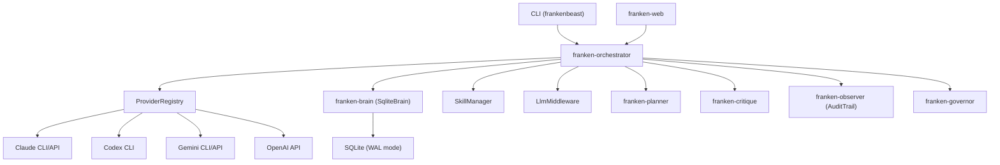
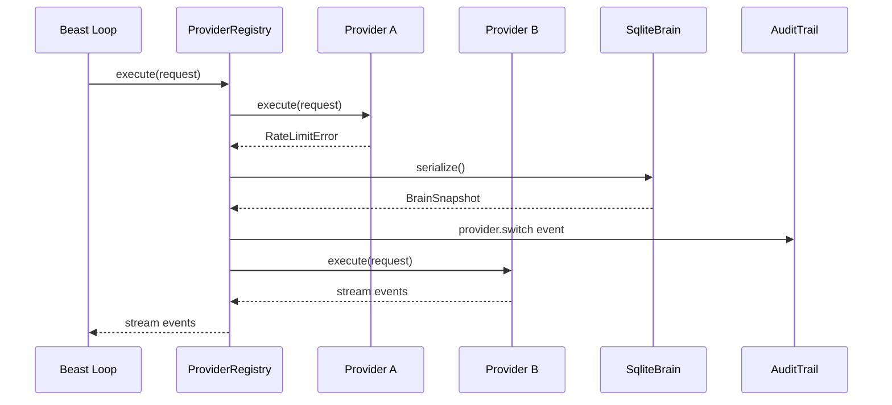
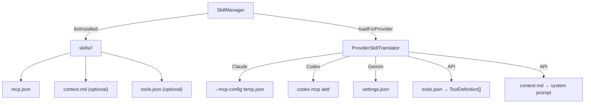
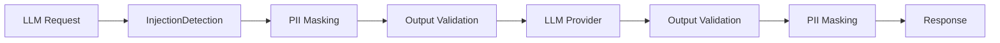
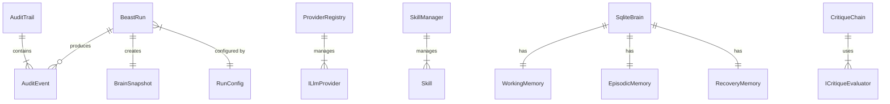

# Chunk 9.1: Update ARCHITECTURE.md

**Phase:** 9 — Documentation + Cleanup
**Depends on:** Phase 8 (all components wired)
**Estimated size:** Medium (~300 lines documentation)

---

## Purpose

Rewrite `docs/ARCHITECTURE.md` to reflect the new 8-package architecture. Include Mermaid diagrams for the system overview, provider registry flow, brain serialize/hydrate, skill loading pipeline, and security middleware chain.

## Current State

The existing ARCHITECTURE.md describes the 13-package layout with packages that no longer exist after consolidation (franken-comms, franken-mcp, franken-skills, franken-heartbeat, frankenfirewall).

## Content Structure

### 1. System Overview Diagram



### 2. Package Layout

```
packages/
├── franken-types/           # Shared type definitions + Zod schemas
├── franken-brain/           # SQLite-based memory (working, episodic, recovery)
├── franken-planner/         # DAG planning
├── franken-observer/        # Audit trail + execution replay
├── franken-critique/        # Self-critique + ReflectionEvaluator
├── franken-governor/        # HITL governance
├── franken-web/             # Dashboard (simple/advanced modes)
└── franken-orchestrator/    # Beast Loop, CLI, providers, skills, security
```

Each package gets a brief description of its role, public API surface, and key types.

### 3. Provider Registry Flow



### 4. Brain Serialize/Hydrate Flow

```mermaid
graph LR
    A["SqliteBrain"] -->|serialize()| B["BrainSnapshot JSON"]
    B -->|"SqliteBrain.hydrate()"| C["New SqliteBrain"]
    A --> D["Working Memory (Map + SQLite)"]
    A --> E["Episodic Memory (SQLite)"]
    A --> F["Recovery (SQLite checkpoints)"]
```

Document the `BrainSnapshot` schema, serialization format, and cross-provider handoff semantics.

### 5. Skill Loading Pipeline



### 6. Security Middleware Chain



Document the three security profiles (strict/standard/permissive) and which middleware each enables.

### 7. Beast Loop Phases

Document the four-phase execution model:
1. **Ingestion** — middleware → brain hydrate → skill context assembly
2. **Planning** — planner + critique with optional reflection
3. **Execution** — ProviderRegistry.execute() with MCP skills + middleware
4. **Closure** — optional reflection → brain checkpoint → audit finalize → snapshot

### 8. Data Flow ERD



## Files

- **Modify:** `docs/ARCHITECTURE.md` — full rewrite

## Exit Criteria

- All Mermaid diagrams render correctly
- 8-package layout documented (no references to deleted packages)
- Provider registry flow including failover clearly diagrammed
- Brain serialize/hydrate documented with schema
- Skill loading pipeline with per-provider translation documented
- Security profiles and middleware chain documented
- Beast Loop four-phase model documented
- ERD covers all major data relationships
